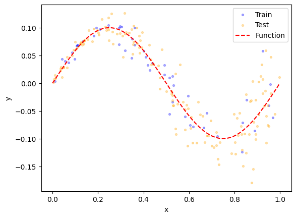
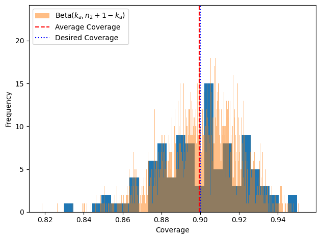

## Data Generation


```python
import numpy as np 
import matplotlib.pyplot as plt
from sklearn.model_selection import train_test_split
from sklearn.preprocessing import StandardScaler  

def process_data(X, y, train_size, random_state=None):
    """ 
    Splits data into training, calibration, and test sets, and normalizes the inputs

    Parameters:
    ------------
    X: array 
        The inputs of the dataset to be split 
    y: array 
        The outputs of the dataset to be split
    train_size: float
        fraction of the dataset to use for training (bounded between 0 and 1)
    calibrate_size: float 
        fraction of the dataset to use for calibration (bounded between 0 and 1)
    random_state: float 
        The split state to fix for consistent results between function calls (defaults to None)
    """
    
    # Split into train/calibration and validation sets
    X_train, X_test, y_train, y_test = train_test_split(X, y, test_size = 1-(train_size), random_state=random_state)

    return X_train, X_test, y_train, y_test

def recombine_data(X_calibrate, X_test, y_calibrate, y_test):
    """
    Combines and then splits calibration and testing data for conformal prediction validation  

    Parameters:
    ----------
    X_calibrate: array 
        The inputs of the calibration dataset 
    X_test: array 
        The inputs of the test dataset 
    y_calibrate: array 
        The outputs of the calibration dataset 
    y_test: array 
        The outputs of the test dataset 
    """
    test_size = y_test.size / (y_test.size + y_calibrate.size)
    combined_X = np.append(X_calibrate, X_test, axis=0)
    combined_y = np.append(y_calibrate, y_test)
    new_X_calibrate, new_X_test, new_y_calibrate, new_y_test = train_test_split(combined_X, combined_y, test_size=test_size)
    return new_X_calibrate, new_X_test, new_y_calibrate, new_y_test 

def generate_unvaried_data(n):
    """ 
    Generates synthetic data with no variance according to the sine function described above 

    Parameters: 
    -----------
    n: int 
        amount of data to generate 
    """
    x = np.linspace(0, 1, n)
    y = 0.1 * np.sin(2 * np.pi * x)
    return(x.reshape(-1, 1), y)

def generate_varied_data(n):
    """ 
    Generates synthetic data with variance according to the sine function described above

    Parameters: 
    -----------
    n: int 
        amount of data to generate 
    """
    rng = np.random.default_rng() 
    x = rng.random(n)
    epsilon = rng.standard_normal(n)
    y = 0.1 * (np.sin(2 * np.pi * x) + 0.4*epsilon * (0.1 + x)) 
    return x.reshape(-1, 1), y 

def plot_data(X, y, ax, scatter = False, **kwargs):
    """ 
    A generic plotting function 

    Parameters: 
    ----------- 
    X: np.array
        The inputs to be plotted 
    y: np.array 
        The outputs to be plotted 
    ax: Axes 
        The axes on which to plot the data 
    scatter: bool 
        True if a scatter plot is desired, false if a line graph is desired 
    **kwargs 
        matplotlib additional plotting parameters 
    """
    if scatter == True: 
        ax.scatter(X, y, **kwargs)
    else: 
        ax.plot(X, y, **kwargs)
    ax.set_xlabel("x")
    ax.set_ylabel("y")

fig, ax = plt.subplots() 
fun_x, fun_y = generate_unvaried_data(100)
x,y = generate_varied_data(1000)
X_train, X_test, y_train, y_test = process_data(x, y, 0.25)
plot_data(X_train, y_train, ax, scatter=True, color='blue', alpha = 0.3, label="Train", s=8)
plot_data(X_test, y_test, ax, scatter=True, color='orange', alpha = 0.3, label="Test", s=8)
plot_data(fun_x, fun_y, ax, color='red', linestyle = 'dashed', label='Function')
plt.legend()
plt.show()

```


    

    


```python
from uqregressors.conformal.conformal_split import ConformalQuantileRegressor
from uqregressors.metrics.metrics import coverage

def run_prediction_trials(model, alpha, num_trials, dataset_size, train_size, calibrate_size=0):
    """ 
    Runs a number of trials of conformal prediction. The model is trained once, and the 
    calibration and test set are combined and re-split for every iteration. The coverage is calculated, 
    and the distribution of coverage is output. 

    Parameters: 
    -----------
    num_trials: int 
        The number of trials to carry out 
    dataset_size: int 
        The number of data points to generate 
    train_size: float 
        The size of the training dataset relative to the entire dataset size (bounded between 0 and 1)
    calibrate_size: float 
        The size of the calibration dataset relative to the entire dataset size (bounded between 0 and 1)
    poly_order: int 
        The order of the polynomials used to fit the quantile regression functions
    alpha: float
        One minus the desired confidence interval bounded between 0 and 1 (i.e., 0.05)
    """
    coverage_dist = np.empty(num_trials)
    X, y = generate_unvaried_data(dataset_size)
    X_train, X_test, y_train, y_test = process_data(X, y, train_size)
    for i in range(num_trials): 
        X_train, X_test, y_train, y_test = process_data(X, y, train_size)
        model.fit(X_train, y_train)
        mean, lower, upper = model.predict(X_test)
        coverage_dist[i] = coverage(lower, upper, y_test)
        print(i)
        print(f"coverage: {coverage_dist[i]}")
    return coverage_dist

def plot_histogram(distribution, alpha, bin_width=0.005, n2 = None):
    """
    Plots a histogram of the coverage distribution 

    Parameters: 
    ----------
    distribution: array
        The distribution to plot a histogram for
    bin_width: float 
        The width of the histogram bins bounded between 0 and 1 
        Defaults to 0.005 (half a percent)
    
    """
    fig, ax = plt.subplots(tight_layout=True)
    plt.hist(distribution, bins=int(1/bin_width))
    #ax.set_xlim(0, 1)
    ax.set_xlabel("Coverage")
    ax.set_ylabel("Frequency")
    average = np.mean(distribution)
    if n2 is not None: 
        ka = np.ceil((1-alpha) * (n2+1))
        kb = n2 + 1 - ka
        gen = np.random.default_rng()
        distr = gen.beta(ka, kb, 10000)
        plt.hist(distr, bins = int(100/(bin_width)), alpha=0.5, label = 'Beta($k_a, n_2+1-k_a$)')

    plt.axvline(x=average, color='red', linestyle='--', label = 'Average Coverage')
    plt.axvline(x=1-alpha, color = 'blue', linestyle = ':', label = 'Desired Coverage')
    plt.legend()
    plt.show()

num_trials=100
dataset_size = 1000
bin_width = 0.04
train_size = 0.5 
calibrate_size = 0.5
n2 = int(calibrate_size * dataset_size * train_size)
alpha = 0.1

model = ConformalQuantileRegressor(
    hidden_sizes = [128, 128], 
    cal_size=calibrate_size,
    alpha=alpha,
    dropout=None, 
    epochs=100, 
    batch_size=256, 
    learning_rate=5e-4, 
    optimizer_kwargs = {"weight_decay": 1e-6}, 
    device="cuda", 
    scale_data=True, 
    use_wandb=False
)

coverage_distribution = run_prediction_trials(model, alpha, num_trials, dataset_size, train_size, calibrate_size)
plot_histogram(coverage_distribution, alpha, bin_width, n2=n2)
```

    [Logger-12256] epoch=0, train_loss=0.33394166827201843
    

    [Logger-12256] epoch=5, train_loss=0.22572878003120422
    [Logger-12256] epoch=10, train_loss=0.1418345868587494
    [Logger-12256] epoch=15, train_loss=0.08290089666843414
    [Logger-12256] epoch=20, train_loss=0.05647741258144379
    [Logger-12256] epoch=25, train_loss=0.05324038118124008
    [Logger-12256] epoch=30, train_loss=0.053915835916996
    [Logger-12256] epoch=35, train_loss=0.05143670737743378
    [Logger-12256] epoch=40, train_loss=0.04711431264877319
    [Logger-12256] epoch=45, train_loss=0.043042268604040146
    [Logger-12256] epoch=50, train_loss=0.04160427302122116
    [Logger-12256] epoch=55, train_loss=0.04088420420885086
    [Logger-12256] epoch=60, train_loss=0.03980352729558945
    [Logger-12256] epoch=65, train_loss=0.03921408951282501
    [Logger-12256] epoch=70, train_loss=0.03847067058086395
    [Logger-12256] epoch=75, train_loss=0.037756484001874924
    [Logger-12256] epoch=80, train_loss=0.03716643154621124
    [Logger-12256] epoch=85, train_loss=0.03648632764816284
    [Logger-12256] epoch=90, train_loss=0.03577606752514839
    [Logger-12256] epoch=95, train_loss=0.03505394235253334
    [Logger-12256] epoch=0, train_loss=0.4579327404499054
    [Logger-12256] epoch=5, train_loss=0.298176109790802
    [Logger-12256] epoch=10, train_loss=0.18127408623695374
    [Logger-12256] epoch=15, train_loss=0.1047208160161972
    [Logger-12256] epoch=20, train_loss=0.07089071720838547
    [Logger-12256] epoch=25, train_loss=0.058242615312337875
    

    0
    coverage: 0.876
    

    [Logger-12256] epoch=30, train_loss=0.06011021509766579
    [Logger-12256] epoch=35, train_loss=0.058747973293066025
    [Logger-12256] epoch=40, train_loss=0.05487891286611557
    [Logger-12256] epoch=45, train_loss=0.049597304314374924
    [Logger-12256] epoch=50, train_loss=0.044612713158130646
    [Logger-12256] epoch=55, train_loss=0.04365474358201027
    [Logger-12256] epoch=60, train_loss=0.041931163519620895
    [Logger-12256] epoch=65, train_loss=0.040652524679899216
    [Logger-12256] epoch=70, train_loss=0.04011562466621399
    [Logger-12256] epoch=75, train_loss=0.03959884122014046
    [Logger-12256] epoch=80, train_loss=0.03891214355826378
    [Logger-12256] epoch=85, train_loss=0.03848185017704964
    [Logger-12256] epoch=90, train_loss=0.03796885162591934
    [Logger-12256] epoch=95, train_loss=0.03745894506573677
    [Logger-12256] epoch=0, train_loss=0.46700233221054077
    [Logger-12256] epoch=5, train_loss=0.3514181077480316
    [Logger-12256] epoch=10, train_loss=0.26130008697509766
    [Logger-12256] epoch=15, train_loss=0.18561401963233948
    [Logger-12256] epoch=20, train_loss=0.12487359344959259
    [Logger-12256] epoch=25, train_loss=0.08129637688398361
    

    1
    coverage: 0.88
    

    [Logger-12256] epoch=30, train_loss=0.05519172549247742
    [Logger-12256] epoch=35, train_loss=0.053641900420188904
    [Logger-12256] epoch=40, train_loss=0.054801225662231445
    [Logger-12256] epoch=45, train_loss=0.05332517623901367
    [Logger-12256] epoch=50, train_loss=0.05025111138820648
    [Logger-12256] epoch=55, train_loss=0.047820087522268295
    [Logger-12256] epoch=60, train_loss=0.046231627464294434
    [Logger-12256] epoch=65, train_loss=0.043885041028261185
    [Logger-12256] epoch=70, train_loss=0.04292769730091095
    [Logger-12256] epoch=75, train_loss=0.042452793568372726
    [Logger-12256] epoch=80, train_loss=0.04187535494565964
    [Logger-12256] epoch=85, train_loss=0.04126426950097084
    [Logger-12256] epoch=90, train_loss=0.04091954231262207
    [Logger-12256] epoch=95, train_loss=0.04049545153975487
    [Logger-12256] epoch=0, train_loss=0.4052925705909729
    [Logger-12256] epoch=5, train_loss=0.2866857051849365
    [Logger-12256] epoch=10, train_loss=0.18938535451889038
    [Logger-12256] epoch=15, train_loss=0.11752051115036011
    [Logger-12256] epoch=20, train_loss=0.06858093291521072
    [Logger-12256] epoch=25, train_loss=0.050721071660518646
    

    2
    coverage: 0.902
    

    [Logger-12256] epoch=30, train_loss=0.051876332610845566
    [Logger-12256] epoch=35, train_loss=0.051751069724559784
    [Logger-12256] epoch=40, train_loss=0.049531497061252594
    [Logger-12256] epoch=45, train_loss=0.04848005622625351
    [Logger-12256] epoch=50, train_loss=0.046381451189517975
    [Logger-12256] epoch=55, train_loss=0.04348361864686012
    [Logger-12256] epoch=60, train_loss=0.04136310890316963
    [Logger-12256] epoch=65, train_loss=0.04097980633378029
    [Logger-12256] epoch=70, train_loss=0.039436791092157364
    [Logger-12256] epoch=75, train_loss=0.03898883983492851
    [Logger-12256] epoch=80, train_loss=0.03796379640698433
    [Logger-12256] epoch=85, train_loss=0.03735342249274254
    [Logger-12256] epoch=90, train_loss=0.03661832585930824
    [Logger-12256] epoch=95, train_loss=0.03578880801796913
    [Logger-12256] epoch=0, train_loss=0.4230755865573883
    [Logger-12256] epoch=5, train_loss=0.30719175934791565
    [Logger-12256] epoch=10, train_loss=0.21513721346855164
    [Logger-12256] epoch=15, train_loss=0.1405431181192398
    [Logger-12256] epoch=20, train_loss=0.08177884668111801
    [Logger-12256] epoch=25, train_loss=0.05045656859874725
    

    3
    coverage: 0.894
    

    [Logger-12256] epoch=30, train_loss=0.05081334710121155
    [Logger-12256] epoch=35, train_loss=0.051839105784893036
    [Logger-12256] epoch=40, train_loss=0.05098915845155716
    [Logger-12256] epoch=45, train_loss=0.04848653823137283
    [Logger-12256] epoch=50, train_loss=0.045025259256362915
    [Logger-12256] epoch=55, train_loss=0.04282280057668686
    [Logger-12256] epoch=60, train_loss=0.04144277423620224
    [Logger-12256] epoch=65, train_loss=0.04080062359571457
    [Logger-12256] epoch=70, train_loss=0.03960222005844116
    [Logger-12256] epoch=75, train_loss=0.03882706165313721
    [Logger-12256] epoch=80, train_loss=0.03836583346128464
    [Logger-12256] epoch=85, train_loss=0.03776262700557709
    [Logger-12256] epoch=90, train_loss=0.03721357882022858
    [Logger-12256] epoch=95, train_loss=0.03664689138531685
    [Logger-12256] epoch=0, train_loss=0.4417931139469147
    [Logger-12256] epoch=5, train_loss=0.303796648979187
    [Logger-12256] epoch=10, train_loss=0.19901160895824432
    [Logger-12256] epoch=15, train_loss=0.12370622158050537
    [Logger-12256] epoch=20, train_loss=0.0751764178276062
    [Logger-12256] epoch=25, train_loss=0.05859098955988884
    

    4
    coverage: 0.904
    

    [Logger-12256] epoch=30, train_loss=0.05612083524465561
    [Logger-12256] epoch=35, train_loss=0.05654577165842056
    [Logger-12256] epoch=40, train_loss=0.05396697670221329
    [Logger-12256] epoch=45, train_loss=0.050640299916267395
    [Logger-12256] epoch=50, train_loss=0.04762575030326843
    [Logger-12256] epoch=55, train_loss=0.04510403051972389
    [Logger-12256] epoch=60, train_loss=0.04377949610352516
    [Logger-12256] epoch=65, train_loss=0.04341172054409981
    [Logger-12256] epoch=70, train_loss=0.042795006185770035
    [Logger-12256] epoch=75, train_loss=0.04199659079313278
    [Logger-12256] epoch=80, train_loss=0.04145028814673424
    [Logger-12256] epoch=85, train_loss=0.04108443483710289
    [Logger-12256] epoch=90, train_loss=0.040640801191329956
    [Logger-12256] epoch=95, train_loss=0.04010618105530739
    [Logger-12256] epoch=0, train_loss=0.4707830548286438
    [Logger-12256] epoch=5, train_loss=0.33859071135520935
    [Logger-12256] epoch=10, train_loss=0.23705217242240906
    [Logger-12256] epoch=15, train_loss=0.16010096669197083
    [Logger-12256] epoch=20, train_loss=0.09982089698314667
    [Logger-12256] epoch=25, train_loss=0.0607818104326725
    

    5
    coverage: 0.904
    

    [Logger-12256] epoch=30, train_loss=0.051301829516887665
    [Logger-12256] epoch=35, train_loss=0.05434068664908409
    [Logger-12256] epoch=40, train_loss=0.05451461672782898
    [Logger-12256] epoch=45, train_loss=0.05276027321815491
    [Logger-12256] epoch=50, train_loss=0.04976188391447067
    [Logger-12256] epoch=55, train_loss=0.04591844975948334
    [Logger-12256] epoch=60, train_loss=0.04321767017245293
    [Logger-12256] epoch=65, train_loss=0.041957102715969086
    [Logger-12256] epoch=70, train_loss=0.040057871490716934
    [Logger-12256] epoch=75, train_loss=0.03917588293552399
    [Logger-12256] epoch=80, train_loss=0.038503386080265045
    [Logger-12256] epoch=85, train_loss=0.03816106542944908
    [Logger-12256] epoch=90, train_loss=0.037584833800792694
    [Logger-12256] epoch=95, train_loss=0.03713864088058472
    [Logger-12256] epoch=0, train_loss=0.4430817663669586
    [Logger-12256] epoch=5, train_loss=0.30982181429862976
    [Logger-12256] epoch=10, train_loss=0.20239517092704773
    [Logger-12256] epoch=15, train_loss=0.12124054878950119
    [Logger-12256] epoch=20, train_loss=0.06768611073493958
    [Logger-12256] epoch=25, train_loss=0.055319253355264664
    

    6
    coverage: 0.906
    

    [Logger-12256] epoch=30, train_loss=0.05916263908147812
    [Logger-12256] epoch=35, train_loss=0.05868164822459221
    [Logger-12256] epoch=40, train_loss=0.05562475696206093
    [Logger-12256] epoch=45, train_loss=0.05251235514879227
    [Logger-12256] epoch=50, train_loss=0.04876844212412834
    [Logger-12256] epoch=55, train_loss=0.04412331432104111
    [Logger-12256] epoch=60, train_loss=0.043410226702690125
    [Logger-12256] epoch=65, train_loss=0.041983697563409805
    [Logger-12256] epoch=70, train_loss=0.04175342619419098
    [Logger-12256] epoch=75, train_loss=0.04105975478887558
    [Logger-12256] epoch=80, train_loss=0.04044853150844574
    [Logger-12256] epoch=85, train_loss=0.03995152562856674
    [Logger-12256] epoch=90, train_loss=0.039470821619033813
    [Logger-12256] epoch=95, train_loss=0.03901049867272377
    [Logger-12256] epoch=0, train_loss=0.4578493535518646
    [Logger-12256] epoch=5, train_loss=0.34747323393821716
    [Logger-12256] epoch=10, train_loss=0.25813373923301697
    [Logger-12256] epoch=15, train_loss=0.18357324600219727
    [Logger-12256] epoch=20, train_loss=0.12262773513793945
    [Logger-12256] epoch=25, train_loss=0.0818004459142685
    

    7
    coverage: 0.93
    

    [Logger-12256] epoch=30, train_loss=0.06365722417831421
    [Logger-12256] epoch=35, train_loss=0.05328615754842758
    [Logger-12256] epoch=40, train_loss=0.051623910665512085
    [Logger-12256] epoch=45, train_loss=0.05021991953253746
    [Logger-12256] epoch=50, train_loss=0.047905851155519485
    [Logger-12256] epoch=55, train_loss=0.04544365033507347
    [Logger-12256] epoch=60, train_loss=0.04421808943152428
    [Logger-12256] epoch=65, train_loss=0.04200667887926102
    [Logger-12256] epoch=70, train_loss=0.04138593748211861
    [Logger-12256] epoch=75, train_loss=0.04033143073320389
    [Logger-12256] epoch=80, train_loss=0.0396508127450943
    [Logger-12256] epoch=85, train_loss=0.038971398025751114
    [Logger-12256] epoch=90, train_loss=0.038336992263793945
    [Logger-12256] epoch=95, train_loss=0.037706419825553894
    [Logger-12256] epoch=0, train_loss=0.4035841226577759
    [Logger-12256] epoch=5, train_loss=0.26731520891189575
    [Logger-12256] epoch=10, train_loss=0.1639419049024582
    [Logger-12256] epoch=15, train_loss=0.09016336500644684
    [Logger-12256] epoch=20, train_loss=0.05397988110780716
    [Logger-12256] epoch=25, train_loss=0.05702410265803337
    

    8
    coverage: 0.888
    

    [Logger-12256] epoch=30, train_loss=0.05798063054680824
    [Logger-12256] epoch=35, train_loss=0.055262621492147446
    [Logger-12256] epoch=40, train_loss=0.05156954750418663
    [Logger-12256] epoch=45, train_loss=0.047640610486269
    [Logger-12256] epoch=50, train_loss=0.04278697445988655
    [Logger-12256] epoch=55, train_loss=0.04270198941230774
    [Logger-12256] epoch=60, train_loss=0.04155401885509491
    [Logger-12256] epoch=65, train_loss=0.04070286080241203
    [Logger-12256] epoch=70, train_loss=0.03978952392935753
    [Logger-12256] epoch=75, train_loss=0.039327580481767654
    [Logger-12256] epoch=80, train_loss=0.038759201765060425
    [Logger-12256] epoch=85, train_loss=0.038179848343133926
    [Logger-12256] epoch=90, train_loss=0.03759804740548134
    [Logger-12256] epoch=95, train_loss=0.037074580788612366
    [Logger-12256] epoch=0, train_loss=0.4184277057647705
    [Logger-12256] epoch=5, train_loss=0.3137521743774414
    [Logger-12256] epoch=10, train_loss=0.23106852173805237
    [Logger-12256] epoch=15, train_loss=0.1634887456893921
    [Logger-12256] epoch=20, train_loss=0.11197890341281891
    [Logger-12256] epoch=25, train_loss=0.08003143221139908
    [Logger-12256] epoch=30, train_loss=0.060313645750284195
    

    9
    coverage: 0.898
    

    [Logger-12256] epoch=35, train_loss=0.049323052167892456
    [Logger-12256] epoch=40, train_loss=0.0496334470808506
    [Logger-12256] epoch=45, train_loss=0.04874970391392708
    [Logger-12256] epoch=50, train_loss=0.04636212810873985
    [Logger-12256] epoch=55, train_loss=0.04536985978484154
    [Logger-12256] epoch=60, train_loss=0.04374296963214874
    [Logger-12256] epoch=65, train_loss=0.04244004935026169
    [Logger-12256] epoch=70, train_loss=0.04070959985256195
    [Logger-12256] epoch=75, train_loss=0.040438782423734665
    [Logger-12256] epoch=80, train_loss=0.039544522762298584
    [Logger-12256] epoch=85, train_loss=0.03901215270161629
    [Logger-12256] epoch=90, train_loss=0.03833196684718132
    [Logger-12256] epoch=95, train_loss=0.037848878651857376
    [Logger-12256] epoch=0, train_loss=0.5110581517219543
    [Logger-12256] epoch=5, train_loss=0.3525412678718567
    [Logger-12256] epoch=10, train_loss=0.22809891402721405
    [Logger-12256] epoch=15, train_loss=0.1348511427640915
    [Logger-12256] epoch=20, train_loss=0.07149505615234375
    

    10
    coverage: 0.924
    

    [Logger-12256] epoch=25, train_loss=0.05893419310450554
    [Logger-12256] epoch=30, train_loss=0.06342131644487381
    [Logger-12256] epoch=35, train_loss=0.06308244168758392
    [Logger-12256] epoch=40, train_loss=0.059755176305770874
    [Logger-12256] epoch=45, train_loss=0.054685428738594055
    [Logger-12256] epoch=50, train_loss=0.04870741814374924
    [Logger-12256] epoch=55, train_loss=0.04437125474214554
    [Logger-12256] epoch=60, train_loss=0.042276423424482346
    [Logger-12256] epoch=65, train_loss=0.04214318469166756
    [Logger-12256] epoch=70, train_loss=0.04107102006673813
    [Logger-12256] epoch=75, train_loss=0.040450699627399445
    [Logger-12256] epoch=80, train_loss=0.039956338703632355
    [Logger-12256] epoch=85, train_loss=0.03952188417315483
    [Logger-12256] epoch=90, train_loss=0.038942255079746246
    [Logger-12256] epoch=95, train_loss=0.038529518991708755
    [Logger-12256] epoch=0, train_loss=0.4805208742618561
    [Logger-12256] epoch=5, train_loss=0.3595598340034485
    [Logger-12256] epoch=10, train_loss=0.26744794845581055
    [Logger-12256] epoch=15, train_loss=0.19781138002872467
    [Logger-12256] epoch=20, train_loss=0.14025624096393585
    [Logger-12256] epoch=25, train_loss=0.09695538878440857
    

    11
    coverage: 0.83
    

    [Logger-12256] epoch=30, train_loss=0.0672072172164917
    [Logger-12256] epoch=35, train_loss=0.05451824516057968
    [Logger-12256] epoch=40, train_loss=0.05179238319396973
    [Logger-12256] epoch=45, train_loss=0.05160314217209816
    [Logger-12256] epoch=50, train_loss=0.049237899482250214
    [Logger-12256] epoch=55, train_loss=0.04582656919956207
    [Logger-12256] epoch=60, train_loss=0.043793290853500366
    [Logger-12256] epoch=65, train_loss=0.04135841503739357
    [Logger-12256] epoch=70, train_loss=0.041513651609420776
    [Logger-12256] epoch=75, train_loss=0.04064660146832466
    [Logger-12256] epoch=80, train_loss=0.039776988327503204
    [Logger-12256] epoch=85, train_loss=0.03925645351409912
    [Logger-12256] epoch=90, train_loss=0.03882026672363281
    [Logger-12256] epoch=95, train_loss=0.03841616213321686
    [Logger-12256] epoch=0, train_loss=0.3978217542171478
    [Logger-12256] epoch=5, train_loss=0.2832140028476715
    [Logger-12256] epoch=10, train_loss=0.19167038798332214
    [Logger-12256] epoch=15, train_loss=0.12243583053350449
    [Logger-12256] epoch=20, train_loss=0.07618235796689987
    [Logger-12256] epoch=25, train_loss=0.05533194541931152
    [Logger-12256] epoch=30, train_loss=0.04690377041697502
    

    12
    coverage: 0.904
    

    [Logger-12256] epoch=35, train_loss=0.04725082218647003
    [Logger-12256] epoch=40, train_loss=0.0464194156229496
    [Logger-12256] epoch=45, train_loss=0.04511246085166931
    [Logger-12256] epoch=50, train_loss=0.043711498379707336
    [Logger-12256] epoch=55, train_loss=0.04209993779659271
    [Logger-12256] epoch=60, train_loss=0.04046166315674782
    [Logger-12256] epoch=65, train_loss=0.039197083562612534
    [Logger-12256] epoch=70, train_loss=0.03912224620580673
    [Logger-12256] epoch=75, train_loss=0.03818916901946068
    [Logger-12256] epoch=80, train_loss=0.03767184540629387
    [Logger-12256] epoch=85, train_loss=0.03703077509999275
    [Logger-12256] epoch=90, train_loss=0.03646078705787659
    [Logger-12256] epoch=95, train_loss=0.035879578441381454
    [Logger-12256] epoch=0, train_loss=0.40841981768608093
    [Logger-12256] epoch=5, train_loss=0.28849929571151733
    [Logger-12256] epoch=10, train_loss=0.19423699378967285
    [Logger-12256] epoch=15, train_loss=0.1193569004535675
    [Logger-12256] epoch=20, train_loss=0.06706659495830536
    [Logger-12256] epoch=25, train_loss=0.046403661370277405
    

    13
    coverage: 0.91
    

    [Logger-12256] epoch=30, train_loss=0.04993565380573273
    [Logger-12256] epoch=35, train_loss=0.05013219267129898
    [Logger-12256] epoch=40, train_loss=0.04923992231488228
    [Logger-12256] epoch=45, train_loss=0.04840020835399628
    [Logger-12256] epoch=50, train_loss=0.0464676171541214
    [Logger-12256] epoch=55, train_loss=0.04388323426246643
    [Logger-12256] epoch=60, train_loss=0.042579539120197296
    [Logger-12256] epoch=65, train_loss=0.04081381857395172
    [Logger-12256] epoch=70, train_loss=0.03925364091992378
    [Logger-12256] epoch=75, train_loss=0.03921360522508621
    [Logger-12256] epoch=80, train_loss=0.03823848068714142
    [Logger-12256] epoch=85, train_loss=0.03777641803026199
    [Logger-12256] epoch=90, train_loss=0.036938317120075226
    [Logger-12256] epoch=95, train_loss=0.036304835230112076
    [Logger-12256] epoch=0, train_loss=0.505885899066925
    [Logger-12256] epoch=5, train_loss=0.39254263043403625
    [Logger-12256] epoch=10, train_loss=0.2975737154483795
    [Logger-12256] epoch=15, train_loss=0.21467450261116028
    [Logger-12256] epoch=20, train_loss=0.1397470384836197
    [Logger-12256] epoch=25, train_loss=0.07921264320611954
    [Logger-12256] epoch=30, train_loss=0.046783603727817535
    

    14
    coverage: 0.868
    

    [Logger-12256] epoch=35, train_loss=0.04756186529994011
    [Logger-12256] epoch=40, train_loss=0.04877442494034767
    [Logger-12256] epoch=45, train_loss=0.04828802868723869
    [Logger-12256] epoch=50, train_loss=0.04757646471261978
    [Logger-12256] epoch=55, train_loss=0.04558748006820679
    [Logger-12256] epoch=60, train_loss=0.04315613582730293
    [Logger-12256] epoch=65, train_loss=0.04075997322797775
    [Logger-12256] epoch=70, train_loss=0.04010395333170891
    [Logger-12256] epoch=75, train_loss=0.03909994661808014
    [Logger-12256] epoch=80, train_loss=0.03870677947998047
    [Logger-12256] epoch=85, train_loss=0.03768144175410271
    [Logger-12256] epoch=90, train_loss=0.03721576929092407
    [Logger-12256] epoch=95, train_loss=0.036575399339199066
    [Logger-12256] epoch=0, train_loss=0.42545247077941895
    [Logger-12256] epoch=5, train_loss=0.29943040013313293
    [Logger-12256] epoch=10, train_loss=0.2021927535533905
    [Logger-12256] epoch=15, train_loss=0.1255113184452057
    [Logger-12256] epoch=20, train_loss=0.07043492794036865
    [Logger-12256] epoch=25, train_loss=0.048940423876047134
    

    15
    coverage: 0.876
    

    [Logger-12256] epoch=30, train_loss=0.052767977118492126
    [Logger-12256] epoch=35, train_loss=0.05301469936966896
    [Logger-12256] epoch=40, train_loss=0.05130397155880928
    [Logger-12256] epoch=45, train_loss=0.04895634576678276
    [Logger-12256] epoch=50, train_loss=0.04610363394021988
    [Logger-12256] epoch=55, train_loss=0.04375648871064186
    [Logger-12256] epoch=60, train_loss=0.041762884706258774
    [Logger-12256] epoch=65, train_loss=0.040416788309812546
    [Logger-12256] epoch=70, train_loss=0.04013833776116371
    [Logger-12256] epoch=75, train_loss=0.039136216044425964
    [Logger-12256] epoch=80, train_loss=0.038897909224033356
    [Logger-12256] epoch=85, train_loss=0.03802688792347908
    [Logger-12256] epoch=90, train_loss=0.03762972727417946
    [Logger-12256] epoch=95, train_loss=0.037025172263383865
    [Logger-12256] epoch=0, train_loss=0.38566407561302185
    [Logger-12256] epoch=5, train_loss=0.2629270851612091
    [Logger-12256] epoch=10, train_loss=0.16759547591209412
    [Logger-12256] epoch=15, train_loss=0.09689392894506454
    [Logger-12256] epoch=20, train_loss=0.06386503577232361
    [Logger-12256] epoch=25, train_loss=0.06280487030744553
    

    16
    coverage: 0.882
    

    [Logger-12256] epoch=30, train_loss=0.06456511467695236
    [Logger-12256] epoch=35, train_loss=0.06265425682067871
    [Logger-12256] epoch=40, train_loss=0.05855628475546837
    [Logger-12256] epoch=45, train_loss=0.05299445241689682
    [Logger-12256] epoch=50, train_loss=0.04629424214363098
    [Logger-12256] epoch=55, train_loss=0.04516388848423958
    [Logger-12256] epoch=60, train_loss=0.04270930588245392
    [Logger-12256] epoch=65, train_loss=0.041767384856939316
    [Logger-12256] epoch=70, train_loss=0.041089776903390884
    [Logger-12256] epoch=75, train_loss=0.04005603864789009
    [Logger-12256] epoch=80, train_loss=0.03983568027615547
    [Logger-12256] epoch=85, train_loss=0.03919080272316933
    [Logger-12256] epoch=90, train_loss=0.038721468299627304
    [Logger-12256] epoch=95, train_loss=0.038249216973781586
    [Logger-12256] epoch=0, train_loss=0.40864142775535583
    [Logger-12256] epoch=5, train_loss=0.28915759921073914
    [Logger-12256] epoch=10, train_loss=0.18958646059036255
    [Logger-12256] epoch=15, train_loss=0.11169217526912689
    [Logger-12256] epoch=20, train_loss=0.06532174348831177
    [Logger-12256] epoch=25, train_loss=0.05366978049278259
    

    17
    coverage: 0.938
    

    [Logger-12256] epoch=30, train_loss=0.056303203105926514
    [Logger-12256] epoch=35, train_loss=0.055029574781656265
    [Logger-12256] epoch=40, train_loss=0.051758114248514175
    [Logger-12256] epoch=45, train_loss=0.04822610691189766
    [Logger-12256] epoch=50, train_loss=0.045483317226171494
    [Logger-12256] epoch=55, train_loss=0.043346453458070755
    [Logger-12256] epoch=60, train_loss=0.04313034936785698
    [Logger-12256] epoch=65, train_loss=0.04130527749657631
    [Logger-12256] epoch=70, train_loss=0.04102477431297302
    [Logger-12256] epoch=75, train_loss=0.04018363356590271
    [Logger-12256] epoch=80, train_loss=0.0395657941699028
    [Logger-12256] epoch=85, train_loss=0.03894928842782974
    [Logger-12256] epoch=90, train_loss=0.038342591375112534
    [Logger-12256] epoch=95, train_loss=0.037670474499464035
    [Logger-12256] epoch=0, train_loss=0.3796504735946655
    [Logger-12256] epoch=5, train_loss=0.25233885645866394
    [Logger-12256] epoch=10, train_loss=0.15911805629730225
    [Logger-12256] epoch=15, train_loss=0.09316622465848923
    [Logger-12256] epoch=20, train_loss=0.05799255147576332
    [Logger-12256] epoch=25, train_loss=0.05444485694169998
    

    18
    coverage: 0.914
    

    [Logger-12256] epoch=30, train_loss=0.055930159986019135
    [Logger-12256] epoch=35, train_loss=0.05353245511651039
    [Logger-12256] epoch=40, train_loss=0.04888696223497391
    [Logger-12256] epoch=45, train_loss=0.04509972780942917
    [Logger-12256] epoch=50, train_loss=0.042675238102674484
    [Logger-12256] epoch=55, train_loss=0.04134593531489372
    [Logger-12256] epoch=60, train_loss=0.04065074026584625
    [Logger-12256] epoch=65, train_loss=0.03992433473467827
    [Logger-12256] epoch=70, train_loss=0.03920048102736473
    [Logger-12256] epoch=75, train_loss=0.03865467384457588
    [Logger-12256] epoch=80, train_loss=0.03801831975579262
    [Logger-12256] epoch=85, train_loss=0.03740604594349861
    [Logger-12256] epoch=90, train_loss=0.036793291568756104
    [Logger-12256] epoch=95, train_loss=0.03613382205367088
    [Logger-12256] epoch=0, train_loss=0.4305196702480316
    [Logger-12256] epoch=5, train_loss=0.2874975800514221
    [Logger-12256] epoch=10, train_loss=0.17315086722373962
    [Logger-12256] epoch=15, train_loss=0.08857454359531403
    [Logger-12256] epoch=20, train_loss=0.04786679893732071
    [Logger-12256] epoch=25, train_loss=0.05357085540890694
    

    19
    coverage: 0.91
    

    [Logger-12256] epoch=30, train_loss=0.05426793918013573
    [Logger-12256] epoch=35, train_loss=0.05159677565097809
    [Logger-12256] epoch=40, train_loss=0.049672629684209824
    [Logger-12256] epoch=45, train_loss=0.04749782010912895
    [Logger-12256] epoch=50, train_loss=0.043970126658678055
    [Logger-12256] epoch=55, train_loss=0.040567345917224884
    [Logger-12256] epoch=60, train_loss=0.0399918369948864
    [Logger-12256] epoch=65, train_loss=0.03942794352769852
    [Logger-12256] epoch=70, train_loss=0.03850001096725464
    [Logger-12256] epoch=75, train_loss=0.03796840459108353
    [Logger-12256] epoch=80, train_loss=0.03732091560959816
    [Logger-12256] epoch=85, train_loss=0.036733392626047134
    [Logger-12256] epoch=90, train_loss=0.036121949553489685
    [Logger-12256] epoch=95, train_loss=0.035527780652046204
    [Logger-12256] epoch=0, train_loss=0.4947355091571808
    [Logger-12256] epoch=5, train_loss=0.35328203439712524
    [Logger-12256] epoch=10, train_loss=0.2392706573009491
    [Logger-12256] epoch=15, train_loss=0.15470191836357117
    [Logger-12256] epoch=20, train_loss=0.09748831391334534
    [Logger-12256] epoch=25, train_loss=0.06550861150026321
    

    20
    coverage: 0.902
    

    [Logger-12256] epoch=30, train_loss=0.05996023118495941
    [Logger-12256] epoch=35, train_loss=0.06248693913221359
    [Logger-12256] epoch=40, train_loss=0.0612901970744133
    [Logger-12256] epoch=45, train_loss=0.05775889754295349
    [Logger-12256] epoch=50, train_loss=0.052818506956100464
    [Logger-12256] epoch=55, train_loss=0.047126058489084244
    [Logger-12256] epoch=60, train_loss=0.045440539717674255
    [Logger-12256] epoch=65, train_loss=0.043807487934827805
    [Logger-12256] epoch=70, train_loss=0.04345493018627167
    [Logger-12256] epoch=75, train_loss=0.042712315917015076
    [Logger-12256] epoch=80, train_loss=0.04203745350241661
    [Logger-12256] epoch=85, train_loss=0.04151947796344757
    [Logger-12256] epoch=90, train_loss=0.041050706058740616
    [Logger-12256] epoch=95, train_loss=0.04043428227305412
    [Logger-12256] epoch=0, train_loss=0.44800031185150146
    [Logger-12256] epoch=5, train_loss=0.3076123893260956
    [Logger-12256] epoch=10, train_loss=0.1996099352836609
    [Logger-12256] epoch=15, train_loss=0.12021122127771378
    [Logger-12256] epoch=20, train_loss=0.06462258100509644
    [Logger-12256] epoch=25, train_loss=0.04673934355378151
    [Logger-12256] epoch=30, train_loss=0.04994460567831993
    

    21
    coverage: 0.918
    

    [Logger-12256] epoch=35, train_loss=0.049634844064712524
    [Logger-12256] epoch=40, train_loss=0.048037394881248474
    [Logger-12256] epoch=45, train_loss=0.04695679992437363
    [Logger-12256] epoch=50, train_loss=0.04470736160874367
    [Logger-12256] epoch=55, train_loss=0.04161956161260605
    [Logger-12256] epoch=60, train_loss=0.04016917571425438
    [Logger-12256] epoch=65, train_loss=0.03932994604110718
    [Logger-12256] epoch=70, train_loss=0.03873060643672943
    [Logger-12256] epoch=75, train_loss=0.03799925744533539
    [Logger-12256] epoch=80, train_loss=0.03749270737171173
    [Logger-12256] epoch=85, train_loss=0.03696958348155022
    [Logger-12256] epoch=90, train_loss=0.0363447405397892
    [Logger-12256] epoch=95, train_loss=0.0358111634850502
    [Logger-12256] epoch=0, train_loss=0.4349273145198822
    [Logger-12256] epoch=5, train_loss=0.29446396231651306
    [Logger-12256] epoch=10, train_loss=0.18983164429664612
    [Logger-12256] epoch=15, train_loss=0.1126762330532074
    [Logger-12256] epoch=20, train_loss=0.06232435628771782
    

    22
    coverage: 0.884
    

    [Logger-12256] epoch=25, train_loss=0.047812771052122116
    [Logger-12256] epoch=30, train_loss=0.050650905817747116
    [Logger-12256] epoch=35, train_loss=0.04976498335599899
    [Logger-12256] epoch=40, train_loss=0.04815013334155083
    [Logger-12256] epoch=45, train_loss=0.04636288806796074
    [Logger-12256] epoch=50, train_loss=0.04374321177601814
    [Logger-12256] epoch=55, train_loss=0.04204052686691284
    [Logger-12256] epoch=60, train_loss=0.0399789921939373
    [Logger-12256] epoch=65, train_loss=0.039219025522470474
    [Logger-12256] epoch=70, train_loss=0.038435664027929306
    [Logger-12256] epoch=75, train_loss=0.037954412400722504
    [Logger-12256] epoch=80, train_loss=0.03719484061002731
    [Logger-12256] epoch=85, train_loss=0.036593757569789886
    [Logger-12256] epoch=90, train_loss=0.0360068753361702
    [Logger-12256] epoch=95, train_loss=0.03531627729535103
    [Logger-12256] epoch=0, train_loss=0.5072709321975708
    [Logger-12256] epoch=5, train_loss=0.3663739264011383
    [Logger-12256] epoch=10, train_loss=0.25395962595939636
    [Logger-12256] epoch=15, train_loss=0.1646871268749237
    [Logger-12256] epoch=20, train_loss=0.09860191494226456
    [Logger-12256] epoch=25, train_loss=0.06535381823778152
    

    23
    coverage: 0.876
    

    [Logger-12256] epoch=30, train_loss=0.05148831754922867
    [Logger-12256] epoch=35, train_loss=0.052081398665905
    [Logger-12256] epoch=40, train_loss=0.05167888104915619
    [Logger-12256] epoch=45, train_loss=0.04910456761717796
    [Logger-12256] epoch=50, train_loss=0.04566577449440956
    [Logger-12256] epoch=55, train_loss=0.043021026998758316
    [Logger-12256] epoch=60, train_loss=0.04213380813598633
    [Logger-12256] epoch=65, train_loss=0.040603622794151306
    [Logger-12256] epoch=70, train_loss=0.03929123282432556
    [Logger-12256] epoch=75, train_loss=0.0385952852666378
    [Logger-12256] epoch=80, train_loss=0.03823232278227806
    [Logger-12256] epoch=85, train_loss=0.03767487779259682
    [Logger-12256] epoch=90, train_loss=0.03716062381863594
    [Logger-12256] epoch=95, train_loss=0.036815058439970016
    [Logger-12256] epoch=0, train_loss=0.39145949482917786
    [Logger-12256] epoch=5, train_loss=0.26243263483047485
    [Logger-12256] epoch=10, train_loss=0.16473492980003357
    [Logger-12256] epoch=15, train_loss=0.0926884338259697
    [Logger-12256] epoch=20, train_loss=0.054835688322782516
    [Logger-12256] epoch=25, train_loss=0.055125266313552856
    

    24
    coverage: 0.906
    

    [Logger-12256] epoch=30, train_loss=0.05553901940584183
    [Logger-12256] epoch=35, train_loss=0.052809517830610275
    [Logger-12256] epoch=40, train_loss=0.04862932115793228
    [Logger-12256] epoch=45, train_loss=0.0449528843164444
    [Logger-12256] epoch=50, train_loss=0.04296111315488815
    [Logger-12256] epoch=55, train_loss=0.04207223653793335
    [Logger-12256] epoch=60, train_loss=0.040437836199998856
    [Logger-12256] epoch=65, train_loss=0.04007219523191452
    [Logger-12256] epoch=70, train_loss=0.03932356834411621
    [Logger-12256] epoch=75, train_loss=0.03849954530596733
    [Logger-12256] epoch=80, train_loss=0.0377749539911747
    [Logger-12256] epoch=85, train_loss=0.03704782947897911
    [Logger-12256] epoch=90, train_loss=0.03631439059972763
    [Logger-12256] epoch=95, train_loss=0.03554777055978775
    [Logger-12256] epoch=0, train_loss=0.42070505023002625
    [Logger-12256] epoch=5, train_loss=0.27648407220840454
    [Logger-12256] epoch=10, train_loss=0.16747623682022095
    [Logger-12256] epoch=15, train_loss=0.09784375131130219
    [Logger-12256] epoch=20, train_loss=0.06534639000892639
    [Logger-12256] epoch=25, train_loss=0.056245945394039154
    [Logger-12256] epoch=30, train_loss=0.05846787244081497
    

    25
    coverage: 0.868
    

    [Logger-12256] epoch=35, train_loss=0.05668824166059494
    [Logger-12256] epoch=40, train_loss=0.052324771881103516
    [Logger-12256] epoch=45, train_loss=0.04747459664940834
    [Logger-12256] epoch=50, train_loss=0.04391636699438095
    [Logger-12256] epoch=55, train_loss=0.044003330171108246
    [Logger-12256] epoch=60, train_loss=0.04202618449926376
    [Logger-12256] epoch=65, train_loss=0.04168778657913208
    [Logger-12256] epoch=70, train_loss=0.04098387435078621
    [Logger-12256] epoch=75, train_loss=0.04015885666012764
    [Logger-12256] epoch=80, train_loss=0.0396137498319149
    [Logger-12256] epoch=85, train_loss=0.03902098163962364
    [Logger-12256] epoch=90, train_loss=0.03834524750709534
    [Logger-12256] epoch=95, train_loss=0.03774157911539078
    [Logger-12256] epoch=0, train_loss=0.5425097346305847
    [Logger-12256] epoch=5, train_loss=0.4024117588996887
    [Logger-12256] epoch=10, train_loss=0.283223956823349
    [Logger-12256] epoch=15, train_loss=0.19524605572223663
    [Logger-12256] epoch=20, train_loss=0.12816235423088074
    

    26
    coverage: 0.886
    

    [Logger-12256] epoch=25, train_loss=0.07562720030546188
    [Logger-12256] epoch=30, train_loss=0.043714459985494614
    [Logger-12256] epoch=35, train_loss=0.04399867355823517
    [Logger-12256] epoch=40, train_loss=0.0461871437728405
    [Logger-12256] epoch=45, train_loss=0.04635843634605408
    [Logger-12256] epoch=50, train_loss=0.04524813964962959
    [Logger-12256] epoch=55, train_loss=0.04327714815735817
    [Logger-12256] epoch=60, train_loss=0.04090025648474693
    [Logger-12256] epoch=65, train_loss=0.03938239440321922
    [Logger-12256] epoch=70, train_loss=0.038047343492507935
    [Logger-12256] epoch=75, train_loss=0.036740709096193314
    [Logger-12256] epoch=80, train_loss=0.036021944135427475
    [Logger-12256] epoch=85, train_loss=0.03536895290017128
    [Logger-12256] epoch=90, train_loss=0.03464746102690697
    [Logger-12256] epoch=95, train_loss=0.03404906019568443
    [Logger-12256] epoch=0, train_loss=0.5046543478965759
    [Logger-12256] epoch=5, train_loss=0.356716513633728
    [Logger-12256] epoch=10, train_loss=0.2378430962562561
    [Logger-12256] epoch=15, train_loss=0.1455048769712448
    [Logger-12256] epoch=20, train_loss=0.07916359603404999
    [Logger-12256] epoch=25, train_loss=0.05174315348267555
    

    27
    coverage: 0.922
    

    [Logger-12256] epoch=30, train_loss=0.05070463940501213
    [Logger-12256] epoch=35, train_loss=0.05183738097548485
    [Logger-12256] epoch=40, train_loss=0.0508846677839756
    [Logger-12256] epoch=45, train_loss=0.04804512858390808
    [Logger-12256] epoch=50, train_loss=0.044580284506082535
    [Logger-12256] epoch=55, train_loss=0.042568717151880264
    [Logger-12256] epoch=60, train_loss=0.040327273309230804
    [Logger-12256] epoch=65, train_loss=0.03926702216267586
    [Logger-12256] epoch=70, train_loss=0.0380355641245842
    [Logger-12256] epoch=75, train_loss=0.037609733641147614
    [Logger-12256] epoch=80, train_loss=0.0365474559366703
    [Logger-12256] epoch=85, train_loss=0.036047257483005524
    [Logger-12256] epoch=90, train_loss=0.03556974604725838
    [Logger-12256] epoch=95, train_loss=0.035031724721193314
    [Logger-12256] epoch=0, train_loss=0.4200776517391205
    [Logger-12256] epoch=5, train_loss=0.29152095317840576
    [Logger-12256] epoch=10, train_loss=0.18861575424671173
    [Logger-12256] epoch=15, train_loss=0.1053488478064537
    [Logger-12256] epoch=20, train_loss=0.05282897129654884
    [Logger-12256] epoch=25, train_loss=0.04702509939670563
    

    28
    coverage: 0.928
    

    [Logger-12256] epoch=30, train_loss=0.048836033791303635
    [Logger-12256] epoch=35, train_loss=0.048775993287563324
    [Logger-12256] epoch=40, train_loss=0.04782148078083992
    [Logger-12256] epoch=45, train_loss=0.04594999924302101
    [Logger-12256] epoch=50, train_loss=0.04335013031959534
    [Logger-12256] epoch=55, train_loss=0.041544362902641296
    [Logger-12256] epoch=60, train_loss=0.03884059190750122
    [Logger-12256] epoch=65, train_loss=0.03832968324422836
    [Logger-12256] epoch=70, train_loss=0.03777972608804703
    [Logger-12256] epoch=75, train_loss=0.03665192425251007
    [Logger-12256] epoch=80, train_loss=0.03601181134581566
    [Logger-12256] epoch=85, train_loss=0.035331130027770996
    [Logger-12256] epoch=90, train_loss=0.03461915999650955
    [Logger-12256] epoch=95, train_loss=0.03390628844499588
    [Logger-12256] epoch=0, train_loss=0.4444371461868286
    [Logger-12256] epoch=5, train_loss=0.312029629945755
    [Logger-12256] epoch=10, train_loss=0.20869998633861542
    [Logger-12256] epoch=15, train_loss=0.1333385407924652
    [Logger-12256] epoch=20, train_loss=0.08261065930128098
    [Logger-12256] epoch=25, train_loss=0.05991183966398239
    

    29
    coverage: 0.918
    

    [Logger-12256] epoch=30, train_loss=0.0578494668006897
    [Logger-12256] epoch=35, train_loss=0.05833262577652931
    [Logger-12256] epoch=40, train_loss=0.055732518434524536
    [Logger-12256] epoch=45, train_loss=0.05142706632614136
    [Logger-12256] epoch=50, train_loss=0.04729042947292328
    [Logger-12256] epoch=55, train_loss=0.04521041363477707
    [Logger-12256] epoch=60, train_loss=0.044819965958595276
    [Logger-12256] epoch=65, train_loss=0.04296273738145828
    [Logger-12256] epoch=70, train_loss=0.04275815933942795
    [Logger-12256] epoch=75, train_loss=0.04176012799143791
    [Logger-12256] epoch=80, train_loss=0.04141638055443764
    [Logger-12256] epoch=85, train_loss=0.040825989097356796
    [Logger-12256] epoch=90, train_loss=0.04022158682346344
    [Logger-12256] epoch=95, train_loss=0.039785295724868774
    [Logger-12256] epoch=0, train_loss=0.4163255989551544
    [Logger-12256] epoch=5, train_loss=0.29757753014564514
    [Logger-12256] epoch=10, train_loss=0.20676682889461517
    [Logger-12256] epoch=15, train_loss=0.1400613784790039
    [Logger-12256] epoch=20, train_loss=0.09245586395263672
    [Logger-12256] epoch=25, train_loss=0.0652284175157547
    

    30
    coverage: 0.946
    

    [Logger-12256] epoch=30, train_loss=0.061260856688022614
    [Logger-12256] epoch=35, train_loss=0.06362334638834
    [Logger-12256] epoch=40, train_loss=0.06293760240077972
    [Logger-12256] epoch=45, train_loss=0.060412004590034485
    [Logger-12256] epoch=50, train_loss=0.05688117444515228
    [Logger-12256] epoch=55, train_loss=0.05324835330247879
    [Logger-12256] epoch=60, train_loss=0.05030644312500954
    [Logger-12256] epoch=65, train_loss=0.04859648272395134
    [Logger-12256] epoch=70, train_loss=0.047132883220911026
    [Logger-12256] epoch=75, train_loss=0.0451105535030365
    [Logger-12256] epoch=80, train_loss=0.044076066464185715
    [Logger-12256] epoch=85, train_loss=0.04292862117290497
    [Logger-12256] epoch=90, train_loss=0.04186475649476051
    [Logger-12256] epoch=95, train_loss=0.0405043326318264
    [Logger-12256] epoch=0, train_loss=0.5605207681655884
    [Logger-12256] epoch=5, train_loss=0.407916396856308
    [Logger-12256] epoch=10, train_loss=0.28983038663864136
    [Logger-12256] epoch=15, train_loss=0.20084767043590546
    

    31
    coverage: 0.93
    

    [Logger-12256] epoch=20, train_loss=0.13271939754486084
    [Logger-12256] epoch=25, train_loss=0.08436942100524902
    [Logger-12256] epoch=30, train_loss=0.054511819034814835
    [Logger-12256] epoch=35, train_loss=0.04835306853055954
    [Logger-12256] epoch=40, train_loss=0.05055181309580803
    [Logger-12256] epoch=45, train_loss=0.04975785315036774
    [Logger-12256] epoch=50, train_loss=0.04738212749361992
    [Logger-12256] epoch=55, train_loss=0.04520946741104126
    [Logger-12256] epoch=60, train_loss=0.04284415394067764
    [Logger-12256] epoch=65, train_loss=0.04036499932408333
    [Logger-12256] epoch=70, train_loss=0.03982064127922058
    [Logger-12256] epoch=75, train_loss=0.03914721682667732
    [Logger-12256] epoch=80, train_loss=0.038599640130996704
    [Logger-12256] epoch=85, train_loss=0.038287267088890076
    [Logger-12256] epoch=90, train_loss=0.03774430975317955
    [Logger-12256] epoch=95, train_loss=0.03731302171945572
    [Logger-12256] epoch=0, train_loss=0.48266053199768066
    [Logger-12256] epoch=5, train_loss=0.3359563648700714
    [Logger-12256] epoch=10, train_loss=0.21873047947883606
    [Logger-12256] epoch=15, train_loss=0.12866440415382385
    [Logger-12256] epoch=20, train_loss=0.0692535787820816
    

    32
    coverage: 0.91
    

    [Logger-12256] epoch=25, train_loss=0.044892817735672
    [Logger-12256] epoch=30, train_loss=0.047247447073459625
    [Logger-12256] epoch=35, train_loss=0.04845660552382469
    [Logger-12256] epoch=40, train_loss=0.047482799738645554
    [Logger-12256] epoch=45, train_loss=0.04546396806836128
    [Logger-12256] epoch=50, train_loss=0.04320141673088074
    [Logger-12256] epoch=55, train_loss=0.04080215469002724
    [Logger-12256] epoch=60, train_loss=0.039099451154470444
    [Logger-12256] epoch=65, train_loss=0.037386637181043625
    [Logger-12256] epoch=70, train_loss=0.03682669252157211
    [Logger-12256] epoch=75, train_loss=0.03578102961182594
    [Logger-12256] epoch=80, train_loss=0.03523728996515274
    [Logger-12256] epoch=85, train_loss=0.03455526754260063
    [Logger-12256] epoch=90, train_loss=0.0338481068611145
    [Logger-12256] epoch=95, train_loss=0.03304889425635338
    [Logger-12256] epoch=0, train_loss=0.4128704369068146
    [Logger-12256] epoch=5, train_loss=0.2686435878276825
    [Logger-12256] epoch=10, train_loss=0.16472181677818298
    [Logger-12256] epoch=15, train_loss=0.09434118866920471
    

    33
    coverage: 0.882
    

    [Logger-12256] epoch=20, train_loss=0.05165843665599823
    [Logger-12256] epoch=25, train_loss=0.04761239141225815
    [Logger-12256] epoch=30, train_loss=0.04993284121155739
    [Logger-12256] epoch=35, train_loss=0.05026773363351822
    [Logger-12256] epoch=40, train_loss=0.049341969192028046
    [Logger-12256] epoch=45, train_loss=0.047623954713344574
    [Logger-12256] epoch=50, train_loss=0.04507865756750107
    [Logger-12256] epoch=55, train_loss=0.04188348352909088
    [Logger-12256] epoch=60, train_loss=0.041237980127334595
    [Logger-12256] epoch=65, train_loss=0.040251996368169785
    [Logger-12256] epoch=70, train_loss=0.03951583057641983
    [Logger-12256] epoch=75, train_loss=0.0388307049870491
    [Logger-12256] epoch=80, train_loss=0.03815588355064392
    [Logger-12256] epoch=85, train_loss=0.03746950253844261
    [Logger-12256] epoch=90, train_loss=0.03672385588288307
    [Logger-12256] epoch=95, train_loss=0.036049045622348785
    [Logger-12256] epoch=0, train_loss=0.4341554641723633
    [Logger-12256] epoch=5, train_loss=0.30144912004470825
    [Logger-12256] epoch=10, train_loss=0.20140153169631958
    [Logger-12256] epoch=15, train_loss=0.1350809633731842
    

    34
    coverage: 0.864
    

    [Logger-12256] epoch=20, train_loss=0.09621797502040863
    [Logger-12256] epoch=25, train_loss=0.07419459521770477
    [Logger-12256] epoch=30, train_loss=0.061029527336359024
    [Logger-12256] epoch=35, train_loss=0.06026267260313034
    [Logger-12256] epoch=40, train_loss=0.058991607278585434
    [Logger-12256] epoch=45, train_loss=0.055517300963401794
    [Logger-12256] epoch=50, train_loss=0.05100903660058975
    [Logger-12256] epoch=55, train_loss=0.04774206876754761
    [Logger-12256] epoch=60, train_loss=0.04469512030482292
    [Logger-12256] epoch=65, train_loss=0.04407878220081329
    [Logger-12256] epoch=70, train_loss=0.04221651330590248
    [Logger-12256] epoch=75, train_loss=0.04083305969834328
    [Logger-12256] epoch=80, train_loss=0.03996530547738075
    [Logger-12256] epoch=85, train_loss=0.039545271545648575
    [Logger-12256] epoch=90, train_loss=0.038799066096544266
    [Logger-12256] epoch=95, train_loss=0.038303568959236145
    [Logger-12256] epoch=0, train_loss=0.46219557523727417
    [Logger-12256] epoch=5, train_loss=0.3359295129776001
    [Logger-12256] epoch=10, train_loss=0.2367042601108551
    [Logger-12256] epoch=15, train_loss=0.15498653054237366
    [Logger-12256] epoch=20, train_loss=0.09341361373662949
    

    35
    coverage: 0.892
    

    [Logger-12256] epoch=25, train_loss=0.07087967544794083
    [Logger-12256] epoch=30, train_loss=0.06356092542409897
    [Logger-12256] epoch=35, train_loss=0.06507740169763565
    [Logger-12256] epoch=40, train_loss=0.06281492859125137
    [Logger-12256] epoch=45, train_loss=0.058270275592803955
    [Logger-12256] epoch=50, train_loss=0.05246330425143242
    [Logger-12256] epoch=55, train_loss=0.04867670685052872
    [Logger-12256] epoch=60, train_loss=0.043944794684648514
    [Logger-12256] epoch=65, train_loss=0.043043412268161774
    [Logger-12256] epoch=70, train_loss=0.0411578007042408
    [Logger-12256] epoch=75, train_loss=0.0411389097571373
    [Logger-12256] epoch=80, train_loss=0.040116969496011734
    [Logger-12256] epoch=85, train_loss=0.03960525617003441
    [Logger-12256] epoch=90, train_loss=0.039155855774879456
    [Logger-12256] epoch=95, train_loss=0.038669995963573456
    [Logger-12256] epoch=0, train_loss=0.4535021483898163
    [Logger-12256] epoch=5, train_loss=0.32564231753349304
    [Logger-12256] epoch=10, train_loss=0.22211068868637085
    [Logger-12256] epoch=15, train_loss=0.14309608936309814
    [Logger-12256] epoch=20, train_loss=0.09038134664297104
    

    36
    coverage: 0.894
    

    [Logger-12256] epoch=25, train_loss=0.05929521098732948
    [Logger-12256] epoch=30, train_loss=0.05024760216474533
    [Logger-12256] epoch=35, train_loss=0.051435891538858414
    [Logger-12256] epoch=40, train_loss=0.05005798488855362
    [Logger-12256] epoch=45, train_loss=0.04779885336756706
    [Logger-12256] epoch=50, train_loss=0.04579741880297661
    [Logger-12256] epoch=55, train_loss=0.04376466944813728
    [Logger-12256] epoch=60, train_loss=0.04224323481321335
    [Logger-12256] epoch=65, train_loss=0.041386913508176804
    [Logger-12256] epoch=70, train_loss=0.040597304701805115
    [Logger-12256] epoch=75, train_loss=0.040112800896167755
    [Logger-12256] epoch=80, train_loss=0.03971917927265167
    [Logger-12256] epoch=85, train_loss=0.039326462894678116
    [Logger-12256] epoch=90, train_loss=0.038779716938734055
    [Logger-12256] epoch=95, train_loss=0.03831073269248009
    [Logger-12256] epoch=0, train_loss=0.39786648750305176
    [Logger-12256] epoch=5, train_loss=0.28480806946754456
    [Logger-12256] epoch=10, train_loss=0.19432097673416138
    [Logger-12256] epoch=15, train_loss=0.12379878759384155
    [Logger-12256] epoch=20, train_loss=0.07374518364667892
    [Logger-12256] epoch=25, train_loss=0.055708061903715134
    

    37
    coverage: 0.89
    

    [Logger-12256] epoch=30, train_loss=0.060159832239151
    [Logger-12256] epoch=35, train_loss=0.05985484644770622
    [Logger-12256] epoch=40, train_loss=0.05636192485690117
    [Logger-12256] epoch=45, train_loss=0.05080397054553032
    [Logger-12256] epoch=50, train_loss=0.04399807006120682
    [Logger-12256] epoch=55, train_loss=0.045082975178956985
    [Logger-12256] epoch=60, train_loss=0.04243215546011925
    [Logger-12256] epoch=65, train_loss=0.04248056560754776
    [Logger-12256] epoch=70, train_loss=0.04134345054626465
    [Logger-12256] epoch=75, train_loss=0.04102218896150589
    [Logger-12256] epoch=80, train_loss=0.04034293442964554
    [Logger-12256] epoch=85, train_loss=0.03983395919203758
    [Logger-12256] epoch=90, train_loss=0.03927944228053093
    [Logger-12256] epoch=95, train_loss=0.038732342422008514
    [Logger-12256] epoch=0, train_loss=0.424286425113678
    [Logger-12256] epoch=5, train_loss=0.2862280607223511
    [Logger-12256] epoch=10, train_loss=0.18107062578201294
    [Logger-12256] epoch=15, train_loss=0.1101471334695816
    [Logger-12256] epoch=20, train_loss=0.06712749600410461
    [Logger-12256] epoch=25, train_loss=0.04853905737400055
    

    38
    coverage: 0.922
    

    [Logger-12256] epoch=30, train_loss=0.051041726022958755
    [Logger-12256] epoch=35, train_loss=0.05156157165765762
    [Logger-12256] epoch=40, train_loss=0.05005109682679176
    [Logger-12256] epoch=45, train_loss=0.04721281677484512
    [Logger-12256] epoch=50, train_loss=0.04439806938171387
    [Logger-12256] epoch=55, train_loss=0.042937271296978
    [Logger-12256] epoch=60, train_loss=0.04142998531460762
    [Logger-12256] epoch=65, train_loss=0.03949947655200958
    [Logger-12256] epoch=70, train_loss=0.03885699808597565
    [Logger-12256] epoch=75, train_loss=0.03845925256609917
    [Logger-12256] epoch=80, train_loss=0.03776385635137558
    [Logger-12256] epoch=85, train_loss=0.03706606477499008
    [Logger-12256] epoch=90, train_loss=0.036586418747901917
    [Logger-12256] epoch=95, train_loss=0.035986945033073425
    [Logger-12256] epoch=0, train_loss=0.45807868242263794
    [Logger-12256] epoch=5, train_loss=0.3142879903316498
    [Logger-12256] epoch=10, train_loss=0.2057667076587677
    [Logger-12256] epoch=15, train_loss=0.12287097424268723
    [Logger-12256] epoch=20, train_loss=0.0666477158665657
    

    39
    coverage: 0.882
    

    [Logger-12256] epoch=25, train_loss=0.049037858843803406
    [Logger-12256] epoch=30, train_loss=0.05252290144562721
    [Logger-12256] epoch=35, train_loss=0.05229317024350166
    [Logger-12256] epoch=40, train_loss=0.05065528303384781
    [Logger-12256] epoch=45, train_loss=0.049224622547626495
    [Logger-12256] epoch=50, train_loss=0.04762019217014313
    [Logger-12256] epoch=55, train_loss=0.045062676072120667
    [Logger-12256] epoch=60, train_loss=0.042602814733982086
    [Logger-12256] epoch=65, train_loss=0.04121869057416916
    [Logger-12256] epoch=70, train_loss=0.04043807089328766
    [Logger-12256] epoch=75, train_loss=0.0396655835211277
    [Logger-12256] epoch=80, train_loss=0.039354365319013596
    [Logger-12256] epoch=85, train_loss=0.03866303339600563
    [Logger-12256] epoch=90, train_loss=0.038195811212062836
    [Logger-12256] epoch=95, train_loss=0.0376126654446125
    [Logger-12256] epoch=0, train_loss=0.4069259762763977
    [Logger-12256] epoch=5, train_loss=0.29745808243751526
    

    40
    coverage: 0.902
    

    [Logger-12256] epoch=10, train_loss=0.2067611962556839
    [Logger-12256] epoch=15, train_loss=0.13442233204841614
    [Logger-12256] epoch=20, train_loss=0.08044206351041794
    [Logger-12256] epoch=25, train_loss=0.055156175047159195
    [Logger-12256] epoch=30, train_loss=0.05172087997198105
    [Logger-12256] epoch=35, train_loss=0.052716661244630814
    [Logger-12256] epoch=40, train_loss=0.05167519673705101
    [Logger-12256] epoch=45, train_loss=0.04969128593802452
    [Logger-12256] epoch=50, train_loss=0.046591561287641525
    [Logger-12256] epoch=55, train_loss=0.04399402067065239
    [Logger-12256] epoch=60, train_loss=0.041921649128198624
    [Logger-12256] epoch=65, train_loss=0.04126708582043648
    [Logger-12256] epoch=70, train_loss=0.039966654032468796
    [Logger-12256] epoch=75, train_loss=0.039501842111349106
    [Logger-12256] epoch=80, train_loss=0.03884167969226837
    [Logger-12256] epoch=85, train_loss=0.03823719546198845
    [Logger-12256] epoch=90, train_loss=0.03753641992807388
    [Logger-12256] epoch=95, train_loss=0.03694074600934982
    [Logger-12256] epoch=0, train_loss=0.37040483951568604
    [Logger-12256] epoch=5, train_loss=0.26020899415016174
    [Logger-12256] epoch=10, train_loss=0.1694745570421219
    [Logger-12256] epoch=15, train_loss=0.10398110747337341
    [Logger-12256] epoch=20, train_loss=0.06349431723356247
    [Logger-12256] epoch=25, train_loss=0.0516061969101429
    

    41
    coverage: 0.898
    

    [Logger-12256] epoch=30, train_loss=0.05339396744966507
    [Logger-12256] epoch=35, train_loss=0.05237196758389473
    [Logger-12256] epoch=40, train_loss=0.04901358485221863
    [Logger-12256] epoch=45, train_loss=0.04626164585351944
    [Logger-12256] epoch=50, train_loss=0.044901419430971146
    [Logger-12256] epoch=55, train_loss=0.04276397079229355
    [Logger-12256] epoch=60, train_loss=0.04161407798528671
    [Logger-12256] epoch=65, train_loss=0.041031189262866974
    [Logger-12256] epoch=70, train_loss=0.04045227915048599
    [Logger-12256] epoch=75, train_loss=0.03984275832772255
    [Logger-12256] epoch=80, train_loss=0.03934391960501671
    [Logger-12256] epoch=85, train_loss=0.038912151008844376
    [Logger-12256] epoch=90, train_loss=0.03838249295949936
    [Logger-12256] epoch=95, train_loss=0.0378950871527195
    [Logger-12256] epoch=0, train_loss=0.4048160910606384
    [Logger-12256] epoch=5, train_loss=0.29117995500564575
    [Logger-12256] epoch=10, train_loss=0.1980391889810562
    [Logger-12256] epoch=15, train_loss=0.12497714906930923
    [Logger-12256] epoch=20, train_loss=0.07225248962640762
    [Logger-12256] epoch=25, train_loss=0.054250139743089676
    [Logger-12256] epoch=30, train_loss=0.057036515325307846
    

    42
    coverage: 0.896
    

    [Logger-12256] epoch=35, train_loss=0.057348862290382385
    [Logger-12256] epoch=40, train_loss=0.055115003138780594
    [Logger-12256] epoch=45, train_loss=0.051469799131155014
    [Logger-12256] epoch=50, train_loss=0.04838915169239044
    [Logger-12256] epoch=55, train_loss=0.0444226935505867
    [Logger-12256] epoch=60, train_loss=0.04142390564084053
    [Logger-12256] epoch=65, train_loss=0.04098057001829147
    [Logger-12256] epoch=70, train_loss=0.04024846851825714
    [Logger-12256] epoch=75, train_loss=0.03954317048192024
    [Logger-12256] epoch=80, train_loss=0.03896180912852287
    [Logger-12256] epoch=85, train_loss=0.03827822953462601
    [Logger-12256] epoch=90, train_loss=0.03771333768963814
    [Logger-12256] epoch=95, train_loss=0.03707174211740494
    [Logger-12256] epoch=0, train_loss=0.39976173639297485
    [Logger-12256] epoch=5, train_loss=0.2743483781814575
    [Logger-12256] epoch=10, train_loss=0.17375758290290833
    [Logger-12256] epoch=15, train_loss=0.09932761639356613
    [Logger-12256] epoch=20, train_loss=0.05753388628363609
    [Logger-12256] epoch=25, train_loss=0.04992127791047096
    

    43
    coverage: 0.914
    

    [Logger-12256] epoch=30, train_loss=0.051717035472393036
    [Logger-12256] epoch=35, train_loss=0.050375331193208694
    [Logger-12256] epoch=40, train_loss=0.0494130440056324
    [Logger-12256] epoch=45, train_loss=0.04773441329598427
    [Logger-12256] epoch=50, train_loss=0.04509720206260681
    [Logger-12256] epoch=55, train_loss=0.043421871960163116
    [Logger-12256] epoch=60, train_loss=0.04113190621137619
    [Logger-12256] epoch=65, train_loss=0.04103397950530052
    [Logger-12256] epoch=70, train_loss=0.039799414575099945
    [Logger-12256] epoch=75, train_loss=0.03940236195921898
    [Logger-12256] epoch=80, train_loss=0.038623712956905365
    [Logger-12256] epoch=85, train_loss=0.038000740110874176
    [Logger-12256] epoch=90, train_loss=0.03740451857447624
    [Logger-12256] epoch=95, train_loss=0.036762699484825134
    [Logger-12256] epoch=0, train_loss=0.4739547371864319
    [Logger-12256] epoch=5, train_loss=0.3372320234775543
    [Logger-12256] epoch=10, train_loss=0.23119792342185974
    [Logger-12256] epoch=15, train_loss=0.15141591429710388
    [Logger-12256] epoch=20, train_loss=0.09394339472055435
    

    44
    coverage: 0.93
    

    [Logger-12256] epoch=25, train_loss=0.06386154890060425
    [Logger-12256] epoch=30, train_loss=0.053745005279779434
    [Logger-12256] epoch=35, train_loss=0.05351453647017479
    [Logger-12256] epoch=40, train_loss=0.05265374109148979
    [Logger-12256] epoch=45, train_loss=0.050316233187913895
    [Logger-12256] epoch=50, train_loss=0.047953344881534576
    [Logger-12256] epoch=55, train_loss=0.045648492872714996
    [Logger-12256] epoch=60, train_loss=0.04350399598479271
    [Logger-12256] epoch=65, train_loss=0.04321334883570671
    [Logger-12256] epoch=70, train_loss=0.04214460402727127
    [Logger-12256] epoch=75, train_loss=0.04110570251941681
    [Logger-12256] epoch=80, train_loss=0.04077135771512985
    [Logger-12256] epoch=85, train_loss=0.04007309302687645
    [Logger-12256] epoch=90, train_loss=0.03953394293785095
    [Logger-12256] epoch=95, train_loss=0.03895082324743271
    [Logger-12256] epoch=0, train_loss=0.45509830117225647
    [Logger-12256] epoch=5, train_loss=0.3418348729610443
    [Logger-12256] epoch=10, train_loss=0.24682572484016418
    [Logger-12256] epoch=15, train_loss=0.16669093072414398
    [Logger-12256] epoch=20, train_loss=0.10106020420789719
    [Logger-12256] epoch=25, train_loss=0.05566415563225746
    [Logger-12256] epoch=30, train_loss=0.045862458646297455
    

    45
    coverage: 0.906
    

    [Logger-12256] epoch=35, train_loss=0.048326823860406876
    [Logger-12256] epoch=40, train_loss=0.04884148761630058
    [Logger-12256] epoch=45, train_loss=0.04842355474829674
    [Logger-12256] epoch=50, train_loss=0.046549297869205475
    [Logger-12256] epoch=55, train_loss=0.04401872307062149
    [Logger-12256] epoch=60, train_loss=0.04107113927602768
    [Logger-12256] epoch=65, train_loss=0.0397535003721714
    [Logger-12256] epoch=70, train_loss=0.03938847407698631
    [Logger-12256] epoch=75, train_loss=0.03851288929581642
    [Logger-12256] epoch=80, train_loss=0.03775225207209587
    [Logger-12256] epoch=85, train_loss=0.037398964166641235
    [Logger-12256] epoch=90, train_loss=0.03680257499217987
    [Logger-12256] epoch=95, train_loss=0.03613078221678734
    [Logger-12256] epoch=0, train_loss=0.3780863881111145
    [Logger-12256] epoch=5, train_loss=0.2562567889690399
    [Logger-12256] epoch=10, train_loss=0.15879841148853302
    [Logger-12256] epoch=15, train_loss=0.08860857039690018
    [Logger-12256] epoch=20, train_loss=0.05350823327898979
    [Logger-12256] epoch=25, train_loss=0.05494755133986473
    

    46
    coverage: 0.884
    

    [Logger-12256] epoch=30, train_loss=0.05595312640070915
    [Logger-12256] epoch=35, train_loss=0.05368053540587425
    [Logger-12256] epoch=40, train_loss=0.05004141479730606
    [Logger-12256] epoch=45, train_loss=0.04564782977104187
    [Logger-12256] epoch=50, train_loss=0.042966146022081375
    [Logger-12256] epoch=55, train_loss=0.04192483052611351
    [Logger-12256] epoch=60, train_loss=0.04049890488386154
    [Logger-12256] epoch=65, train_loss=0.03999772667884827
    [Logger-12256] epoch=70, train_loss=0.03927617147564888
    [Logger-12256] epoch=75, train_loss=0.03877684846520424
    [Logger-12256] epoch=80, train_loss=0.03801988437771797
    [Logger-12256] epoch=85, train_loss=0.03742591291666031
    [Logger-12256] epoch=90, train_loss=0.03682733327150345
    [Logger-12256] epoch=95, train_loss=0.036184992641210556
    [Logger-12256] epoch=0, train_loss=0.4569464325904846
    [Logger-12256] epoch=5, train_loss=0.3326725959777832
    [Logger-12256] epoch=10, train_loss=0.23731981217861176
    [Logger-12256] epoch=15, train_loss=0.16684158146381378
    [Logger-12256] epoch=20, train_loss=0.1090986430644989
    

    47
    coverage: 0.914
    

    [Logger-12256] epoch=25, train_loss=0.06921326369047165
    [Logger-12256] epoch=30, train_loss=0.05262860655784607
    [Logger-12256] epoch=35, train_loss=0.046400584280490875
    [Logger-12256] epoch=40, train_loss=0.047370441257953644
    [Logger-12256] epoch=45, train_loss=0.046862512826919556
    [Logger-12256] epoch=50, train_loss=0.04535696655511856
    [Logger-12256] epoch=55, train_loss=0.04371820390224457
    [Logger-12256] epoch=60, train_loss=0.04151376336812973
    [Logger-12256] epoch=65, train_loss=0.04014231637120247
    [Logger-12256] epoch=70, train_loss=0.03947426751255989
    [Logger-12256] epoch=75, train_loss=0.03866168111562729
    [Logger-12256] epoch=80, train_loss=0.037928689271211624
    [Logger-12256] epoch=85, train_loss=0.03731110319495201
    [Logger-12256] epoch=90, train_loss=0.036703936755657196
    [Logger-12256] epoch=95, train_loss=0.03600554168224335
    [Logger-12256] epoch=0, train_loss=0.47324737906455994
    [Logger-12256] epoch=5, train_loss=0.35594847798347473
    [Logger-12256] epoch=10, train_loss=0.2653234302997589
    [Logger-12256] epoch=15, train_loss=0.1922398805618286
    [Logger-12256] epoch=20, train_loss=0.13270197808742523
    [Logger-12256] epoch=25, train_loss=0.08867158740758896
    

    48
    coverage: 0.862
    

    [Logger-12256] epoch=30, train_loss=0.05894573777914047
    [Logger-12256] epoch=35, train_loss=0.045396801084280014
    [Logger-12256] epoch=40, train_loss=0.0462888740003109
    [Logger-12256] epoch=45, train_loss=0.04654134809970856
    [Logger-12256] epoch=50, train_loss=0.04650465026497841
    [Logger-12256] epoch=55, train_loss=0.045657169073820114
    [Logger-12256] epoch=60, train_loss=0.04416607692837715
    [Logger-12256] epoch=65, train_loss=0.04258368909358978
    [Logger-12256] epoch=70, train_loss=0.04132474586367607
    [Logger-12256] epoch=75, train_loss=0.039890557527542114
    [Logger-12256] epoch=80, train_loss=0.03966968134045601
    [Logger-12256] epoch=85, train_loss=0.039003677666187286
    [Logger-12256] epoch=90, train_loss=0.03831152245402336
    [Logger-12256] epoch=95, train_loss=0.03785813972353935
    [Logger-12256] epoch=0, train_loss=0.42925843596458435
    [Logger-12256] epoch=5, train_loss=0.2936103045940399
    [Logger-12256] epoch=10, train_loss=0.18646381795406342
    [Logger-12256] epoch=15, train_loss=0.10773541033267975
    [Logger-12256] epoch=20, train_loss=0.05924220383167267
    

    49
    coverage: 0.922
    

    [Logger-12256] epoch=25, train_loss=0.04956156015396118
    [Logger-12256] epoch=30, train_loss=0.05219339206814766
    [Logger-12256] epoch=35, train_loss=0.05139360949397087
    [Logger-12256] epoch=40, train_loss=0.049777690321207047
    [Logger-12256] epoch=45, train_loss=0.0475371815264225
    [Logger-12256] epoch=50, train_loss=0.04430624470114708
    [Logger-12256] epoch=55, train_loss=0.041423190385103226
    [Logger-12256] epoch=60, train_loss=0.04047514870762825
    [Logger-12256] epoch=65, train_loss=0.03991711512207985
    [Logger-12256] epoch=70, train_loss=0.039283424615859985
    [Logger-12256] epoch=75, train_loss=0.038560349494218826
    [Logger-12256] epoch=80, train_loss=0.037986524403095245
    [Logger-12256] epoch=85, train_loss=0.03750632703304291
    [Logger-12256] epoch=90, train_loss=0.03691389784216881
    [Logger-12256] epoch=95, train_loss=0.03640518710017204
    [Logger-12256] epoch=0, train_loss=0.45604366064071655
    [Logger-12256] epoch=5, train_loss=0.30904287099838257
    [Logger-12256] epoch=10, train_loss=0.20330040156841278
    [Logger-12256] epoch=15, train_loss=0.12531904876232147
    [Logger-12256] epoch=20, train_loss=0.08465149253606796
    [Logger-12256] epoch=25, train_loss=0.06416034698486328
    

    50
    coverage: 0.912
    

    [Logger-12256] epoch=30, train_loss=0.05496210232377052
    [Logger-12256] epoch=35, train_loss=0.054349567741155624
    [Logger-12256] epoch=40, train_loss=0.05079517140984535
    [Logger-12256] epoch=45, train_loss=0.04823749139904976
    [Logger-12256] epoch=50, train_loss=0.04408450797200203
    [Logger-12256] epoch=55, train_loss=0.04259149730205536
    [Logger-12256] epoch=60, train_loss=0.041128747165203094
    [Logger-12256] epoch=65, train_loss=0.0401734784245491
    [Logger-12256] epoch=70, train_loss=0.03974151238799095
    [Logger-12256] epoch=75, train_loss=0.03932473435997963
    [Logger-12256] epoch=80, train_loss=0.03859071806073189
    [Logger-12256] epoch=85, train_loss=0.03813370317220688
    [Logger-12256] epoch=90, train_loss=0.037659335881471634
    [Logger-12256] epoch=95, train_loss=0.03715527430176735
    [Logger-12256] epoch=0, train_loss=0.41848573088645935
    [Logger-12256] epoch=5, train_loss=0.31470707058906555
    [Logger-12256] epoch=10, train_loss=0.2313094288110733
    [Logger-12256] epoch=15, train_loss=0.15872983634471893
    [Logger-12256] epoch=20, train_loss=0.09628787636756897
    

    51
    coverage: 0.932
    

    [Logger-12256] epoch=25, train_loss=0.055473823100328445
    [Logger-12256] epoch=30, train_loss=0.04867621138691902
    [Logger-12256] epoch=35, train_loss=0.0517195425927639
    [Logger-12256] epoch=40, train_loss=0.05186101049184799
    [Logger-12256] epoch=45, train_loss=0.05009057745337486
    [Logger-12256] epoch=50, train_loss=0.04717395827174187
    [Logger-12256] epoch=55, train_loss=0.04399849846959114
    [Logger-12256] epoch=60, train_loss=0.041906703263521194
    [Logger-12256] epoch=65, train_loss=0.03979015722870827
    [Logger-12256] epoch=70, train_loss=0.0390663705766201
    [Logger-12256] epoch=75, train_loss=0.03762292116880417
    [Logger-12256] epoch=80, train_loss=0.036998506635427475
    [Logger-12256] epoch=85, train_loss=0.036081429570913315
    [Logger-12256] epoch=90, train_loss=0.03514929488301277
    [Logger-12256] epoch=95, train_loss=0.0342455692589283
    [Logger-12256] epoch=0, train_loss=0.4041976034641266
    [Logger-12256] epoch=5, train_loss=0.2910078763961792
    [Logger-12256] epoch=10, train_loss=0.19898651540279388
    [Logger-12256] epoch=15, train_loss=0.1263432651758194
    [Logger-12256] epoch=20, train_loss=0.07719030231237411
    [Logger-12256] epoch=25, train_loss=0.05570593476295471
    [Logger-12256] epoch=30, train_loss=0.053848277777433395
    

    52
    coverage: 0.9
    

    [Logger-12256] epoch=35, train_loss=0.054213862866163254
    [Logger-12256] epoch=40, train_loss=0.05159416422247887
    [Logger-12256] epoch=45, train_loss=0.04738185927271843
    [Logger-12256] epoch=50, train_loss=0.04421602934598923
    [Logger-12256] epoch=55, train_loss=0.042752549052238464
    [Logger-12256] epoch=60, train_loss=0.04198131337761879
    [Logger-12256] epoch=65, train_loss=0.04071774333715439
    [Logger-12256] epoch=70, train_loss=0.040309615433216095
    [Logger-12256] epoch=75, train_loss=0.03956396505236626
    [Logger-12256] epoch=80, train_loss=0.039054255932569504
    [Logger-12256] epoch=85, train_loss=0.03839137777686119
    [Logger-12256] epoch=90, train_loss=0.037755727767944336
    [Logger-12256] epoch=95, train_loss=0.03706911578774452
    [Logger-12256] epoch=0, train_loss=0.4780927896499634
    [Logger-12256] epoch=5, train_loss=0.3373009264469147
    [Logger-12256] epoch=10, train_loss=0.2300768345594406
    [Logger-12256] epoch=15, train_loss=0.14689533412456512
    [Logger-12256] epoch=20, train_loss=0.08348353952169418
    [Logger-12256] epoch=25, train_loss=0.05230928957462311
    

    53
    coverage: 0.848
    

    [Logger-12256] epoch=30, train_loss=0.052181728184223175
    [Logger-12256] epoch=35, train_loss=0.05345429480075836
    [Logger-12256] epoch=40, train_loss=0.05192122608423233
    [Logger-12256] epoch=45, train_loss=0.050086088478565216
    [Logger-12256] epoch=50, train_loss=0.04734475910663605
    [Logger-12256] epoch=55, train_loss=0.04352559149265289
    [Logger-12256] epoch=60, train_loss=0.04171879589557648
    [Logger-12256] epoch=65, train_loss=0.04158252850174904
    [Logger-12256] epoch=70, train_loss=0.0402282290160656
    [Logger-12256] epoch=75, train_loss=0.039908021688461304
    [Logger-12256] epoch=80, train_loss=0.03931669145822525
    [Logger-12256] epoch=85, train_loss=0.03902581334114075
    [Logger-12256] epoch=90, train_loss=0.0385185107588768
    [Logger-12256] epoch=95, train_loss=0.038113072514534
    [Logger-12256] epoch=0, train_loss=0.4406116306781769
    [Logger-12256] epoch=5, train_loss=0.3059099614620209
    [Logger-12256] epoch=10, train_loss=0.20205160975456238
    [Logger-12256] epoch=15, train_loss=0.12621894478797913
    [Logger-12256] epoch=20, train_loss=0.07191958278417587
    

    54
    coverage: 0.912
    

    [Logger-12256] epoch=25, train_loss=0.05415906757116318
    [Logger-12256] epoch=30, train_loss=0.05794927105307579
    [Logger-12256] epoch=35, train_loss=0.05747371166944504
    [Logger-12256] epoch=40, train_loss=0.05421057343482971
    [Logger-12256] epoch=45, train_loss=0.049289271235466
    [Logger-12256] epoch=50, train_loss=0.04531161114573479
    [Logger-12256] epoch=55, train_loss=0.042745012789964676
    [Logger-12256] epoch=60, train_loss=0.042566072195768356
    [Logger-12256] epoch=65, train_loss=0.040863968431949615
    [Logger-12256] epoch=70, train_loss=0.04041582718491554
    [Logger-12256] epoch=75, train_loss=0.039566148072481155
    [Logger-12256] epoch=80, train_loss=0.03887057676911354
    [Logger-12256] epoch=85, train_loss=0.038100115954875946
    [Logger-12256] epoch=90, train_loss=0.03738904744386673
    [Logger-12256] epoch=95, train_loss=0.03674818575382233
    [Logger-12256] epoch=0, train_loss=0.4553988575935364
    [Logger-12256] epoch=5, train_loss=0.3307177424430847
    [Logger-12256] epoch=10, train_loss=0.2282867431640625
    [Logger-12256] epoch=15, train_loss=0.14579778909683228
    [Logger-12256] epoch=20, train_loss=0.08628115803003311
    [Logger-12256] epoch=25, train_loss=0.060542453080415726
    

    55
    coverage: 0.85
    

    [Logger-12256] epoch=30, train_loss=0.05806289240717888
    [Logger-12256] epoch=35, train_loss=0.0589451789855957
    [Logger-12256] epoch=40, train_loss=0.05652983859181404
    [Logger-12256] epoch=45, train_loss=0.0520511269569397
    [Logger-12256] epoch=50, train_loss=0.04637758806347847
    [Logger-12256] epoch=55, train_loss=0.043024200946092606
    [Logger-12256] epoch=60, train_loss=0.041910648345947266
    [Logger-12256] epoch=65, train_loss=0.04058706760406494
    [Logger-12256] epoch=70, train_loss=0.04019445925951004
    [Logger-12256] epoch=75, train_loss=0.03921826183795929
    [Logger-12256] epoch=80, train_loss=0.03864550217986107
    [Logger-12256] epoch=85, train_loss=0.038076482713222504
    [Logger-12256] epoch=90, train_loss=0.037515558302402496
    [Logger-12256] epoch=95, train_loss=0.037022124975919724
    [Logger-12256] epoch=0, train_loss=0.5669509172439575
    [Logger-12256] epoch=5, train_loss=0.42107322812080383
    [Logger-12256] epoch=10, train_loss=0.3084779977798462
    [Logger-12256] epoch=15, train_loss=0.21643048524856567
    [Logger-12256] epoch=20, train_loss=0.14094790816307068
    [Logger-12256] epoch=25, train_loss=0.08353117108345032
    

    56
    coverage: 0.928
    

    [Logger-12256] epoch=30, train_loss=0.049722373485565186
    [Logger-12256] epoch=35, train_loss=0.044895946979522705
    [Logger-12256] epoch=40, train_loss=0.04685523733496666
    [Logger-12256] epoch=45, train_loss=0.04623204842209816
    [Logger-12256] epoch=50, train_loss=0.04600438103079796
    [Logger-12256] epoch=55, train_loss=0.044703975319862366
    [Logger-12256] epoch=60, train_loss=0.04272610694169998
    [Logger-12256] epoch=65, train_loss=0.04091019555926323
    [Logger-12256] epoch=70, train_loss=0.0397188700735569
    [Logger-12256] epoch=75, train_loss=0.03833559527993202
    [Logger-12256] epoch=80, train_loss=0.03827640041708946
    [Logger-12256] epoch=85, train_loss=0.03742297366261482
    [Logger-12256] epoch=90, train_loss=0.037238627672195435
    [Logger-12256] epoch=95, train_loss=0.036748528480529785
    [Logger-12256] epoch=0, train_loss=0.4522625207901001
    [Logger-12256] epoch=5, train_loss=0.3141877055168152
    [Logger-12256] epoch=10, train_loss=0.20244906842708588
    [Logger-12256] epoch=15, train_loss=0.12205637246370316
    [Logger-12256] epoch=20, train_loss=0.06834523379802704
    [Logger-12256] epoch=25, train_loss=0.04748177155852318
    

    57
    coverage: 0.924
    

    [Logger-12256] epoch=30, train_loss=0.05110292136669159
    [Logger-12256] epoch=35, train_loss=0.05123455449938774
    [Logger-12256] epoch=40, train_loss=0.05036608502268791
    [Logger-12256] epoch=45, train_loss=0.04837866500020027
    [Logger-12256] epoch=50, train_loss=0.0460146963596344
    [Logger-12256] epoch=55, train_loss=0.04398508369922638
    [Logger-12256] epoch=60, train_loss=0.041642025113105774
    [Logger-12256] epoch=65, train_loss=0.04017260670661926
    [Logger-12256] epoch=70, train_loss=0.03957965224981308
    [Logger-12256] epoch=75, train_loss=0.0389305055141449
    [Logger-12256] epoch=80, train_loss=0.03835339471697807
    [Logger-12256] epoch=85, train_loss=0.03784539923071861
    [Logger-12256] epoch=90, train_loss=0.037183549255132675
    [Logger-12256] epoch=95, train_loss=0.03662896901369095
    [Logger-12256] epoch=0, train_loss=0.4714129865169525
    [Logger-12256] epoch=5, train_loss=0.32645735144615173
    [Logger-12256] epoch=10, train_loss=0.21493381261825562
    [Logger-12256] epoch=15, train_loss=0.13578976690769196
    [Logger-12256] epoch=20, train_loss=0.08005194365978241
    

    58
    coverage: 0.882
    

    [Logger-12256] epoch=25, train_loss=0.05121032893657684
    [Logger-12256] epoch=30, train_loss=0.04876008257269859
    [Logger-12256] epoch=35, train_loss=0.049991872161626816
    [Logger-12256] epoch=40, train_loss=0.04869556799530983
    [Logger-12256] epoch=45, train_loss=0.04698171094059944
    [Logger-12256] epoch=50, train_loss=0.04560042917728424
    [Logger-12256] epoch=55, train_loss=0.043590836226940155
    [Logger-12256] epoch=60, train_loss=0.04099992290139198
    [Logger-12256] epoch=65, train_loss=0.04026159271597862
    [Logger-12256] epoch=70, train_loss=0.03966887295246124
    [Logger-12256] epoch=75, train_loss=0.03892053663730621
    [Logger-12256] epoch=80, train_loss=0.0380614697933197
    [Logger-12256] epoch=85, train_loss=0.03748435154557228
    [Logger-12256] epoch=90, train_loss=0.036877404898405075
    [Logger-12256] epoch=95, train_loss=0.036277253180742264
    [Logger-12256] epoch=0, train_loss=0.43034717440605164
    [Logger-12256] epoch=5, train_loss=0.2887076735496521
    [Logger-12256] epoch=10, train_loss=0.17814210057258606
    [Logger-12256] epoch=15, train_loss=0.09819066524505615
    [Logger-12256] epoch=20, train_loss=0.05754230171442032
    [Logger-12256] epoch=25, train_loss=0.06078162044286728
    

    59
    coverage: 0.908
    

    [Logger-12256] epoch=30, train_loss=0.06291025876998901
    [Logger-12256] epoch=35, train_loss=0.061570558696985245
    [Logger-12256] epoch=40, train_loss=0.05805523321032524
    [Logger-12256] epoch=45, train_loss=0.0531989149749279
    [Logger-12256] epoch=50, train_loss=0.04785018786787987
    [Logger-12256] epoch=55, train_loss=0.04466155543923378
    [Logger-12256] epoch=60, train_loss=0.04211016371846199
    [Logger-12256] epoch=65, train_loss=0.041191086173057556
    [Logger-12256] epoch=70, train_loss=0.04002339020371437
    [Logger-12256] epoch=75, train_loss=0.03960855305194855
    [Logger-12256] epoch=80, train_loss=0.03863728418946266
    [Logger-12256] epoch=85, train_loss=0.038093846291303635
    [Logger-12256] epoch=90, train_loss=0.03729349002242088
    [Logger-12256] epoch=95, train_loss=0.03655397146940231
    [Logger-12256] epoch=0, train_loss=0.4539698362350464
    [Logger-12256] epoch=5, train_loss=0.33127671480178833
    [Logger-12256] epoch=10, train_loss=0.23097781836986542
    [Logger-12256] epoch=15, train_loss=0.1502017080783844
    [Logger-12256] epoch=20, train_loss=0.08945663273334503
    [Logger-12256] epoch=25, train_loss=0.05495309829711914
    

    60
    coverage: 0.888
    

    [Logger-12256] epoch=30, train_loss=0.05316190421581268
    [Logger-12256] epoch=35, train_loss=0.054659273475408554
    [Logger-12256] epoch=40, train_loss=0.05292635038495064
    [Logger-12256] epoch=45, train_loss=0.04926569014787674
    [Logger-12256] epoch=50, train_loss=0.04556247591972351
    [Logger-12256] epoch=55, train_loss=0.04374850541353226
    [Logger-12256] epoch=60, train_loss=0.04149607568979263
    [Logger-12256] epoch=65, train_loss=0.04081717133522034
    [Logger-12256] epoch=70, train_loss=0.04000309854745865
    [Logger-12256] epoch=75, train_loss=0.03955182805657387
    [Logger-12256] epoch=80, train_loss=0.0389912985265255
    [Logger-12256] epoch=85, train_loss=0.03851873055100441
    [Logger-12256] epoch=90, train_loss=0.03797878324985504
    [Logger-12256] epoch=95, train_loss=0.03752501681447029
    [Logger-12256] epoch=0, train_loss=0.45166271924972534
    [Logger-12256] epoch=5, train_loss=0.3192254900932312
    [Logger-12256] epoch=10, train_loss=0.21319574117660522
    [Logger-12256] epoch=15, train_loss=0.131784588098526
    [Logger-12256] epoch=20, train_loss=0.07579702883958817
    [Logger-12256] epoch=25, train_loss=0.0492449551820755
    

    61
    coverage: 0.904
    

    [Logger-12256] epoch=30, train_loss=0.05179061368107796
    [Logger-12256] epoch=35, train_loss=0.05232644081115723
    [Logger-12256] epoch=40, train_loss=0.050410620868206024
    [Logger-12256] epoch=45, train_loss=0.04772830009460449
    [Logger-12256] epoch=50, train_loss=0.04491646587848663
    [Logger-12256] epoch=55, train_loss=0.04323703050613403
    [Logger-12256] epoch=60, train_loss=0.04164775460958481
    [Logger-12256] epoch=65, train_loss=0.04073787108063698
    [Logger-12256] epoch=70, train_loss=0.04018843173980713
    [Logger-12256] epoch=75, train_loss=0.03955524414777756
    [Logger-12256] epoch=80, train_loss=0.03930255398154259
    [Logger-12256] epoch=85, train_loss=0.03877367451786995
    [Logger-12256] epoch=90, train_loss=0.038337592035532
    [Logger-12256] epoch=95, train_loss=0.03793715685606003
    [Logger-12256] epoch=0, train_loss=0.5273000001907349
    [Logger-12256] epoch=5, train_loss=0.39057502150535583
    [Logger-12256] epoch=10, train_loss=0.2809622287750244
    [Logger-12256] epoch=15, train_loss=0.19398172199726105
    [Logger-12256] epoch=20, train_loss=0.12752237915992737
    [Logger-12256] epoch=25, train_loss=0.08111792057752609
    

    62
    coverage: 0.894
    

    [Logger-12256] epoch=30, train_loss=0.054786816239356995
    [Logger-12256] epoch=35, train_loss=0.0501183420419693
    [Logger-12256] epoch=40, train_loss=0.051597271114587784
    [Logger-12256] epoch=45, train_loss=0.05042370408773422
    [Logger-12256] epoch=50, train_loss=0.04751487821340561
    [Logger-12256] epoch=55, train_loss=0.04454086348414421
    [Logger-12256] epoch=60, train_loss=0.043139200657606125
    [Logger-12256] epoch=65, train_loss=0.04113869369029999
    [Logger-12256] epoch=70, train_loss=0.040583204478025436
    [Logger-12256] epoch=75, train_loss=0.03999179229140282
    [Logger-12256] epoch=80, train_loss=0.0393647700548172
    [Logger-12256] epoch=85, train_loss=0.03884764015674591
    [Logger-12256] epoch=90, train_loss=0.038335759192705154
    [Logger-12256] epoch=95, train_loss=0.037726473063230515
    [Logger-12256] epoch=0, train_loss=0.46016913652420044
    [Logger-12256] epoch=5, train_loss=0.34821516275405884
    [Logger-12256] epoch=10, train_loss=0.2564598619937897
    [Logger-12256] epoch=15, train_loss=0.18088752031326294
    [Logger-12256] epoch=20, train_loss=0.1178639605641365
    [Logger-12256] epoch=25, train_loss=0.07025665789842606
    

    63
    coverage: 0.916
    

    [Logger-12256] epoch=30, train_loss=0.04676814377307892
    [Logger-12256] epoch=35, train_loss=0.049811411648988724
    [Logger-12256] epoch=40, train_loss=0.05071314051747322
    [Logger-12256] epoch=45, train_loss=0.04988338425755501
    [Logger-12256] epoch=50, train_loss=0.04784884303808212
    [Logger-12256] epoch=55, train_loss=0.04566046968102455
    [Logger-12256] epoch=60, train_loss=0.043956562876701355
    [Logger-12256] epoch=65, train_loss=0.042088113725185394
    [Logger-12256] epoch=70, train_loss=0.04083394259214401
    [Logger-12256] epoch=75, train_loss=0.039478152990341187
    [Logger-12256] epoch=80, train_loss=0.03934800252318382
    [Logger-12256] epoch=85, train_loss=0.03854168578982353
    [Logger-12256] epoch=90, train_loss=0.03821012005209923
    [Logger-12256] epoch=95, train_loss=0.03748501092195511
    [Logger-12256] epoch=0, train_loss=0.4679936170578003
    [Logger-12256] epoch=5, train_loss=0.35074254870414734
    [Logger-12256] epoch=10, train_loss=0.253955215215683
    [Logger-12256] epoch=15, train_loss=0.17074738442897797
    [Logger-12256] epoch=20, train_loss=0.10448598116636276
    [Logger-12256] epoch=25, train_loss=0.06110338494181633
    

    64
    coverage: 0.902
    

    [Logger-12256] epoch=30, train_loss=0.04817502945661545
    [Logger-12256] epoch=35, train_loss=0.049902793020009995
    [Logger-12256] epoch=40, train_loss=0.04939026013016701
    [Logger-12256] epoch=45, train_loss=0.0482097789645195
    [Logger-12256] epoch=50, train_loss=0.046041179448366165
    [Logger-12256] epoch=55, train_loss=0.04361913353204727
    [Logger-12256] epoch=60, train_loss=0.04140838608145714
    [Logger-12256] epoch=65, train_loss=0.03974141925573349
    [Logger-12256] epoch=70, train_loss=0.03892107680439949
    [Logger-12256] epoch=75, train_loss=0.037872571498155594
    [Logger-12256] epoch=80, train_loss=0.03709135577082634
    [Logger-12256] epoch=85, train_loss=0.036472827196121216
    [Logger-12256] epoch=90, train_loss=0.03591481223702431
    [Logger-12256] epoch=95, train_loss=0.03522336483001709
    [Logger-12256] epoch=0, train_loss=0.4040033221244812
    [Logger-12256] epoch=5, train_loss=0.28711578249931335
    [Logger-12256] epoch=10, train_loss=0.1905003935098648
    [Logger-12256] epoch=15, train_loss=0.11349590867757797
    [Logger-12256] epoch=20, train_loss=0.06239345669746399
    [Logger-12256] epoch=25, train_loss=0.04532986506819725
    [Logger-12256] epoch=30, train_loss=0.04870981723070145
    

    65
    coverage: 0.888
    

    [Logger-12256] epoch=35, train_loss=0.04868951812386513
    [Logger-12256] epoch=40, train_loss=0.04733540862798691
    [Logger-12256] epoch=45, train_loss=0.04668303206562996
    [Logger-12256] epoch=50, train_loss=0.044966671615839005
    [Logger-12256] epoch=55, train_loss=0.04259350895881653
    [Logger-12256] epoch=60, train_loss=0.04033255949616432
    [Logger-12256] epoch=65, train_loss=0.03947730362415314
    [Logger-12256] epoch=70, train_loss=0.03920094668865204
    [Logger-12256] epoch=75, train_loss=0.038227517157793045
    [Logger-12256] epoch=80, train_loss=0.03782175853848457
    [Logger-12256] epoch=85, train_loss=0.037281449884176254
    [Logger-12256] epoch=90, train_loss=0.03662650287151337
    [Logger-12256] epoch=95, train_loss=0.0360928438603878
    [Logger-12256] epoch=0, train_loss=0.40507540106773376
    [Logger-12256] epoch=5, train_loss=0.2763429582118988
    [Logger-12256] epoch=10, train_loss=0.17223474383354187
    [Logger-12256] epoch=15, train_loss=0.09907236695289612
    [Logger-12256] epoch=20, train_loss=0.05745888128876686
    

    66
    coverage: 0.884
    

    [Logger-12256] epoch=25, train_loss=0.054924126714468
    [Logger-12256] epoch=30, train_loss=0.05699238181114197
    [Logger-12256] epoch=35, train_loss=0.055608510971069336
    [Logger-12256] epoch=40, train_loss=0.05243612080812454
    [Logger-12256] epoch=45, train_loss=0.049473896622657776
    [Logger-12256] epoch=50, train_loss=0.04582400619983673
    [Logger-12256] epoch=55, train_loss=0.043978869915008545
    [Logger-12256] epoch=60, train_loss=0.04255473241209984
    [Logger-12256] epoch=65, train_loss=0.04187075421214104
    [Logger-12256] epoch=70, train_loss=0.041087858378887177
    [Logger-12256] epoch=75, train_loss=0.04041830077767372
    [Logger-12256] epoch=80, train_loss=0.03976926952600479
    [Logger-12256] epoch=85, train_loss=0.03917154297232628
    [Logger-12256] epoch=90, train_loss=0.03870171681046486
    [Logger-12256] epoch=95, train_loss=0.038134194910526276
    [Logger-12256] epoch=0, train_loss=0.48989999294281006
    [Logger-12256] epoch=5, train_loss=0.3302239179611206
    [Logger-12256] epoch=10, train_loss=0.21031056344509125
    [Logger-12256] epoch=15, train_loss=0.11678964644670486
    [Logger-12256] epoch=20, train_loss=0.05971243232488632
    [Logger-12256] epoch=25, train_loss=0.04767441749572754
    [Logger-12256] epoch=30, train_loss=0.05063582956790924
    

    67
    coverage: 0.912
    

    [Logger-12256] epoch=35, train_loss=0.05004963278770447
    [Logger-12256] epoch=40, train_loss=0.047652993351221085
    [Logger-12256] epoch=45, train_loss=0.045253098011016846
    [Logger-12256] epoch=50, train_loss=0.042759474366903305
    [Logger-12256] epoch=55, train_loss=0.04013648256659508
    [Logger-12256] epoch=60, train_loss=0.038413990288972855
    [Logger-12256] epoch=65, train_loss=0.0379473902285099
    [Logger-12256] epoch=70, train_loss=0.0373036228120327
    [Logger-12256] epoch=75, train_loss=0.03684817999601364
    [Logger-12256] epoch=80, train_loss=0.03628595173358917
    [Logger-12256] epoch=85, train_loss=0.035732705146074295
    [Logger-12256] epoch=90, train_loss=0.03525908663868904
    [Logger-12256] epoch=95, train_loss=0.03480631485581398
    [Logger-12256] epoch=0, train_loss=0.46636727452278137
    [Logger-12256] epoch=5, train_loss=0.3421221673488617
    [Logger-12256] epoch=10, train_loss=0.2480873316526413
    [Logger-12256] epoch=15, train_loss=0.1725776195526123
    [Logger-12256] epoch=20, train_loss=0.11726293712854385
    [Logger-12256] epoch=25, train_loss=0.07897071540355682
    

    68
    coverage: 0.914
    

    [Logger-12256] epoch=30, train_loss=0.058984555304050446
    [Logger-12256] epoch=35, train_loss=0.04901833459734917
    [Logger-12256] epoch=40, train_loss=0.04824116453528404
    [Logger-12256] epoch=45, train_loss=0.04862188920378685
    [Logger-12256] epoch=50, train_loss=0.04709567502140999
    [Logger-12256] epoch=55, train_loss=0.045087069272994995
    [Logger-12256] epoch=60, train_loss=0.043523695319890976
    [Logger-12256] epoch=65, train_loss=0.042278073728084564
    [Logger-12256] epoch=70, train_loss=0.040891826152801514
    [Logger-12256] epoch=75, train_loss=0.04032192379236221
    [Logger-12256] epoch=80, train_loss=0.04006839171051979
    [Logger-12256] epoch=85, train_loss=0.03937910497188568
    [Logger-12256] epoch=90, train_loss=0.03885374218225479
    [Logger-12256] epoch=95, train_loss=0.03838672488927841
    [Logger-12256] epoch=0, train_loss=0.4545557498931885
    [Logger-12256] epoch=5, train_loss=0.3244512677192688
    [Logger-12256] epoch=10, train_loss=0.22017472982406616
    [Logger-12256] epoch=15, train_loss=0.13788333535194397
    [Logger-12256] epoch=20, train_loss=0.07678873836994171
    [Logger-12256] epoch=25, train_loss=0.049733422696590424
    

    69
    coverage: 0.95
    

    [Logger-12256] epoch=30, train_loss=0.052999887615442276
    [Logger-12256] epoch=35, train_loss=0.05324399843811989
    [Logger-12256] epoch=40, train_loss=0.05114932358264923
    [Logger-12256] epoch=45, train_loss=0.04899736866354942
    [Logger-12256] epoch=50, train_loss=0.04620213434100151
    [Logger-12256] epoch=55, train_loss=0.043510206043720245
    [Logger-12256] epoch=60, train_loss=0.042258646339178085
    [Logger-12256] epoch=65, train_loss=0.04110327363014221
    [Logger-12256] epoch=70, train_loss=0.0400569923222065
    [Logger-12256] epoch=75, train_loss=0.039746277034282684
    [Logger-12256] epoch=80, train_loss=0.039026349782943726
    [Logger-12256] epoch=85, train_loss=0.03829747065901756
    [Logger-12256] epoch=90, train_loss=0.03769884631037712
    [Logger-12256] epoch=95, train_loss=0.03706301003694534
    [Logger-12256] epoch=0, train_loss=0.432918906211853
    [Logger-12256] epoch=5, train_loss=0.3313738703727722
    [Logger-12256] epoch=10, train_loss=0.24646180868148804
    [Logger-12256] epoch=15, train_loss=0.1747845560312271
    [Logger-12256] epoch=20, train_loss=0.11415834724903107
    [Logger-12256] epoch=25, train_loss=0.07082774490118027
    

    70
    coverage: 0.908
    

    [Logger-12256] epoch=30, train_loss=0.05210838094353676
    [Logger-12256] epoch=35, train_loss=0.04948260635137558
    [Logger-12256] epoch=40, train_loss=0.050590891391038895
    [Logger-12256] epoch=45, train_loss=0.049893178045749664
    [Logger-12256] epoch=50, train_loss=0.047982923686504364
    [Logger-12256] epoch=55, train_loss=0.04586848244071007
    [Logger-12256] epoch=60, train_loss=0.04410981014370918
    [Logger-12256] epoch=65, train_loss=0.042974840849637985
    [Logger-12256] epoch=70, train_loss=0.04107571765780449
    [Logger-12256] epoch=75, train_loss=0.04037602245807648
    [Logger-12256] epoch=80, train_loss=0.039683494716882706
    [Logger-12256] epoch=85, train_loss=0.03870673477649689
    [Logger-12256] epoch=90, train_loss=0.03804740682244301
    [Logger-12256] epoch=95, train_loss=0.03735144063830376
    [Logger-12256] epoch=0, train_loss=0.47483888268470764
    [Logger-12256] epoch=5, train_loss=0.3383603096008301
    [Logger-12256] epoch=10, train_loss=0.23210014402866364
    [Logger-12256] epoch=15, train_loss=0.15447364747524261
    [Logger-12256] epoch=20, train_loss=0.09584209322929382
    [Logger-12256] epoch=25, train_loss=0.059661123901605606
    

    71
    coverage: 0.902
    

    [Logger-12256] epoch=30, train_loss=0.05122574791312218
    [Logger-12256] epoch=35, train_loss=0.05270704999566078
    [Logger-12256] epoch=40, train_loss=0.051767099648714066
    [Logger-12256] epoch=45, train_loss=0.04948493465781212
    [Logger-12256] epoch=50, train_loss=0.04673464596271515
    [Logger-12256] epoch=55, train_loss=0.04491215571761131
    [Logger-12256] epoch=60, train_loss=0.04298194497823715
    [Logger-12256] epoch=65, train_loss=0.04109019786119461
    [Logger-12256] epoch=70, train_loss=0.040904320776462555
    [Logger-12256] epoch=75, train_loss=0.04017564654350281
    [Logger-12256] epoch=80, train_loss=0.0394529290497303
    [Logger-12256] epoch=85, train_loss=0.03898133710026741
    [Logger-12256] epoch=90, train_loss=0.03844006359577179
    [Logger-12256] epoch=95, train_loss=0.03786695376038551
    [Logger-12256] epoch=0, train_loss=0.39077186584472656
    [Logger-12256] epoch=5, train_loss=0.26523557305336
    [Logger-12256] epoch=10, train_loss=0.17068049311637878
    [Logger-12256] epoch=15, train_loss=0.10128408670425415
    [Logger-12256] epoch=20, train_loss=0.0638912171125412
    [Logger-12256] epoch=25, train_loss=0.05699820816516876
    

    72
    coverage: 0.89
    

    [Logger-12256] epoch=30, train_loss=0.05944722890853882
    [Logger-12256] epoch=35, train_loss=0.05819253996014595
    [Logger-12256] epoch=40, train_loss=0.0546671599149704
    [Logger-12256] epoch=45, train_loss=0.04984722286462784
    [Logger-12256] epoch=50, train_loss=0.04545397311449051
    [Logger-12256] epoch=55, train_loss=0.04394673928618431
    [Logger-12256] epoch=60, train_loss=0.04321001097559929
    [Logger-12256] epoch=65, train_loss=0.04162846878170967
    [Logger-12256] epoch=70, train_loss=0.041450873017311096
    [Logger-12256] epoch=75, train_loss=0.04064004123210907
    [Logger-12256] epoch=80, train_loss=0.04020766541361809
    [Logger-12256] epoch=85, train_loss=0.03965570405125618
    [Logger-12256] epoch=90, train_loss=0.03919848054647446
    [Logger-12256] epoch=95, train_loss=0.03871885687112808
    [Logger-12256] epoch=0, train_loss=0.43192923069000244
    [Logger-12256] epoch=5, train_loss=0.3244688808917999
    [Logger-12256] epoch=10, train_loss=0.23487672209739685
    [Logger-12256] epoch=15, train_loss=0.15961956977844238
    [Logger-12256] epoch=20, train_loss=0.10148587822914124
    [Logger-12256] epoch=25, train_loss=0.06732112169265747
    [Logger-12256] epoch=30, train_loss=0.054564423859119415
    

    73
    coverage: 0.896
    

    [Logger-12256] epoch=35, train_loss=0.05518701300024986
    [Logger-12256] epoch=40, train_loss=0.05443594977259636
    [Logger-12256] epoch=45, train_loss=0.051431044936180115
    [Logger-12256] epoch=50, train_loss=0.04744976386427879
    [Logger-12256] epoch=55, train_loss=0.04363347217440605
    [Logger-12256] epoch=60, train_loss=0.04275597631931305
    [Logger-12256] epoch=65, train_loss=0.041866105049848557
    [Logger-12256] epoch=70, train_loss=0.04076186567544937
    [Logger-12256] epoch=75, train_loss=0.040114786475896835
    [Logger-12256] epoch=80, train_loss=0.03960658609867096
    [Logger-12256] epoch=85, train_loss=0.03904305025935173
    [Logger-12256] epoch=90, train_loss=0.03839147463440895
    [Logger-12256] epoch=95, train_loss=0.03781704977154732
    [Logger-12256] epoch=0, train_loss=0.43813520669937134
    [Logger-12256] epoch=5, train_loss=0.3401870131492615
    [Logger-12256] epoch=10, train_loss=0.25918298959732056
    [Logger-12256] epoch=15, train_loss=0.19502660632133484
    [Logger-12256] epoch=20, train_loss=0.14342734217643738
    [Logger-12256] epoch=25, train_loss=0.10686413943767548
    

    74
    coverage: 0.922
    

    [Logger-12256] epoch=30, train_loss=0.08242470026016235
    [Logger-12256] epoch=35, train_loss=0.06370352953672409
    [Logger-12256] epoch=40, train_loss=0.053508806973695755
    [Logger-12256] epoch=45, train_loss=0.052333954721689224
    [Logger-12256] epoch=50, train_loss=0.051121216267347336
    [Logger-12256] epoch=55, train_loss=0.047752633690834045
    [Logger-12256] epoch=60, train_loss=0.04615544527769089
    [Logger-12256] epoch=65, train_loss=0.044408366084098816
    [Logger-12256] epoch=70, train_loss=0.04332657903432846
    [Logger-12256] epoch=75, train_loss=0.04203924909234047
    [Logger-12256] epoch=80, train_loss=0.041492849588394165
    [Logger-12256] epoch=85, train_loss=0.04063905030488968
    [Logger-12256] epoch=90, train_loss=0.03988700732588768
    [Logger-12256] epoch=95, train_loss=0.039200395345687866
    [Logger-12256] epoch=0, train_loss=0.47192439436912537
    [Logger-12256] epoch=5, train_loss=0.3346640169620514
    [Logger-12256] epoch=10, train_loss=0.22814717888832092
    [Logger-12256] epoch=15, train_loss=0.14345072209835052
    [Logger-12256] epoch=20, train_loss=0.0809493213891983
    [Logger-12256] epoch=25, train_loss=0.05737925320863724
    

    75
    coverage: 0.922
    

    [Logger-12256] epoch=30, train_loss=0.056717563420534134
    [Logger-12256] epoch=35, train_loss=0.057984430342912674
    [Logger-12256] epoch=40, train_loss=0.056258514523506165
    [Logger-12256] epoch=45, train_loss=0.05271882191300392
    [Logger-12256] epoch=50, train_loss=0.04817778989672661
    [Logger-12256] epoch=55, train_loss=0.0436236597597599
    [Logger-12256] epoch=60, train_loss=0.04259047284722328
    [Logger-12256] epoch=65, train_loss=0.04205694794654846
    [Logger-12256] epoch=70, train_loss=0.040483444929122925
    [Logger-12256] epoch=75, train_loss=0.04033186659216881
    [Logger-12256] epoch=80, train_loss=0.03964971750974655
    [Logger-12256] epoch=85, train_loss=0.039284367114305496
    [Logger-12256] epoch=90, train_loss=0.03868710249662399
    [Logger-12256] epoch=95, train_loss=0.03817523270845413
    [Logger-12256] epoch=0, train_loss=0.4958306550979614
    [Logger-12256] epoch=5, train_loss=0.3663189113140106
    [Logger-12256] epoch=10, train_loss=0.2650652527809143
    [Logger-12256] epoch=15, train_loss=0.1892320215702057
    [Logger-12256] epoch=20, train_loss=0.12995295226573944
    

    76
    coverage: 0.894
    

    [Logger-12256] epoch=25, train_loss=0.0833011046051979
    [Logger-12256] epoch=30, train_loss=0.057967767119407654
    [Logger-12256] epoch=35, train_loss=0.05194849520921707
    [Logger-12256] epoch=40, train_loss=0.05327211692929268
    [Logger-12256] epoch=45, train_loss=0.05174368992447853
    [Logger-12256] epoch=50, train_loss=0.048478104174137115
    [Logger-12256] epoch=55, train_loss=0.046683572232723236
    [Logger-12256] epoch=60, train_loss=0.04455140605568886
    [Logger-12256] epoch=65, train_loss=0.042606253176927567
    [Logger-12256] epoch=70, train_loss=0.041242122650146484
    [Logger-12256] epoch=75, train_loss=0.04069279506802559
    [Logger-12256] epoch=80, train_loss=0.040165580809116364
    [Logger-12256] epoch=85, train_loss=0.039682477712631226
    [Logger-12256] epoch=90, train_loss=0.039265137165784836
    [Logger-12256] epoch=95, train_loss=0.038674455136060715
    [Logger-12256] epoch=0, train_loss=0.5101366639137268
    [Logger-12256] epoch=5, train_loss=0.3860487937927246
    [Logger-12256] epoch=10, train_loss=0.2846323251724243
    [Logger-12256] epoch=15, train_loss=0.2018875777721405
    [Logger-12256] epoch=20, train_loss=0.13124343752861023
    [Logger-12256] epoch=25, train_loss=0.07868170738220215
    [Logger-12256] epoch=30, train_loss=0.048598237335681915
    

    77
    coverage: 0.868
    

    [Logger-12256] epoch=35, train_loss=0.04707905650138855
    [Logger-12256] epoch=40, train_loss=0.048500750213861465
    [Logger-12256] epoch=45, train_loss=0.04764953628182411
    [Logger-12256] epoch=50, train_loss=0.04631504416465759
    [Logger-12256] epoch=55, train_loss=0.0448300875723362
    [Logger-12256] epoch=60, train_loss=0.042987603694200516
    [Logger-12256] epoch=65, train_loss=0.0409197099506855
    [Logger-12256] epoch=70, train_loss=0.03978867456316948
    [Logger-12256] epoch=75, train_loss=0.038996364921331406
    [Logger-12256] epoch=80, train_loss=0.0384197011590004
    [Logger-12256] epoch=85, train_loss=0.03764347359538078
    [Logger-12256] epoch=90, train_loss=0.03725099563598633
    [Logger-12256] epoch=95, train_loss=0.03671513497829437
    [Logger-12256] epoch=0, train_loss=0.4386158585548401
    [Logger-12256] epoch=5, train_loss=0.31128132343292236
    [Logger-12256] epoch=10, train_loss=0.21036297082901
    [Logger-12256] epoch=15, train_loss=0.12809468805789948
    [Logger-12256] epoch=20, train_loss=0.0677591860294342
    [Logger-12256] epoch=25, train_loss=0.04740384966135025
    [Logger-12256] epoch=30, train_loss=0.05145895481109619
    

    78
    coverage: 0.882
    

    [Logger-12256] epoch=35, train_loss=0.05241304263472557
    [Logger-12256] epoch=40, train_loss=0.050778187811374664
    [Logger-12256] epoch=45, train_loss=0.0490032322704792
    [Logger-12256] epoch=50, train_loss=0.04667239636182785
    [Logger-12256] epoch=55, train_loss=0.043632566928863525
    [Logger-12256] epoch=60, train_loss=0.04212184250354767
    [Logger-12256] epoch=65, train_loss=0.040810007601976395
    [Logger-12256] epoch=70, train_loss=0.03979836404323578
    [Logger-12256] epoch=75, train_loss=0.03962365910410881
    [Logger-12256] epoch=80, train_loss=0.03870094567537308
    [Logger-12256] epoch=85, train_loss=0.03810255602002144
    [Logger-12256] epoch=90, train_loss=0.03745928779244423
    [Logger-12256] epoch=95, train_loss=0.03682948648929596
    [Logger-12256] epoch=0, train_loss=0.3583585321903229
    [Logger-12256] epoch=5, train_loss=0.24898909032344818
    [Logger-12256] epoch=10, train_loss=0.17024169862270355
    [Logger-12256] epoch=15, train_loss=0.11628270149230957
    

    79
    coverage: 0.892
    

    [Logger-12256] epoch=20, train_loss=0.08671855181455612
    [Logger-12256] epoch=25, train_loss=0.06629197299480438
    [Logger-12256] epoch=30, train_loss=0.05545875057578087
    [Logger-12256] epoch=35, train_loss=0.05389079079031944
    [Logger-12256] epoch=40, train_loss=0.0510878711938858
    [Logger-12256] epoch=45, train_loss=0.04979218542575836
    [Logger-12256] epoch=50, train_loss=0.04783345386385918
    [Logger-12256] epoch=55, train_loss=0.045363474637269974
    [Logger-12256] epoch=60, train_loss=0.04321211576461792
    [Logger-12256] epoch=65, train_loss=0.042995620518922806
    [Logger-12256] epoch=70, train_loss=0.04233114793896675
    [Logger-12256] epoch=75, train_loss=0.04129459708929062
    [Logger-12256] epoch=80, train_loss=0.04075302556157112
    [Logger-12256] epoch=85, train_loss=0.040233708918094635
    [Logger-12256] epoch=90, train_loss=0.03955822065472603
    [Logger-12256] epoch=95, train_loss=0.03901008889079094
    [Logger-12256] epoch=0, train_loss=0.4558483362197876
    [Logger-12256] epoch=5, train_loss=0.30925777554512024
    [Logger-12256] epoch=10, train_loss=0.19793616235256195
    [Logger-12256] epoch=15, train_loss=0.12421135604381561
    [Logger-12256] epoch=20, train_loss=0.08317477256059647
    [Logger-12256] epoch=25, train_loss=0.06385724991559982
    

    80
    coverage: 0.932
    

    [Logger-12256] epoch=30, train_loss=0.05155795440077782
    [Logger-12256] epoch=35, train_loss=0.051622454077005386
    [Logger-12256] epoch=40, train_loss=0.05025624483823776
    [Logger-12256] epoch=45, train_loss=0.04810892790555954
    [Logger-12256] epoch=50, train_loss=0.045008912682533264
    [Logger-12256] epoch=55, train_loss=0.04368041455745697
    [Logger-12256] epoch=60, train_loss=0.041271090507507324
    [Logger-12256] epoch=65, train_loss=0.04007873684167862
    [Logger-12256] epoch=70, train_loss=0.03953494504094124
    [Logger-12256] epoch=75, train_loss=0.03855656832456589
    [Logger-12256] epoch=80, train_loss=0.03805512562394142
    [Logger-12256] epoch=85, train_loss=0.037398237735033035
    [Logger-12256] epoch=90, train_loss=0.03671305254101753
    [Logger-12256] epoch=95, train_loss=0.03611401468515396
    [Logger-12256] epoch=0, train_loss=0.3604421615600586
    [Logger-12256] epoch=5, train_loss=0.23799100518226624
    [Logger-12256] epoch=10, train_loss=0.14452825486660004
    [Logger-12256] epoch=15, train_loss=0.07521547377109528
    [Logger-12256] epoch=20, train_loss=0.043970171362161636
    [Logger-12256] epoch=25, train_loss=0.04756571352481842
    [Logger-12256] epoch=30, train_loss=0.048327744007110596
    

    81
    coverage: 0.878
    

    [Logger-12256] epoch=35, train_loss=0.04854816943407059
    [Logger-12256] epoch=40, train_loss=0.04688210040330887
    [Logger-12256] epoch=45, train_loss=0.04412849619984627
    [Logger-12256] epoch=50, train_loss=0.04086591675877571
    [Logger-12256] epoch=55, train_loss=0.038761384785175323
    [Logger-12256] epoch=60, train_loss=0.03799450770020485
    [Logger-12256] epoch=65, train_loss=0.03720693662762642
    [Logger-12256] epoch=70, train_loss=0.03598594665527344
    [Logger-12256] epoch=75, train_loss=0.035380247980356216
    [Logger-12256] epoch=80, train_loss=0.03454388305544853
    [Logger-12256] epoch=85, train_loss=0.03363216668367386
    [Logger-12256] epoch=90, train_loss=0.032669685781002045
    [Logger-12256] epoch=95, train_loss=0.03178353235125542
    [Logger-12256] epoch=0, train_loss=0.4038960039615631
    [Logger-12256] epoch=5, train_loss=0.25989004969596863
    [Logger-12256] epoch=10, train_loss=0.14922647178173065
    [Logger-12256] epoch=15, train_loss=0.07894448190927505
    [Logger-12256] epoch=20, train_loss=0.056262679398059845
    

    82
    coverage: 0.902
    

    [Logger-12256] epoch=25, train_loss=0.05494467541575432
    [Logger-12256] epoch=30, train_loss=0.05578625574707985
    [Logger-12256] epoch=35, train_loss=0.05356166511774063
    [Logger-12256] epoch=40, train_loss=0.050126537680625916
    [Logger-12256] epoch=45, train_loss=0.047527194023132324
    [Logger-12256] epoch=50, train_loss=0.04602600261569023
    [Logger-12256] epoch=55, train_loss=0.04327058419585228
    [Logger-12256] epoch=60, train_loss=0.041160229593515396
    [Logger-12256] epoch=65, train_loss=0.04104096069931984
    [Logger-12256] epoch=70, train_loss=0.0401528999209404
    [Logger-12256] epoch=75, train_loss=0.039611004292964935
    [Logger-12256] epoch=80, train_loss=0.03889288380742073
    [Logger-12256] epoch=85, train_loss=0.03834952786564827
    [Logger-12256] epoch=90, train_loss=0.0377657413482666
    [Logger-12256] epoch=95, train_loss=0.03715720400214195
    [Logger-12256] epoch=0, train_loss=0.46185627579689026
    [Logger-12256] epoch=5, train_loss=0.32318708300590515
    [Logger-12256] epoch=10, train_loss=0.2182362675666809
    [Logger-12256] epoch=15, train_loss=0.13752982020378113
    [Logger-12256] epoch=20, train_loss=0.08366948366165161
    [Logger-12256] epoch=25, train_loss=0.06122400984168053
    

    83
    coverage: 0.932
    

    [Logger-12256] epoch=30, train_loss=0.050249967724084854
    [Logger-12256] epoch=35, train_loss=0.049334362149238586
    [Logger-12256] epoch=40, train_loss=0.04838329553604126
    [Logger-12256] epoch=45, train_loss=0.046967219561338425
    [Logger-12256] epoch=50, train_loss=0.04510613530874252
    [Logger-12256] epoch=55, train_loss=0.04327000677585602
    [Logger-12256] epoch=60, train_loss=0.04095805063843727
    [Logger-12256] epoch=65, train_loss=0.04060135781764984
    [Logger-12256] epoch=70, train_loss=0.0400862917304039
    [Logger-12256] epoch=75, train_loss=0.039248209446668625
    [Logger-12256] epoch=80, train_loss=0.03873636946082115
    [Logger-12256] epoch=85, train_loss=0.03815658763051033
    [Logger-12256] epoch=90, train_loss=0.03757801279425621
    [Logger-12256] epoch=95, train_loss=0.03699544072151184
    [Logger-12256] epoch=0, train_loss=0.5348079800605774
    [Logger-12256] epoch=5, train_loss=0.35711807012557983
    [Logger-12256] epoch=10, train_loss=0.2213040441274643
    [Logger-12256] epoch=15, train_loss=0.12465465813875198
    [Logger-12256] epoch=20, train_loss=0.07285384833812714
    [Logger-12256] epoch=25, train_loss=0.049096256494522095
    

    84
    coverage: 0.906
    

    [Logger-12256] epoch=30, train_loss=0.04986691474914551
    [Logger-12256] epoch=35, train_loss=0.050603900104761124
    [Logger-12256] epoch=40, train_loss=0.0494166724383831
    [Logger-12256] epoch=45, train_loss=0.04669780284166336
    [Logger-12256] epoch=50, train_loss=0.044967424124479294
    [Logger-12256] epoch=55, train_loss=0.04387083649635315
    [Logger-12256] epoch=60, train_loss=0.04219641909003258
    [Logger-12256] epoch=65, train_loss=0.04036775231361389
    [Logger-12256] epoch=70, train_loss=0.03862060606479645
    [Logger-12256] epoch=75, train_loss=0.03843851014971733
    [Logger-12256] epoch=80, train_loss=0.03794747218489647
    [Logger-12256] epoch=85, train_loss=0.03741202875971794
    [Logger-12256] epoch=90, train_loss=0.0370420403778553
    [Logger-12256] epoch=95, train_loss=0.03655039519071579
    [Logger-12256] epoch=0, train_loss=0.4440978169441223
    [Logger-12256] epoch=5, train_loss=0.31485116481781006
    [Logger-12256] epoch=10, train_loss=0.21596118807792664
    [Logger-12256] epoch=15, train_loss=0.1357245296239853
    [Logger-12256] epoch=20, train_loss=0.07755589485168457
    [Logger-12256] epoch=25, train_loss=0.049520544707775116
    

    85
    coverage: 0.894
    

    [Logger-12256] epoch=30, train_loss=0.049354370683431625
    [Logger-12256] epoch=35, train_loss=0.05020863935351372
    [Logger-12256] epoch=40, train_loss=0.04846091568470001
    [Logger-12256] epoch=45, train_loss=0.04745243117213249
    [Logger-12256] epoch=50, train_loss=0.046075597405433655
    [Logger-12256] epoch=55, train_loss=0.04345422983169556
    [Logger-12256] epoch=60, train_loss=0.04083242639899254
    [Logger-12256] epoch=65, train_loss=0.040189873427152634
    [Logger-12256] epoch=70, train_loss=0.03935958072543144
    [Logger-12256] epoch=75, train_loss=0.03840519115328789
    [Logger-12256] epoch=80, train_loss=0.03795062378048897
    [Logger-12256] epoch=85, train_loss=0.03728495165705681
    [Logger-12256] epoch=90, train_loss=0.03665927052497864
    [Logger-12256] epoch=95, train_loss=0.0360102541744709
    [Logger-12256] epoch=0, train_loss=0.49305257201194763
    [Logger-12256] epoch=5, train_loss=0.3451977074146271
    [Logger-12256] epoch=10, train_loss=0.22782737016677856
    [Logger-12256] epoch=15, train_loss=0.13609391450881958
    [Logger-12256] epoch=20, train_loss=0.07786756008863449
    [Logger-12256] epoch=25, train_loss=0.05967727303504944
    [Logger-12256] epoch=30, train_loss=0.06002466380596161
    

    86
    coverage: 0.858
    

    [Logger-12256] epoch=35, train_loss=0.06047961860895157
    [Logger-12256] epoch=40, train_loss=0.05797173082828522
    [Logger-12256] epoch=45, train_loss=0.05363679677248001
    [Logger-12256] epoch=50, train_loss=0.04849296435713768
    [Logger-12256] epoch=55, train_loss=0.044956810772418976
    [Logger-12256] epoch=60, train_loss=0.04356136545538902
    [Logger-12256] epoch=65, train_loss=0.04263198375701904
    [Logger-12256] epoch=70, train_loss=0.041359879076480865
    [Logger-12256] epoch=75, train_loss=0.041105762124061584
    [Logger-12256] epoch=80, train_loss=0.040449827909469604
    [Logger-12256] epoch=85, train_loss=0.03975779190659523
    [Logger-12256] epoch=90, train_loss=0.03930855169892311
    [Logger-12256] epoch=95, train_loss=0.03887568786740303
    [Logger-12256] epoch=0, train_loss=0.5003805756568909
    [Logger-12256] epoch=5, train_loss=0.38020533323287964
    [Logger-12256] epoch=10, train_loss=0.28373757004737854
    [Logger-12256] epoch=15, train_loss=0.20464304089546204
    [Logger-12256] epoch=20, train_loss=0.1388877034187317
    [Logger-12256] epoch=25, train_loss=0.09220419824123383
    

    87
    coverage: 0.874
    

    [Logger-12256] epoch=30, train_loss=0.07088837772607803
    [Logger-12256] epoch=35, train_loss=0.060699161142110825
    [Logger-12256] epoch=40, train_loss=0.05796036496758461
    [Logger-12256] epoch=45, train_loss=0.057121556252241135
    [Logger-12256] epoch=50, train_loss=0.05392540991306305
    [Logger-12256] epoch=55, train_loss=0.050472382456064224
    [Logger-12256] epoch=60, train_loss=0.047190286219120026
    [Logger-12256] epoch=65, train_loss=0.044337209314107895
    [Logger-12256] epoch=70, train_loss=0.04341769963502884
    [Logger-12256] epoch=75, train_loss=0.042030639946460724
    [Logger-12256] epoch=80, train_loss=0.04081467166543007
    [Logger-12256] epoch=85, train_loss=0.040558505803346634
    [Logger-12256] epoch=90, train_loss=0.03997844457626343
    [Logger-12256] epoch=95, train_loss=0.03938929736614227
    [Logger-12256] epoch=0, train_loss=0.5525731444358826
    [Logger-12256] epoch=5, train_loss=0.41635817289352417
    [Logger-12256] epoch=10, train_loss=0.2995949983596802
    [Logger-12256] epoch=15, train_loss=0.20505207777023315
    [Logger-12256] epoch=20, train_loss=0.12853214144706726
    [Logger-12256] epoch=25, train_loss=0.07754533737897873
    [Logger-12256] epoch=30, train_loss=0.05619581788778305
    

    88
    coverage: 0.924
    

    [Logger-12256] epoch=35, train_loss=0.05190717428922653
    [Logger-12256] epoch=40, train_loss=0.05366792157292366
    [Logger-12256] epoch=45, train_loss=0.05312570556998253
    [Logger-12256] epoch=50, train_loss=0.051008425652980804
    [Logger-12256] epoch=55, train_loss=0.048130206763744354
    [Logger-12256] epoch=60, train_loss=0.04491173103451729
    [Logger-12256] epoch=65, train_loss=0.04326288774609566
    [Logger-12256] epoch=70, train_loss=0.04143543541431427
    [Logger-12256] epoch=75, train_loss=0.04126135632395744
    [Logger-12256] epoch=80, train_loss=0.04023896902799606
    [Logger-12256] epoch=85, train_loss=0.039843056350946426
    [Logger-12256] epoch=90, train_loss=0.039288345724344254
    [Logger-12256] epoch=95, train_loss=0.03878124803304672
    [Logger-12256] epoch=0, train_loss=0.42841267585754395
    [Logger-12256] epoch=5, train_loss=0.32751697301864624
    [Logger-12256] epoch=10, train_loss=0.23626498878002167
    [Logger-12256] epoch=15, train_loss=0.16138125956058502
    [Logger-12256] epoch=20, train_loss=0.10249900072813034
    [Logger-12256] epoch=25, train_loss=0.06043250486254692
    [Logger-12256] epoch=30, train_loss=0.04961178079247475
    

    89
    coverage: 0.902
    

    [Logger-12256] epoch=35, train_loss=0.05203256383538246
    [Logger-12256] epoch=40, train_loss=0.05149594321846962
    [Logger-12256] epoch=45, train_loss=0.04879148676991463
    [Logger-12256] epoch=50, train_loss=0.045812394469976425
    [Logger-12256] epoch=55, train_loss=0.04388270899653435
    [Logger-12256] epoch=60, train_loss=0.041643962264060974
    [Logger-12256] epoch=65, train_loss=0.04022470861673355
    [Logger-12256] epoch=70, train_loss=0.039103128015995026
    [Logger-12256] epoch=75, train_loss=0.03868521749973297
    [Logger-12256] epoch=80, train_loss=0.037992388010025024
    [Logger-12256] epoch=85, train_loss=0.03747883066534996
    [Logger-12256] epoch=90, train_loss=0.036883674561977386
    [Logger-12256] epoch=95, train_loss=0.036296602338552475
    [Logger-12256] epoch=0, train_loss=0.555645227432251
    [Logger-12256] epoch=5, train_loss=0.40982627868652344
    [Logger-12256] epoch=10, train_loss=0.29218927025794983
    [Logger-12256] epoch=15, train_loss=0.19791458547115326
    [Logger-12256] epoch=20, train_loss=0.12372827529907227
    [Logger-12256] epoch=25, train_loss=0.07096312195062637
    

    90
    coverage: 0.88
    

    [Logger-12256] epoch=30, train_loss=0.05301058292388916
    [Logger-12256] epoch=35, train_loss=0.054695919156074524
    [Logger-12256] epoch=40, train_loss=0.05484715476632118
    [Logger-12256] epoch=45, train_loss=0.052153490483760834
    [Logger-12256] epoch=50, train_loss=0.048034049570560455
    [Logger-12256] epoch=55, train_loss=0.04380375146865845
    [Logger-12256] epoch=60, train_loss=0.04209907725453377
    [Logger-12256] epoch=65, train_loss=0.04109681770205498
    [Logger-12256] epoch=70, train_loss=0.04019208624958992
    [Logger-12256] epoch=75, train_loss=0.039511095732450485
    [Logger-12256] epoch=80, train_loss=0.03915656358003616
    [Logger-12256] epoch=85, train_loss=0.03892030566930771
    [Logger-12256] epoch=90, train_loss=0.038505204021930695
    [Logger-12256] epoch=95, train_loss=0.038184091448783875
    [Logger-12256] epoch=0, train_loss=0.4261487126350403
    [Logger-12256] epoch=5, train_loss=0.29783278703689575
    [Logger-12256] epoch=10, train_loss=0.19857460260391235
    [Logger-12256] epoch=15, train_loss=0.1262204945087433
    [Logger-12256] epoch=20, train_loss=0.07449554651975632
    [Logger-12256] epoch=25, train_loss=0.0519225038588047
    

    91
    coverage: 0.876
    

    [Logger-12256] epoch=30, train_loss=0.05445556342601776
    [Logger-12256] epoch=35, train_loss=0.054835688322782516
    [Logger-12256] epoch=40, train_loss=0.05277067795395851
    [Logger-12256] epoch=45, train_loss=0.04931781068444252
    [Logger-12256] epoch=50, train_loss=0.04713878780603409
    [Logger-12256] epoch=55, train_loss=0.045144934207201004
    [Logger-12256] epoch=60, train_loss=0.043577685952186584
    [Logger-12256] epoch=65, train_loss=0.041235294193029404
    [Logger-12256] epoch=70, train_loss=0.04147231578826904
    [Logger-12256] epoch=75, train_loss=0.04041288048028946
    [Logger-12256] epoch=80, train_loss=0.03998004272580147
    [Logger-12256] epoch=85, train_loss=0.03934504836797714
    [Logger-12256] epoch=90, train_loss=0.03876421973109245
    [Logger-12256] epoch=95, train_loss=0.0382695309817791
    [Logger-12256] epoch=0, train_loss=0.4035535454750061
    [Logger-12256] epoch=5, train_loss=0.27495014667510986
    [Logger-12256] epoch=10, train_loss=0.17238940298557281
    [Logger-12256] epoch=15, train_loss=0.09689836949110031
    [Logger-12256] epoch=20, train_loss=0.06108700856566429
    [Logger-12256] epoch=25, train_loss=0.04989857226610184
    

    92
    coverage: 0.888
    

    [Logger-12256] epoch=30, train_loss=0.05035955086350441
    [Logger-12256] epoch=35, train_loss=0.049364663660526276
    [Logger-12256] epoch=40, train_loss=0.047510478645563126
    [Logger-12256] epoch=45, train_loss=0.04535440355539322
    [Logger-12256] epoch=50, train_loss=0.04322020336985588
    [Logger-12256] epoch=55, train_loss=0.04125402122735977
    [Logger-12256] epoch=60, train_loss=0.0393996424973011
    [Logger-12256] epoch=65, train_loss=0.039100099354982376
    [Logger-12256] epoch=70, train_loss=0.038562074303627014
    [Logger-12256] epoch=75, train_loss=0.037909120321273804
    [Logger-12256] epoch=80, train_loss=0.03747133910655975
    [Logger-12256] epoch=85, train_loss=0.0369177870452404
    [Logger-12256] epoch=90, train_loss=0.03645189851522446
    [Logger-12256] epoch=95, train_loss=0.03597957268357277
    [Logger-12256] epoch=0, train_loss=0.42886441946029663
    [Logger-12256] epoch=5, train_loss=0.29447823762893677
    [Logger-12256] epoch=10, train_loss=0.17930039763450623
    [Logger-12256] epoch=15, train_loss=0.09769755601882935
    [Logger-12256] epoch=20, train_loss=0.05457908660173416
    [Logger-12256] epoch=25, train_loss=0.05518260598182678
    

    93
    coverage: 0.936
    

    [Logger-12256] epoch=30, train_loss=0.057018522173166275
    [Logger-12256] epoch=35, train_loss=0.05563294515013695
    [Logger-12256] epoch=40, train_loss=0.05275869369506836
    [Logger-12256] epoch=45, train_loss=0.04940052330493927
    [Logger-12256] epoch=50, train_loss=0.045346032828092575
    [Logger-12256] epoch=55, train_loss=0.042308446019887924
    [Logger-12256] epoch=60, train_loss=0.039981674402952194
    [Logger-12256] epoch=65, train_loss=0.03915724158287048
    [Logger-12256] epoch=70, train_loss=0.0386255718767643
    [Logger-12256] epoch=75, train_loss=0.03827963024377823
    [Logger-12256] epoch=80, train_loss=0.03745907172560692
    [Logger-12256] epoch=85, train_loss=0.037010494619607925
    [Logger-12256] epoch=90, train_loss=0.036559924483299255
    [Logger-12256] epoch=95, train_loss=0.036084145307540894
    [Logger-12256] epoch=0, train_loss=0.4885547459125519
    [Logger-12256] epoch=5, train_loss=0.36985543370246887
    [Logger-12256] epoch=10, train_loss=0.27791592478752136
    [Logger-12256] epoch=15, train_loss=0.2026977390050888
    [Logger-12256] epoch=20, train_loss=0.141810804605484
    [Logger-12256] epoch=25, train_loss=0.09133556485176086
    

    94
    coverage: 0.85
    

    [Logger-12256] epoch=30, train_loss=0.056991178542375565
    [Logger-12256] epoch=35, train_loss=0.05028737336397171
    [Logger-12256] epoch=40, train_loss=0.05228940770030022
    [Logger-12256] epoch=45, train_loss=0.051363252103328705
    [Logger-12256] epoch=50, train_loss=0.0489630363881588
    [Logger-12256] epoch=55, train_loss=0.04645301029086113
    [Logger-12256] epoch=60, train_loss=0.04477689415216446
    [Logger-12256] epoch=65, train_loss=0.042681366205215454
    [Logger-12256] epoch=70, train_loss=0.04092171788215637
    [Logger-12256] epoch=75, train_loss=0.040426190942525864
    [Logger-12256] epoch=80, train_loss=0.03968409076333046
    [Logger-12256] epoch=85, train_loss=0.03911863639950752
    [Logger-12256] epoch=90, train_loss=0.03846622630953789
    [Logger-12256] epoch=95, train_loss=0.03805838152766228
    [Logger-12256] epoch=0, train_loss=0.43243885040283203
    [Logger-12256] epoch=5, train_loss=0.32018595933914185
    [Logger-12256] epoch=10, train_loss=0.2312690019607544
    [Logger-12256] epoch=15, train_loss=0.16045351326465607
    [Logger-12256] epoch=20, train_loss=0.10467290133237839
    [Logger-12256] epoch=25, train_loss=0.06303632259368896
    

    95
    coverage: 0.888
    

    [Logger-12256] epoch=30, train_loss=0.04840483143925667
    [Logger-12256] epoch=35, train_loss=0.05107712373137474
    [Logger-12256] epoch=40, train_loss=0.05060253292322159
    [Logger-12256] epoch=45, train_loss=0.04977763444185257
    [Logger-12256] epoch=50, train_loss=0.048491206020116806
    [Logger-12256] epoch=55, train_loss=0.04600107669830322
    [Logger-12256] epoch=60, train_loss=0.04331737756729126
    [Logger-12256] epoch=65, train_loss=0.04228217527270317
    [Logger-12256] epoch=70, train_loss=0.04165012389421463
    [Logger-12256] epoch=75, train_loss=0.04071315377950668
    [Logger-12256] epoch=80, train_loss=0.039957981556653976
    [Logger-12256] epoch=85, train_loss=0.039331335574388504
    [Logger-12256] epoch=90, train_loss=0.03857287019491196
    [Logger-12256] epoch=95, train_loss=0.037819452583789825
    [Logger-12256] epoch=0, train_loss=0.39127421379089355
    [Logger-12256] epoch=5, train_loss=0.2584647238254547
    [Logger-12256] epoch=10, train_loss=0.15555208921432495
    [Logger-12256] epoch=15, train_loss=0.08348039537668228
    [Logger-12256] epoch=20, train_loss=0.051174815744161606
    

    96
    coverage: 0.924
    

    [Logger-12256] epoch=25, train_loss=0.052002258598804474
    [Logger-12256] epoch=30, train_loss=0.05256889387965202
    [Logger-12256] epoch=35, train_loss=0.05001956596970558
    [Logger-12256] epoch=40, train_loss=0.04604793339967728
    [Logger-12256] epoch=45, train_loss=0.04320717602968216
    [Logger-12256] epoch=50, train_loss=0.039849914610385895
    [Logger-12256] epoch=55, train_loss=0.03928997367620468
    [Logger-12256] epoch=60, train_loss=0.037735480815172195
    [Logger-12256] epoch=65, train_loss=0.037370745092630386
    [Logger-12256] epoch=70, train_loss=0.036487579345703125
    [Logger-12256] epoch=75, train_loss=0.036093175411224365
    [Logger-12256] epoch=80, train_loss=0.03540559485554695
    [Logger-12256] epoch=85, train_loss=0.03478879854083061
    [Logger-12256] epoch=90, train_loss=0.034188851714134216
    [Logger-12256] epoch=95, train_loss=0.03357511758804321
    [Logger-12256] epoch=0, train_loss=0.4909975826740265
    [Logger-12256] epoch=5, train_loss=0.33390700817108154
    [Logger-12256] epoch=10, train_loss=0.2143675982952118
    [Logger-12256] epoch=15, train_loss=0.12312082201242447
    [Logger-12256] epoch=20, train_loss=0.06498870253562927
    

    97
    coverage: 0.874
    

    [Logger-12256] epoch=25, train_loss=0.047924380749464035
    [Logger-12256] epoch=30, train_loss=0.05043193697929382
    [Logger-12256] epoch=35, train_loss=0.050855603069067
    [Logger-12256] epoch=40, train_loss=0.04995203763246536
    [Logger-12256] epoch=45, train_loss=0.04915793612599373
    [Logger-12256] epoch=50, train_loss=0.047668490558862686
    [Logger-12256] epoch=55, train_loss=0.04544883221387863
    [Logger-12256] epoch=60, train_loss=0.04309288412332535
    [Logger-12256] epoch=65, train_loss=0.04177439957857132
    [Logger-12256] epoch=70, train_loss=0.04042035713791847
    [Logger-12256] epoch=75, train_loss=0.040255106985569
    [Logger-12256] epoch=80, train_loss=0.03949299827218056
    [Logger-12256] epoch=85, train_loss=0.03908047825098038
    [Logger-12256] epoch=90, train_loss=0.03847428038716316
    [Logger-12256] epoch=95, train_loss=0.038009632378816605
    [Logger-12256] epoch=0, train_loss=0.42069151997566223
    [Logger-12256] epoch=5, train_loss=0.27062344551086426
    [Logger-12256] epoch=10, train_loss=0.15688297152519226
    [Logger-12256] epoch=15, train_loss=0.0848878026008606
    [Logger-12256] epoch=20, train_loss=0.058533985167741776
    [Logger-12256] epoch=25, train_loss=0.05682986602187157
    

    98
    coverage: 0.894
    

    [Logger-12256] epoch=30, train_loss=0.057804133743047714
    [Logger-12256] epoch=35, train_loss=0.055468302220106125
    [Logger-12256] epoch=40, train_loss=0.05215047672390938
    [Logger-12256] epoch=45, train_loss=0.0483589842915535
    [Logger-12256] epoch=50, train_loss=0.04319218546152115
    [Logger-12256] epoch=55, train_loss=0.04351486265659332
    [Logger-12256] epoch=60, train_loss=0.04188632220029831
    [Logger-12256] epoch=65, train_loss=0.04146003723144531
    [Logger-12256] epoch=70, train_loss=0.04057975858449936
    [Logger-12256] epoch=75, train_loss=0.03986416012048721
    [Logger-12256] epoch=80, train_loss=0.03902144730091095
    [Logger-12256] epoch=85, train_loss=0.0383807010948658
    [Logger-12256] epoch=90, train_loss=0.037747468799352646
    [Logger-12256] epoch=95, train_loss=0.03708880394697189
    

    99
    coverage: 0.918
    


    

    


    The Kernel crashed while executing code in the current cell or a previous cell. 
    

    Please review the code in the cell(s) to identify a possible cause of the failure. 
    

    Click <a href='https://aka.ms/vscodeJupyterKernelCrash'>here</a> for more info. 
    

    View Jupyter <a href='command:jupyter.viewOutput'>log</a> for further details.

