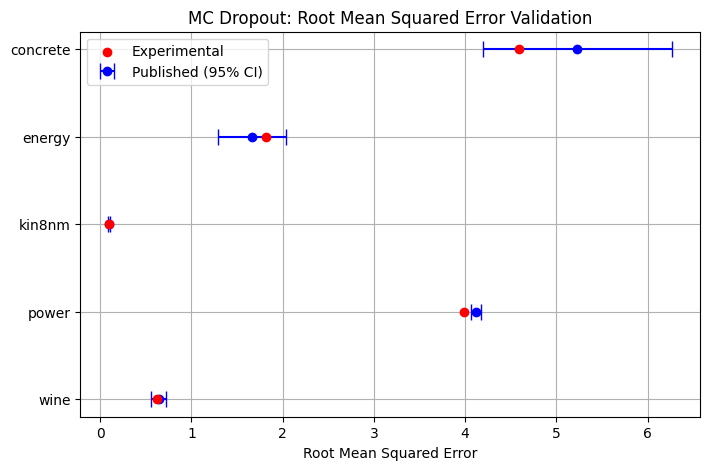
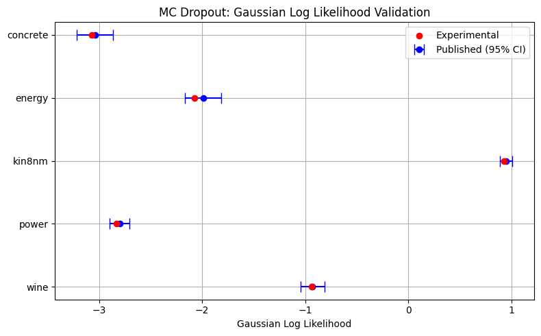
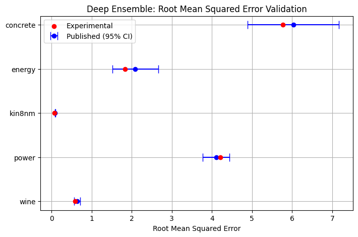
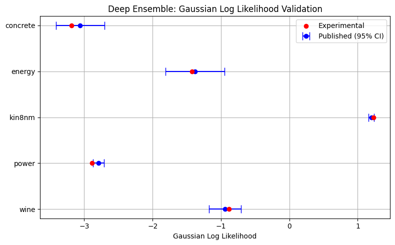

# Validation of Regressor Implementations 
This is an example script which replicates published results for the MC-dropout, Deep Ensemble, and Split Conformal Quantile Regression (CQR) methods. Additionally, average coverage is validated for the K-fold-CQR and normalized conformal ensemble methods. This script matches the experimental setup described in each of these papers using public datasets, runs one fit-predict trial, and verifies that the desired results land within the probable range reported in the published results. 

## Utility functions for running regressor tests:


```python
import numpy as np 
import torch 
from uqregressors.utils.torch_sklearn_utils import train_test_split
from uqregressors.tuning.tuning import tune_hyperparams, log_likelihood
from uqregressors.utils.logging import set_logging_config
from uqregressors.utils.file_manager import FileManager
from uqregressors.bayesian.dropout import MCDropoutRegressor
from uqregressors.bayesian.deep_ens import DeepEnsembleRegressor
from uqregressors.utils.data_loader import clean_dataset, validate_dataset
from uqregressors.metrics.metrics import compute_all_metrics
from uqregressors.utils.data_loader import load_unformatted_dataset
from uqregressors.conformal.cqr import ConformalQuantileRegressor
from uqregressors.conformal.k_fold_cqr import KFoldCQR
from uqregressors.conformal.conformal_ens import ConformalEnsRegressor
from pathlib import Path
from copy import deepcopy
import optuna
device = "cuda" if torch.cuda.is_available() else "cpu"

r_seed = 42
set_logging_config(print=True) # Disable logging for all future regressors for cleanliness
optuna.logging.set_verbosity(optuna.logging.WARNING) # Disable hyperparameter logging for cleanliness

def test_regressor(model, X, y, dataset_name, test_size, seed=None, 
                   tuning_epochs=None, param_space=None, scoring_fn=None, greater=None,
                   initial_params=None, n_trials=None, n_splits=1): 
    if seed is not None: 
        np.random.seed(seed)
        torch.manual_seed(seed)

    X, y = clean_dataset(X, y)
    validate_dataset(X, y, name=dataset_name)

    X_train, X_test, y_train, y_test = train_test_split(X, y, test_size=test_size, random_state=seed)

    # Hyperparameter Optimization: 
    if tuning_epochs is not None and param_space is not None: 
        epochs_copy = model.epochs
        model.epochs = deepcopy(tuning_epochs)
        opt_model, opt_score, study = tune_hyperparams(regressor=model, 
                                                        param_space=param_space,
                                                        X=X_train, 
                                                        y=y_train,
                                                        score_fn=scoring_fn, 
                                                        greater_is_better=greater,
                                                        initial_params=initial_params, 
                                                        n_trials=n_trials, 
                                                        n_splits=n_splits, 
                                                        verbose=False
                                                        )
        model = opt_model 
        model.epochs = epochs_copy 
        
    # Modify learning rate for deep ensembles on energy and kin8nm datasets: 
    if type(model) is DeepEnsembleRegressor: 
        print (type(model))
        if dataset_name in ["energy", "kin8nm"]: 
            print("Setting learning rate to 1e-2")
            model.learning_rate = 1e-2 

        else: 
            print ("Setting learning rate to 1e-1")
            model.learning_rate =1e-1

    model.fit(X_train, y_train)
    mean, lower, upper = model.predict(X_test)

    metrics = compute_all_metrics(mean, lower, upper, y_test, model.alpha)
    metrics["scale_factor"] = np.mean(np.abs(y)).astype(np.float64)

    return metrics 

def run_regressor_test(model, datasets, seed, filename, test_size, 
                       BASE_SAVE_DIR=Path.home()/".uqregressors", 
                       tuning_epochs=None, param_space=None, scoring_fn=None, greater=None, 
                       initial_params=None, n_trials=None, n_splits=1): 
    DATASET_PATH = Path.cwd().absolute() / "datasets"
    saved_results = []
    for name, file in datasets.items(): 
        print(f"\n Loading dataset: {name}")
        X, y = load_unformatted_dataset(DATASET_PATH / file)

        metrics = test_regressor(model, X, y, name, seed=seed, test_size=test_size, 
                                 tuning_epochs=tuning_epochs, param_space=param_space, 
                                 scoring_fn=scoring_fn, greater=greater, initial_params=initial_params, 
                                 n_trials=n_trials, n_splits=n_splits)
        print(metrics)

        fm = FileManager(BASE_SAVE_DIR)
        save_path = fm.save_model(model, name=name + "_" + filename, metrics=metrics)
        saved_results.append((model.__class__, name, save_path))
    return saved_results

def print_results(paths): 
    fm = FileManager()
    for cls, dataset_name, path in paths: 
        results = fm.load_model(cls, path=path, load_logs=False)
        print (f"Results for {dataset_name}")
        print(results["metrics"])
```

## Datasets 
A variety of datasets are chosen which match the datasets for which there are published results. Extremely large datasets, and those where there is ambiguity about which target is being predicted are omitted. 

Information about the datasets used is available in: [Hernández Lobato and Adams, 2015](https://arxiv.org/abs/1502.05336).


```python
datasets_bayesian = { 
    "concrete": "concrete.xls", 
    "energy": "energy_efficiency.xlsx", 
    "kin8nm": "kin8nm.arff", 
    "power": "power_plant.xlsx", 
    "wine": "winequality-red.csv", 
}

datasets_conformal = {
    #"concrete": "concrete.xls",
    "protein": "protein_structure.csv"
}
```


```python
# Download and load the UCI protein dataset directly from the repository
import pandas as pd
import numpy as np
import os
from uqregressors.conformal.cqr import ConformalQuantileRegressor
from uqregressors.tuning.tuning import interval_width
from uqregressors.metrics.metrics import compute_all_metrics
from uqregressors.utils.torch_sklearn_utils import train_test_split
import torch
import requests
from io import StringIO

# UCI Protein Structure Dataset URL (CSV format)
uci_url = "https://archive.ics.uci.edu/ml/machine-learning-databases/00265/CASP.csv"

# Download the dataset
response = requests.get(uci_url)
response.raise_for_status()
df = pd.read_csv(StringIO(response.text))

# Features and target
X = df.drop(columns=["RMSD"]).values
y = df["RMSD"].values

# Set up device and random seed
device = "cuda" if torch.cuda.is_available() else "cpu"
r_seed = 42

# Split data (80% train, 20% test)
X_train, X_test, y_train, y_test = train_test_split(X, y, test_size=0.2, random_state=r_seed)

# Set up CQR with recommended settings for strict Romano et al. replication
cqr = ConformalQuantileRegressor(
    hidden_sizes=[64, 64],
    cal_size=0.5,
    alpha=0.1,
    dropout=0.1,
    epochs=1000,
    batch_size=64,
    learning_rate=5e-4,
    optimizer_kwargs={"weight_decay": 1e-6},
    device=device,
    scale_data=False, # Data has already been scaled in preprocessing
    tau_lo=0.05,
    tau_hi=0.95,
    use_wandb=False,
    random_seed=r_seed
)

# Fit and evaluate
cqr.fit(X_train, y_train)
mean, lower, upper = cqr.predict(X_test)

metrics = compute_all_metrics(mean, lower, upper, y_test, cqr.alpha)
print("CQR metrics on UCI protein dataset (direct download):")
for k, v in metrics.items():
    print(f"{k}: {v}")
```

    [Logger-10928] epoch=0, train_loss=548309.75
    


    ---------------------------------------------------------------------------

    KeyboardInterrupt                         Traceback (most recent call last)

    Cell In[4], line 51
         33 cqr = ConformalQuantileRegressor(
         34     hidden_sizes=[64, 64],
         35     cal_size=0.5,
       (...)
         47     random_seed=r_seed
         48 )
         50 # Fit and evaluate
    ---> 51 cqr.fit(X_train, y_train)
         52 mean, lower, upper = cqr.predict(X_test)
         54 metrics = compute_all_metrics(mean, lower, upper, y_test, cqr.alpha)
    

    File D:\uqregressors\src\uqregressors\conformal\cqr.py:236, in ConformalQuantileRegressor.fit(self, X, y)
        234 for epoch in range(self.epochs):
        235     epoch_loss = 0.0
    --> 236     for xb, yb in dataloader: 
        237         optimizer.zero_grad()
        238         preds = self.model(xb)
    

    File c:\Users\arsha\AppData\Local\hatch\env\virtual\uqregressors\pe5T5b9S\uqregressors\lib\site-packages\torch\utils\data\dataloader.py:701, in _BaseDataLoaderIter.__next__(self)
        698 if self._sampler_iter is None:
        699     # TODO(https://github.com/pytorch/pytorch/issues/76750)
        700     self._reset()  # type: ignore[call-arg]
    --> 701 data = self._next_data()
        702 self._num_yielded += 1
        703 if (
        704     self._dataset_kind == _DatasetKind.Iterable
        705     and self._IterableDataset_len_called is not None
        706     and self._num_yielded > self._IterableDataset_len_called
        707 ):
    

    File c:\Users\arsha\AppData\Local\hatch\env\virtual\uqregressors\pe5T5b9S\uqregressors\lib\site-packages\torch\utils\data\dataloader.py:757, in _SingleProcessDataLoaderIter._next_data(self)
        755 def _next_data(self):
        756     index = self._next_index()  # may raise StopIteration
    --> 757     data = self._dataset_fetcher.fetch(index)  # may raise StopIteration
        758     if self._pin_memory:
        759         data = _utils.pin_memory.pin_memory(data, self._pin_memory_device)
    

    File c:\Users\arsha\AppData\Local\hatch\env\virtual\uqregressors\pe5T5b9S\uqregressors\lib\site-packages\torch\utils\data\_utils\fetch.py:55, in _MapDatasetFetcher.fetch(self, possibly_batched_index)
         53 else:
         54     data = self.dataset[possibly_batched_index]
    ---> 55 return self.collate_fn(data)
    

    File c:\Users\arsha\AppData\Local\hatch\env\virtual\uqregressors\pe5T5b9S\uqregressors\lib\site-packages\torch\utils\data\_utils\collate.py:398, in default_collate(batch)
        337 def default_collate(batch):
        338     r"""
        339     Take in a batch of data and put the elements within the batch into a tensor with an additional outer dimension - batch size.
        340 
       (...)
        396         >>> default_collate(batch)  # Handle `CustomType` automatically
        397     """
    --> 398     return collate(batch, collate_fn_map=default_collate_fn_map)
    

    File c:\Users\arsha\AppData\Local\hatch\env\virtual\uqregressors\pe5T5b9S\uqregressors\lib\site-packages\torch\utils\data\_utils\collate.py:211, in collate(batch, collate_fn_map)
        208 transposed = list(zip(*batch))  # It may be accessed twice, so we use a list.
        210 if isinstance(elem, tuple):
    --> 211     return [
        212         collate(samples, collate_fn_map=collate_fn_map)
        213         for samples in transposed
        214     ]  # Backwards compatibility.
        215 else:
        216     try:
    

    File c:\Users\arsha\AppData\Local\hatch\env\virtual\uqregressors\pe5T5b9S\uqregressors\lib\site-packages\torch\utils\data\_utils\collate.py:212, in <listcomp>(.0)
        208 transposed = list(zip(*batch))  # It may be accessed twice, so we use a list.
        210 if isinstance(elem, tuple):
        211     return [
    --> 212         collate(samples, collate_fn_map=collate_fn_map)
        213         for samples in transposed
        214     ]  # Backwards compatibility.
        215 else:
        216     try:
    

    File c:\Users\arsha\AppData\Local\hatch\env\virtual\uqregressors\pe5T5b9S\uqregressors\lib\site-packages\torch\utils\data\_utils\collate.py:155, in collate(batch, collate_fn_map)
        153 if collate_fn_map is not None:
        154     if elem_type in collate_fn_map:
    --> 155         return collate_fn_map[elem_type](batch, collate_fn_map=collate_fn_map)
        157     for collate_type in collate_fn_map:
        158         if isinstance(elem, collate_type):
    

    File c:\Users\arsha\AppData\Local\hatch\env\virtual\uqregressors\pe5T5b9S\uqregressors\lib\site-packages\torch\utils\data\_utils\collate.py:272, in collate_tensor_fn(batch, collate_fn_map)
        270     storage = elem._typed_storage()._new_shared(numel, device=elem.device)
        271     out = elem.new(storage).resize_(len(batch), *list(elem.size()))
    --> 272 return torch.stack(batch, 0, out=out)
    

    KeyboardInterrupt: 


```python
import matplotlib.pyplot as plt 
import numpy as np 

def plot_validation(pub, save_paths, name, metric_1, metric_2, metric_1_name, metric_2_name): 
    save_paths_dict = dict(zip([path[1] for path in save_paths], [(path[0], path[2]) for path in save_paths]))

    MCD_exp = {}
    fm = FileManager()
    for key, (RMSE, RMSE_std, LL, LL_std) in pub.items(): 
        MCD_exp[key] = fm.load_model(model_class=save_paths_dict[key][0], path=save_paths_dict[key][1])["metrics"]
        
    datasets = list(pub.keys())
    datasets.reverse()
    y_pos = np.arange(len(datasets))

    # Prepare RMSE and LL values
    pub_rmse = np.array([pub[d][0] for d in datasets])
    pub_rmse_err = np.array([1.96 * pub[d][1] for d in datasets])
    exp_rmse = np.array([MCD_exp[d][metric_1] for d in datasets])

    pub_ll = np.array([pub[d][2] for d in datasets])
    pub_ll_err = np.array([1.96 * pub[d][3] for d in datasets])
    if metric_2 is "nll_gaussian": 
        exp_ll = np.array([-MCD_exp[d][metric_2] for d in datasets])
    else: 
        exp_ll = np.array([MCD_exp[d][metric_2] for d in datasets])

    # Plot RMSE
    fig, ax = plt.subplots(figsize=(8, 5))
    ax.errorbar(pub_rmse, y_pos, xerr=pub_rmse_err, fmt='o', label='Published (95% CI)', color='blue', capsize=6)
    ax.scatter(exp_rmse, y_pos, color='red', label='Experimental', zorder=5)
    ax.set_yticks(y_pos)
    ax.set_yticklabels(datasets)
    ax.set_xlabel(metric_1_name)
    ax.set_title(f"{name}: {metric_1_name} Validation")
    ax.legend()
    ax.grid(True)

    # Plot Log Likelihood
    fig2, ax2 = plt.subplots(figsize=(8, 5))
    ax2.errorbar(pub_ll, y_pos, xerr=pub_ll_err, fmt='o', label='Published (95% CI)', color='blue', capsize=6)
    ax2.scatter(exp_ll, y_pos, color='red', label='Experimental', zorder=5)
    ax2.set_yticks(y_pos)
    ax2.set_yticklabels(datasets)
    ax2.set_xlabel(metric_2_name)
    ax2.set_title(f"{name}: {metric_2_name} Validation")
    ax2.legend()
    ax2.grid(True)

    plt.tight_layout()
    plt.show()
```

## MC dropout Regressor 
First, results are generated and compared to the results published in [Gal and Ghahramani, 2016](https://arxiv.org/pdf/1506.02142). As described in the paper, a single layer neural network with 50 hidden units is used with 0.05 dropout probability, and parameters optimized for 400 epochs with minibatch sizes of 32 on the Adam optimizer. Before training, the aleatoric uncertainty parameter, $\tau$, is estimated with 30 iterations of Bayesian Optimization with initial prior length scale 0.01. 


```python
from uqregressors.tuning.tuning import log_likelihood, interval_score


dropout = MCDropoutRegressor(
    hidden_sizes = [50], 
    dropout=0.05, 
    use_paper_weight_decay=True, 
    prior_length_scale=1e-2,
    alpha=0.05, 
    n_samples=100, 
    epochs=400, # Changed to 40 during hyperparameter tuning
    batch_size=32, 
    learning_rate=1e-3, 
    device=device, 
    use_wandb=False
)

# Hyperparameter Tuning: 
param_space = {
    "tau": lambda trial: trial.suggest_float("tau", 1e-2, 1e2, log=True)
}

MC_save_paths = run_regressor_test(dropout, datasets_bayesian, seed=r_seed, filename="dropout_validation", test_size=0.2, 
                   tuning_epochs=40, param_space=param_space, scoring_fn=log_likelihood, greater=True, n_trials=40)

print_results(MC_save_paths)
```

    
     Loading dataset: concrete
    Summary for: concrete dataset
    =============================
    Number of samples: 1030
    Number of features: 8
    Output shape: (1030, 1)
    Dataset validation passed.
    
    


      0%|          | 0/40 [00:00<?, ?it/s]


    {'rmse': np.float64(4.588262381833446), 'coverage': np.float64(0.9854368932038835), 'average_interval_width': np.float64(26.949054310622724), 'interval_score': np.float64(27.265795772515453), 'nll_gaussian': np.float64(3.0689444284791594), 'error_width_corr': np.float64(0.007090388758835557), 'RMSCD': np.float64(0.04183977645045489), 'RMSCD_under': 0.0, 'lowest_group_coverage': np.float64(0.95), 'scale_factor': np.float64(35.81783676147461)}
    Model and additional artifacts saved to: C:\Users\arsha\.uqregressors\models\concrete_dropout_validation
    
     Loading dataset: energy
    Summary for: energy dataset
    ===========================
    Number of samples: 768
    Number of features: 9
    Output shape: (768, 1)
    Dataset validation passed.
    
    


      0%|          | 0/40 [00:00<?, ?it/s]


    {'rmse': np.float64(1.8154151396435967), 'coverage': np.float64(0.9934640522875817), 'average_interval_width': np.float64(9.292824944639518), 'interval_score': np.float64(9.29605581869487), 'nll_gaussian': np.float64(2.0713367590672997), 'error_width_corr': np.float64(0.16627962506319155), 'RMSCD': np.float64(0.04772607021092122), 'RMSCD_under': np.float64(0.016666666666666607), 'lowest_group_coverage': np.float64(0.9333333333333333), 'scale_factor': np.float64(24.58776092529297)}
    Model and additional artifacts saved to: C:\Users\arsha\.uqregressors\models\energy_dropout_validation
    
     Loading dataset: kin8nm
    Summary for: kin8nm dataset
    ===========================
    Number of samples: 8192
    Number of features: 8
    Output shape: (8192, 1)
    Dataset validation passed.
    
    


      0%|          | 0/40 [00:00<?, ?it/s]


    {'rmse': np.float64(0.09964936284927994), 'coverage': np.float64(0.9352869352869353), 'average_interval_width': np.float64(0.36604641983797265), 'interval_score': np.float64(0.3774666080890412), 'nll_gaussian': np.float64(-0.9282787565591294), 'error_width_corr': np.float64(0.2727166245830174), 'RMSCD': np.float64(0.05378532742082101), 'RMSCD_under': np.float64(0.07309063821116123), 'lowest_group_coverage': np.float64(0.7987804878048781), 'scale_factor': np.float64(0.7142835259437561)}
    Model and additional artifacts saved to: C:\Users\arsha\.uqregressors\models\kin8nm_dropout_validation
    
     Loading dataset: power
    Summary for: power dataset
    ==========================
    Number of samples: 9568
    Number of features: 4
    Output shape: (9568, 1)
    Dataset validation passed.
    
    


      0%|          | 0/40 [00:00<?, ?it/s]


    {'rmse': np.float64(3.9932890859700856), 'coverage': np.float64(0.9200209095661265), 'average_interval_width': np.float64(13.52532780313766), 'interval_score': np.float64(14.21172234255546), 'nll_gaussian': np.float64(2.8291955522306482), 'error_width_corr': np.float64(0.007991256770224575), 'RMSCD': np.float64(0.046949003316637955), 'RMSCD_under': np.float64(0.05050914848738009), 'lowest_group_coverage': np.float64(0.8586387434554974), 'scale_factor': np.float64(454.3650207519531)}
    Model and additional artifacts saved to: C:\Users\arsha\.uqregressors\models\power_dropout_validation
    
     Loading dataset: wine
    Summary for: wine dataset
    =========================
    Number of samples: 1599
    Number of features: 11
    Output shape: (1599, 1)
    Dataset validation passed.
    
    


      0%|          | 0/40 [00:00<?, ?it/s]


    {'rmse': np.float64(0.6180300723606387), 'coverage': np.float64(0.9467084639498433), 'average_interval_width': np.float64(2.5444983434527644), 'interval_score': np.float64(2.615172450445289), 'nll_gaussian': np.float64(0.9388280746610236), 'error_width_corr': np.float64(0.10816658057447093), 'RMSCD': np.float64(0.0817773349908775), 'RMSCD_under': np.float64(0.13640703510951083), 'lowest_group_coverage': np.float64(0.71875), 'scale_factor': np.float64(5.636022567749023)}
    Model and additional artifacts saved to: C:\Users\arsha\.uqregressors\models\wine_dropout_validation
    
     Loading dataset: yacht
    Summary for: yacht dataset
    ==========================
    Number of samples: 308
    Number of features: 6
    Output shape: (308, 1)
    Dataset validation passed.
    
    


      0%|          | 0/40 [00:00<?, ?it/s]


    {'rmse': np.float64(5.890747898778732), 'coverage': np.float64(0.9836065573770492), 'average_interval_width': np.float64(27.95698383987927), 'interval_score': np.float64(28.290501446020407), 'nll_gaussian': np.float64(3.222766751055446), 'error_width_corr': np.float64(0.24478048855036813), 'RMSCD': np.float64(0.06009252125773318), 'RMSCD_under': np.float64(0.11666666666666659), 'lowest_group_coverage': np.float64(0.8333333333333334), 'scale_factor': np.float64(10.495357513427734)}
    Model and additional artifacts saved to: C:\Users\arsha\.uqregressors\models\yacht_dropout_validation
    Results for concrete
    {'rmse': 4.588262381833446, 'coverage': 0.9854368932038835, 'average_interval_width': 26.949054310622724, 'interval_score': 27.265795772515453, 'nll_gaussian': 3.0689444284791594, 'error_width_corr': 0.007090388758835557, 'RMSCD': 0.04183977645045489, 'RMSCD_under': 0.0, 'lowest_group_coverage': 0.95, 'scale_factor': 35.81783676147461}
    Results for energy
    {'rmse': 1.8154151396435967, 'coverage': 0.9934640522875817, 'average_interval_width': 9.292824944639518, 'interval_score': 9.29605581869487, 'nll_gaussian': 2.0713367590672997, 'error_width_corr': 0.16627962506319155, 'RMSCD': 0.04772607021092122, 'RMSCD_under': 0.016666666666666607, 'lowest_group_coverage': 0.9333333333333333, 'scale_factor': 24.58776092529297}
    Results for kin8nm
    {'rmse': 0.09964936284927994, 'coverage': 0.9352869352869353, 'average_interval_width': 0.36604641983797265, 'interval_score': 0.3774666080890412, 'nll_gaussian': -0.9282787565591294, 'error_width_corr': 0.2727166245830174, 'RMSCD': 0.05378532742082101, 'RMSCD_under': 0.07309063821116123, 'lowest_group_coverage': 0.7987804878048781, 'scale_factor': 0.7142835259437561}
    Results for power
    {'rmse': 3.9932890859700856, 'coverage': 0.9200209095661265, 'average_interval_width': 13.52532780313766, 'interval_score': 14.21172234255546, 'nll_gaussian': 2.8291955522306482, 'error_width_corr': 0.007991256770224575, 'RMSCD': 0.046949003316637955, 'RMSCD_under': 0.05050914848738009, 'lowest_group_coverage': 0.8586387434554974, 'scale_factor': 454.3650207519531}
    Results for wine
    {'rmse': 0.6180300723606387, 'coverage': 0.9467084639498433, 'average_interval_width': 2.5444983434527644, 'interval_score': 2.615172450445289, 'nll_gaussian': 0.9388280746610236, 'error_width_corr': 0.10816658057447093, 'RMSCD': 0.0817773349908775, 'RMSCD_under': 0.13640703510951083, 'lowest_group_coverage': 0.71875, 'scale_factor': 5.636022567749023}
    Results for yacht
    {'rmse': 5.890747898778732, 'coverage': 0.9836065573770492, 'average_interval_width': 27.95698383987927, 'interval_score': 28.290501446020407, 'nll_gaussian': 3.222766751055446, 'error_width_corr': 0.24478048855036813, 'RMSCD': 0.06009252125773318, 'RMSCD_under': 0.11666666666666659, 'lowest_group_coverage': 0.8333333333333334, 'scale_factor': 10.495357513427734}
    


```python
MCD_pub = {
    "concrete": [5.23, 0.53, -3.04, 0.09], 
    "energy": [1.66, 0.19, -1.99, 0.09], 
    "kin8nm": [0.1, 0.005, 0.95, 0.03], 
    "power": [4.12, 0.03, -2.80, 0.05], 
    "wine": [0.64, 0.04, -0.93, 0.06]
}
plot_validation(MCD_pub, MC_save_paths, "MC Dropout", "rmse", "nll_gaussian", "Root Mean Squared Error", "Gaussian Log Likelihood")
```


    

    


    

    


## Deep Ensemble Regressor 
Next, validation is performed for the Deep Ensemble Regressor as in [Lakshminarayanan et. al. 2017](https://arxiv.org/pdf/1612.01474). A very similar experimental setup as that of MC Dropout is carried out using a Deep Ensemble with 5 estimators, each a single layer neural network with 50 hidden units, a batch size of 100, and a learning rate of either 1e-1 or 1e-2 on the Adam optimizer. 


```python
deep_ens = DeepEnsembleRegressor(
    n_estimators=5, 
    hidden_sizes=[50], 
    n_jobs=2, 
    alpha=0.05, 
    batch_size=100, 
    learning_rate=1e-1, #Changed to 1e-2 for energy and kin8nm datasets 
    epochs=40, 
    device=device, 
    scale_data=True, 
    use_wandb=False
)

deep_ens_save_paths = run_regressor_test(deep_ens, datasets_bayesian, seed=r_seed, filename="deep_ens_validation", test_size=0.1)
```

    
     Loading dataset: concrete
    Summary for: concrete dataset
    =============================
    Number of samples: 1030
    Number of features: 8
    Output shape: (1030, 1)
    Dataset validation passed.
    
    <class 'uqregressors.bayesian.deep_ens.DeepEnsembleRegressor'>
    Setting learning rate to 1e-1
    {'rmse': np.float64(5.770383232717203), 'coverage': np.float64(0.9611650485436893), 'average_interval_width': np.float64(29.67108839460947), 'interval_score': np.float64(30.34469082286057), 'nll_gaussian': np.float64(3.189734210487027), 'error_width_corr': np.float64(0.3009757177966646), 'RMSCD': np.float64(0.05), 'RMSCD_under': np.float64(0.04999999999999993), 'lowest_group_coverage': np.float64(0.9), 'scale_factor': np.float64(35.81783676147461)}
    Model and additional artifacts saved to: C:\Users\arsha\.uqregressors\models\concrete_deep_ens_validation
    
     Loading dataset: energy
    Summary for: energy dataset
    ===========================
    Number of samples: 768
    Number of features: 9
    Output shape: (768, 1)
    Dataset validation passed.
    
    <class 'uqregressors.bayesian.deep_ens.DeepEnsembleRegressor'>
    Setting learning rate to 1e-2
    {'rmse': np.float64(1.8330757524077372), 'coverage': np.float64(0.9868421052631579), 'average_interval_width': np.float64(5.938774146531758), 'interval_score': np.float64(6.002311242254157), 'nll_gaussian': np.float64(1.427535904890559), 'error_width_corr': np.float64(0.8198043930424604), 'RMSCD': np.float64(0.055787497685047566), 'RMSCD_under': np.float64(0.09285714285714286), 'lowest_group_coverage': np.float64(0.8571428571428571), 'scale_factor': np.float64(24.58776092529297)}
    Model and additional artifacts saved to: C:\Users\arsha\.uqregressors\models\energy_deep_ens_validation
    
     Loading dataset: kin8nm
    Summary for: kin8nm dataset
    ===========================
    Number of samples: 8192
    Number of features: 8
    Output shape: (8192, 1)
    Dataset validation passed.
    
    <class 'uqregressors.bayesian.deep_ens.DeepEnsembleRegressor'>
    Setting learning rate to 1e-2
    {'rmse': np.float64(0.0788281170158205), 'coverage': np.float64(0.9706959706959707), 'average_interval_width': np.float64(0.32608041389230114), 'interval_score': np.float64(0.32919911885581754), 'nll_gaussian': np.float64(-1.2335491566098846), 'error_width_corr': np.float64(0.4636986809317498), 'RMSCD': np.float64(0.027056578415295546), 'RMSCD_under': np.float64(0.01097560975609757), 'lowest_group_coverage': np.float64(0.9390243902439024), 'scale_factor': np.float64(0.7142835259437561)}
    Model and additional artifacts saved to: C:\Users\arsha\.uqregressors\models\kin8nm_deep_ens_validation
    
     Loading dataset: power
    Summary for: power dataset
    ==========================
    Number of samples: 9568
    Number of features: 4
    Output shape: (9568, 1)
    Dataset validation passed.
    
    <class 'uqregressors.bayesian.deep_ens.DeepEnsembleRegressor'>
    Setting learning rate to 1e-1
    {'rmse': np.float64(4.216831149786951), 'coverage': np.float64(0.9832635983263598), 'average_interval_width': np.float64(19.94458879287273), 'interval_score': np.float64(20.137508535983674), 'nll_gaussian': np.float64(2.8896741144974745), 'error_width_corr': np.float64(0.046805562480283815), 'RMSCD': np.float64(0.038222243583887504), 'RMSCD_under': np.float64(0.012499999999999956), 'lowest_group_coverage': np.float64(0.9375), 'scale_factor': np.float64(454.3650207519531)}
    Model and additional artifacts saved to: C:\Users\arsha\.uqregressors\models\power_deep_ens_validation
    
     Loading dataset: wine
    Summary for: wine dataset
    =========================
    Number of samples: 1599
    Number of features: 11
    Output shape: (1599, 1)
    Dataset validation passed.
    
    <class 'uqregressors.bayesian.deep_ens.DeepEnsembleRegressor'>
    Setting learning rate to 1e-1
    {'rmse': np.float64(0.5934430336178466), 'coverage': np.float64(0.9811320754716981), 'average_interval_width': np.float64(3.045788622502261), 'interval_score': np.float64(3.0620586782131554), 'nll_gaussian': np.float64(0.8835849316631684), 'error_width_corr': np.float64(0.3834328167957495), 'RMSCD': np.float64(0.052058327330451626), 'RMSCD_under': np.float64(0.05958479019197949), 'lowest_group_coverage': np.float64(0.8666666666666667), 'scale_factor': np.float64(5.636022567749023)}
    Model and additional artifacts saved to: C:\Users\arsha\.uqregressors\models\wine_deep_ens_validation
    
     Loading dataset: yacht
    Summary for: yacht dataset
    ==========================
    Number of samples: 308
    Number of features: 6
    Output shape: (308, 1)
    Dataset validation passed.
    
    <class 'uqregressors.bayesian.deep_ens.DeepEnsembleRegressor'>
    Setting learning rate to 1e-1
    {'rmse': np.float64(2.5566301209425704), 'coverage': np.float64(1.0), 'average_interval_width': np.float64(35.14807030359904), 'interval_score': np.float64(35.14807030359904), 'nll_gaussian': np.float64(3.0527281224615637), 'error_width_corr': np.float64(0.6870108965155924), 'RMSCD': np.float64(0.05000000000000005), 'RMSCD_under': 0.0, 'lowest_group_coverage': np.float64(1.0), 'scale_factor': np.float64(10.495357513427734)}
    Model and additional artifacts saved to: C:\Users\arsha\.uqregressors\models\yacht_deep_ens_validation
    


```python
DE_pub = {
    "concrete": [6.03, 0.58, -3.06, 0.18], 
    "energy": [2.09, 0.29, -1.38, 0.22], 
    "kin8nm": [0.09, 0.005, 1.2, 0.02], 
    "power": [4.11, 0.17, -2.79, 0.04], 
    "wine": [0.64, 0.04, -0.94, 0.12]
}
plot_validation(DE_pub, deep_ens_save_paths, "Deep Ensemble", "rmse", "nll_gaussian", "Root Mean Squared Error", "Gaussian Log Likelihood")
```


    

    


    

    


## Split Conformal Prediction
Next, split conformal prediction is validated according to the results in [Romano et. al. 2019](https://arxiv.org/abs/1905.03222). A split conformal quantile regressor with half of the training data in the calibration set, two hidden layers of 64 neurons each, a 0.1 dropout probability, and trained for 1000 epochs with a batch size of 64 using the standard quantile loss function is implemented as in the paper, and compared to the published results. 


```python
from uqregressors.tuning.tuning import interval_width
device = "cuda"

cqr = ConformalQuantileRegressor(
    hidden_sizes=[64, 64], 
    cal_size = 0.5, 
    alpha=0.1, 
    dropout=0.1, 
    epochs=1000, 
    batch_size=64, 
    learning_rate=5e-4, 
    optimizer_kwargs = {"weight_decay": 1e-6}, 
    device=device, 
    scale_data=True, 
    use_wandb=False
)

param_space = {
    "tau_lo": lambda trial: trial.suggest_float("tau_lo", 0.03, 0.1),
    "tau_hi": lambda trial: trial.suggest_float("tau_hi", 0.9, 0.97) 
}

cqr_save_paths = run_regressor_test(cqr, datasets_conformal, seed=r_seed, filename="cqr_validation", test_size=0.2,
                                    tuning_epochs=500, param_space=param_space, scoring_fn=interval_width, greater=False, 
                                    n_trials=15, n_splits=2)
```

    
     Loading dataset: protein
    Summary for: protein dataset
    ============================
    Number of samples: 45730
    Number of features: 9
    Output shape: (45730, 1)
    Dataset validation passed.
    
    


      0%|          | 0/15 [00:00<?, ?it/s]


    [Logger-2332] epoch=0, train_loss=29.375070571899414
    [Logger-2332] epoch=25, train_loss=9.744149208068848
    [Logger-2332] epoch=50, train_loss=9.38615608215332
    [Logger-2332] epoch=75, train_loss=9.169032096862793
    [Logger-2332] epoch=100, train_loss=8.98993968963623
    [Logger-2332] epoch=125, train_loss=8.834425926208496
    [Logger-2332] epoch=150, train_loss=8.718498229980469
    [Logger-2332] epoch=175, train_loss=8.652233123779297
    [Logger-2332] epoch=200, train_loss=8.500887870788574
    [Logger-2332] epoch=225, train_loss=8.458940505981445
    [Logger-2332] epoch=250, train_loss=8.410343170166016
    [Logger-2332] epoch=275, train_loss=8.324126243591309
    [Logger-2332] epoch=300, train_loss=8.2850341796875
    [Logger-2332] epoch=325, train_loss=8.253741264343262
    [Logger-2332] epoch=350, train_loss=8.246026992797852
    [Logger-2332] epoch=375, train_loss=8.144327163696289
    [Logger-2332] epoch=400, train_loss=8.116179466247559
    [Logger-2332] epoch=425, train_loss=8.112787246704102
    [Logger-2332] epoch=450, train_loss=8.065896034240723
    [Logger-2332] epoch=475, train_loss=8.016290664672852
    [Logger-2332] epoch=0, train_loss=28.99945640563965
    [Logger-2332] epoch=25, train_loss=9.702751159667969
    [Logger-2332] epoch=50, train_loss=9.39040756225586
    [Logger-2332] epoch=75, train_loss=9.144784927368164
    [Logger-2332] epoch=100, train_loss=8.988312721252441
    [Logger-2332] epoch=125, train_loss=8.83963394165039
    [Logger-2332] epoch=150, train_loss=8.747838973999023
    [Logger-2332] epoch=175, train_loss=8.625875473022461
    [Logger-2332] epoch=200, train_loss=8.498321533203125
    [Logger-2332] epoch=225, train_loss=8.484182357788086
    [Logger-2332] epoch=250, train_loss=8.363410949707031
    [Logger-2332] epoch=275, train_loss=8.296144485473633
    [Logger-2332] epoch=300, train_loss=8.26213550567627
    [Logger-2332] epoch=325, train_loss=8.238513946533203
    [Logger-2332] epoch=350, train_loss=8.179627418518066
    [Logger-2332] epoch=375, train_loss=8.138306617736816
    [Logger-2332] epoch=400, train_loss=8.13083267211914
    [Logger-2332] epoch=425, train_loss=8.055790901184082
    [Logger-2332] epoch=450, train_loss=8.061159133911133
    [Logger-2332] epoch=475, train_loss=7.982257843017578
    [Logger-2332] epoch=0, train_loss=21.743619918823242
    [Logger-2332] epoch=25, train_loss=9.756818771362305
    [Logger-2332] epoch=50, train_loss=9.495168685913086
    [Logger-2332] epoch=75, train_loss=9.237393379211426
    [Logger-2332] epoch=100, train_loss=9.116772651672363
    [Logger-2332] epoch=125, train_loss=8.966804504394531
    [Logger-2332] epoch=150, train_loss=8.853650093078613
    [Logger-2332] epoch=175, train_loss=8.738748550415039
    [Logger-2332] epoch=200, train_loss=8.705883026123047
    [Logger-2332] epoch=225, train_loss=8.647501945495605
    [Logger-2332] epoch=250, train_loss=8.594027519226074
    [Logger-2332] epoch=275, train_loss=8.541520118713379
    [Logger-2332] epoch=300, train_loss=8.453348159790039
    [Logger-2332] epoch=325, train_loss=8.451201438903809
    [Logger-2332] epoch=350, train_loss=8.369195938110352
    [Logger-2332] epoch=375, train_loss=8.36515998840332
    [Logger-2332] epoch=400, train_loss=8.344621658325195
    [Logger-2332] epoch=425, train_loss=8.290480613708496
    [Logger-2332] epoch=450, train_loss=8.266529083251953
    [Logger-2332] epoch=475, train_loss=8.244068145751953
    [Logger-2332] epoch=0, train_loss=23.85333251953125
    [Logger-2332] epoch=25, train_loss=9.67967414855957
    [Logger-2332] epoch=50, train_loss=9.22018051147461
    [Logger-2332] epoch=75, train_loss=9.035280227661133
    [Logger-2332] epoch=100, train_loss=8.874486923217773
    [Logger-2332] epoch=125, train_loss=8.752416610717773
    [Logger-2332] epoch=150, train_loss=8.632627487182617
    [Logger-2332] epoch=175, train_loss=8.551595687866211
    [Logger-2332] epoch=200, train_loss=8.408296585083008
    [Logger-2332] epoch=225, train_loss=8.392633438110352
    [Logger-2332] epoch=250, train_loss=8.33920955657959
    [Logger-2332] epoch=275, train_loss=8.258991241455078
    [Logger-2332] epoch=300, train_loss=8.236822128295898
    [Logger-2332] epoch=325, train_loss=8.169498443603516
    [Logger-2332] epoch=350, train_loss=8.107625007629395
    [Logger-2332] epoch=375, train_loss=8.059768676757812
    [Logger-2332] epoch=400, train_loss=8.041999816894531
    [Logger-2332] epoch=425, train_loss=8.017857551574707
    [Logger-2332] epoch=450, train_loss=7.966947078704834
    [Logger-2332] epoch=475, train_loss=7.9314985275268555
    [Logger-2332] epoch=0, train_loss=30.965051651000977
    [Logger-2332] epoch=25, train_loss=9.867982864379883
    [Logger-2332] epoch=50, train_loss=9.423014640808105
    [Logger-2332] epoch=75, train_loss=9.163304328918457
    [Logger-2332] epoch=100, train_loss=8.976810455322266
    [Logger-2332] epoch=125, train_loss=8.841475486755371
    [Logger-2332] epoch=150, train_loss=8.706297874450684
    [Logger-2332] epoch=175, train_loss=8.646299362182617
    [Logger-2332] epoch=200, train_loss=8.578177452087402
    [Logger-2332] epoch=225, train_loss=8.443105697631836
    [Logger-2332] epoch=250, train_loss=8.41368579864502
    [Logger-2332] epoch=275, train_loss=8.372315406799316
    [Logger-2332] epoch=300, train_loss=8.34144115447998
    [Logger-2332] epoch=325, train_loss=8.266715049743652
    [Logger-2332] epoch=350, train_loss=8.202081680297852
    [Logger-2332] epoch=375, train_loss=8.19605541229248
    [Logger-2332] epoch=400, train_loss=8.164142608642578
    [Logger-2332] epoch=425, train_loss=8.100774765014648
    [Logger-2332] epoch=450, train_loss=8.11131477355957
    [Logger-2332] epoch=475, train_loss=8.078055381774902
    [Logger-2332] epoch=0, train_loss=25.351341247558594
    [Logger-2332] epoch=25, train_loss=9.715465545654297
    [Logger-2332] epoch=50, train_loss=9.354594230651855
    [Logger-2332] epoch=75, train_loss=9.061347007751465
    [Logger-2332] epoch=100, train_loss=8.912408828735352
    [Logger-2332] epoch=125, train_loss=8.742012977600098
    [Logger-2332] epoch=150, train_loss=8.588774681091309
    [Logger-2332] epoch=175, train_loss=8.579898834228516
    [Logger-2332] epoch=200, train_loss=8.508382797241211
    [Logger-2332] epoch=225, train_loss=8.43670654296875
    [Logger-2332] epoch=250, train_loss=8.38148021697998
    [Logger-2332] epoch=275, train_loss=8.30417251586914
    [Logger-2332] epoch=300, train_loss=8.3329496383667
    [Logger-2332] epoch=325, train_loss=8.237540245056152
    [Logger-2332] epoch=350, train_loss=8.247983932495117
    [Logger-2332] epoch=375, train_loss=8.185037612915039
    [Logger-2332] epoch=400, train_loss=8.15247631072998
    [Logger-2332] epoch=425, train_loss=8.172115325927734
    [Logger-2332] epoch=450, train_loss=8.069719314575195
    [Logger-2332] epoch=475, train_loss=8.076773643493652
    [Logger-2332] epoch=0, train_loss=28.985855102539062
    [Logger-2332] epoch=25, train_loss=9.82905387878418
    [Logger-2332] epoch=50, train_loss=9.406783103942871
    [Logger-2332] epoch=75, train_loss=9.143854141235352
    [Logger-2332] epoch=100, train_loss=9.000253677368164
    [Logger-2332] epoch=125, train_loss=8.871625900268555
    [Logger-2332] epoch=150, train_loss=8.740560531616211
    [Logger-2332] epoch=175, train_loss=8.66944694519043
    [Logger-2332] epoch=200, train_loss=8.57290267944336
    [Logger-2332] epoch=225, train_loss=8.48755931854248
    [Logger-2332] epoch=250, train_loss=8.423521041870117
    [Logger-2332] epoch=275, train_loss=8.415081977844238
    [Logger-2332] epoch=300, train_loss=8.361907958984375
    [Logger-2332] epoch=325, train_loss=8.323563575744629
    [Logger-2332] epoch=350, train_loss=8.334027290344238
    [Logger-2332] epoch=375, train_loss=8.228656768798828
    [Logger-2332] epoch=400, train_loss=8.170451164245605
    [Logger-2332] epoch=425, train_loss=8.220837593078613
    [Logger-2332] epoch=450, train_loss=8.16330623626709
    [Logger-2332] epoch=475, train_loss=8.115893363952637
    [Logger-2332] epoch=0, train_loss=25.381765365600586
    [Logger-2332] epoch=25, train_loss=9.724717140197754
    [Logger-2332] epoch=50, train_loss=9.323055267333984
    [Logger-2332] epoch=75, train_loss=9.024101257324219
    [Logger-2332] epoch=100, train_loss=8.841089248657227
    [Logger-2332] epoch=125, train_loss=8.723505020141602
    [Logger-2332] epoch=150, train_loss=8.586636543273926
    [Logger-2332] epoch=175, train_loss=8.483159065246582
    [Logger-2332] epoch=200, train_loss=8.396596908569336
    [Logger-2332] epoch=225, train_loss=8.391630172729492
    [Logger-2332] epoch=250, train_loss=8.34841251373291
    [Logger-2332] epoch=275, train_loss=8.255956649780273
    [Logger-2332] epoch=300, train_loss=8.238265991210938
    [Logger-2332] epoch=325, train_loss=8.21438217163086
    [Logger-2332] epoch=350, train_loss=8.215248107910156
    [Logger-2332] epoch=375, train_loss=8.16171932220459
    [Logger-2332] epoch=400, train_loss=8.14001750946045
    [Logger-2332] epoch=425, train_loss=8.079752922058105
    [Logger-2332] epoch=450, train_loss=8.042325019836426
    [Logger-2332] epoch=475, train_loss=8.020655632019043
    [Logger-2332] epoch=0, train_loss=25.433238983154297
    [Logger-2332] epoch=25, train_loss=9.828103065490723
    [Logger-2332] epoch=50, train_loss=9.45897102355957
    [Logger-2332] epoch=75, train_loss=9.212783813476562
    [Logger-2332] epoch=100, train_loss=9.083527565002441
    [Logger-2332] epoch=125, train_loss=8.908280372619629
    [Logger-2332] epoch=150, train_loss=8.799910545349121
    [Logger-2332] epoch=175, train_loss=8.698760032653809
    [Logger-2332] epoch=200, train_loss=8.719054222106934
    [Logger-2332] epoch=225, train_loss=8.579033851623535
    [Logger-2332] epoch=250, train_loss=8.510642051696777
    [Logger-2332] epoch=275, train_loss=8.4835205078125
    [Logger-2332] epoch=300, train_loss=8.421502113342285
    [Logger-2332] epoch=325, train_loss=8.40420150756836
    [Logger-2332] epoch=350, train_loss=8.341649055480957
    [Logger-2332] epoch=375, train_loss=8.341312408447266
    [Logger-2332] epoch=400, train_loss=8.31273365020752
    [Logger-2332] epoch=425, train_loss=8.266759872436523
    [Logger-2332] epoch=450, train_loss=8.237064361572266
    [Logger-2332] epoch=475, train_loss=8.22465705871582
    [Logger-2332] epoch=0, train_loss=26.13536834716797
    [Logger-2332] epoch=25, train_loss=9.643838882446289
    [Logger-2332] epoch=50, train_loss=9.264203071594238
    [Logger-2332] epoch=75, train_loss=9.138814926147461
    [Logger-2332] epoch=100, train_loss=9.003543853759766
    [Logger-2332] epoch=125, train_loss=8.817255020141602
    [Logger-2332] epoch=150, train_loss=8.650097846984863
    [Logger-2332] epoch=175, train_loss=8.623048782348633
    [Logger-2332] epoch=200, train_loss=8.5339937210083
    [Logger-2332] epoch=225, train_loss=8.458306312561035
    [Logger-2332] epoch=250, train_loss=8.343194007873535
    [Logger-2332] epoch=275, train_loss=8.314433097839355
    [Logger-2332] epoch=300, train_loss=8.355731964111328
    [Logger-2332] epoch=325, train_loss=8.208158493041992
    [Logger-2332] epoch=350, train_loss=8.273097038269043
    [Logger-2332] epoch=375, train_loss=8.212766647338867
    [Logger-2332] epoch=400, train_loss=8.146636962890625
    [Logger-2332] epoch=425, train_loss=8.116559028625488
    [Logger-2332] epoch=450, train_loss=8.089767456054688
    [Logger-2332] epoch=475, train_loss=8.028554916381836
    [Logger-2332] epoch=0, train_loss=24.85329818725586
    [Logger-2332] epoch=25, train_loss=9.857905387878418
    [Logger-2332] epoch=50, train_loss=9.479016304016113
    [Logger-2332] epoch=75, train_loss=9.16443920135498
    [Logger-2332] epoch=100, train_loss=9.012334823608398
    [Logger-2332] epoch=125, train_loss=8.869210243225098
    [Logger-2332] epoch=150, train_loss=8.730890274047852
    [Logger-2332] epoch=175, train_loss=8.627687454223633
    [Logger-2332] epoch=200, train_loss=8.54736328125
    [Logger-2332] epoch=225, train_loss=8.512877464294434
    [Logger-2332] epoch=250, train_loss=8.396883964538574
    [Logger-2332] epoch=275, train_loss=8.336238861083984
    [Logger-2332] epoch=300, train_loss=8.2761812210083
    [Logger-2332] epoch=325, train_loss=8.237878799438477
    [Logger-2332] epoch=350, train_loss=8.217728614807129
    [Logger-2332] epoch=375, train_loss=8.20114803314209
    [Logger-2332] epoch=400, train_loss=8.103974342346191
    [Logger-2332] epoch=425, train_loss=8.049907684326172
    [Logger-2332] epoch=450, train_loss=8.061111450195312
    [Logger-2332] epoch=475, train_loss=8.11071491241455
    [Logger-2332] epoch=0, train_loss=22.846012115478516
    [Logger-2332] epoch=25, train_loss=9.667750358581543
    [Logger-2332] epoch=50, train_loss=9.298715591430664
    [Logger-2332] epoch=75, train_loss=9.039600372314453
    [Logger-2332] epoch=100, train_loss=8.907553672790527
    [Logger-2332] epoch=125, train_loss=8.805466651916504
    [Logger-2332] epoch=150, train_loss=8.700052261352539
    [Logger-2332] epoch=175, train_loss=8.655731201171875
    [Logger-2332] epoch=200, train_loss=8.558846473693848
    [Logger-2332] epoch=225, train_loss=8.487324714660645
    [Logger-2332] epoch=250, train_loss=8.404343605041504
    [Logger-2332] epoch=275, train_loss=8.358765602111816
    [Logger-2332] epoch=300, train_loss=8.376086235046387
    [Logger-2332] epoch=325, train_loss=8.296182632446289
    [Logger-2332] epoch=350, train_loss=8.303356170654297
    [Logger-2332] epoch=375, train_loss=8.191790580749512
    [Logger-2332] epoch=400, train_loss=8.138001441955566
    [Logger-2332] epoch=425, train_loss=8.128191947937012
    [Logger-2332] epoch=450, train_loss=8.176806449890137
    [Logger-2332] epoch=475, train_loss=8.033897399902344
    [Logger-2332] epoch=0, train_loss=24.41439437866211
    [Logger-2332] epoch=25, train_loss=9.878921508789062
    [Logger-2332] epoch=50, train_loss=9.52763557434082
    [Logger-2332] epoch=75, train_loss=9.314407348632812
    [Logger-2332] epoch=100, train_loss=9.072358131408691
    [Logger-2332] epoch=125, train_loss=8.951018333435059
    [Logger-2332] epoch=150, train_loss=8.829333305358887
    [Logger-2332] epoch=175, train_loss=8.740743637084961
    [Logger-2332] epoch=200, train_loss=8.642380714416504
    [Logger-2332] epoch=225, train_loss=8.596789360046387
    [Logger-2332] epoch=250, train_loss=8.578654289245605
    [Logger-2332] epoch=275, train_loss=8.447479248046875
    [Logger-2332] epoch=300, train_loss=8.467844009399414
    [Logger-2332] epoch=325, train_loss=8.379986763000488
    [Logger-2332] epoch=350, train_loss=8.347367286682129
    [Logger-2332] epoch=375, train_loss=8.38472843170166
    [Logger-2332] epoch=400, train_loss=8.2888822555542
    [Logger-2332] epoch=425, train_loss=8.260061264038086
    [Logger-2332] epoch=450, train_loss=8.215639114379883
    [Logger-2332] epoch=475, train_loss=8.168604850769043
    [Logger-2332] epoch=0, train_loss=21.219078063964844
    [Logger-2332] epoch=25, train_loss=9.65192699432373
    [Logger-2332] epoch=50, train_loss=9.239916801452637
    [Logger-2332] epoch=75, train_loss=9.024106979370117
    [Logger-2332] epoch=100, train_loss=8.811259269714355
    [Logger-2332] epoch=125, train_loss=8.74992561340332
    [Logger-2332] epoch=150, train_loss=8.6215181350708
    [Logger-2332] epoch=175, train_loss=8.54596996307373
    [Logger-2332] epoch=200, train_loss=8.462732315063477
    [Logger-2332] epoch=225, train_loss=8.424379348754883
    [Logger-2332] epoch=250, train_loss=8.37240219116211
    [Logger-2332] epoch=275, train_loss=8.262321472167969
    [Logger-2332] epoch=300, train_loss=8.259323120117188
    [Logger-2332] epoch=325, train_loss=8.1970853805542
    [Logger-2332] epoch=350, train_loss=8.182483673095703
    [Logger-2332] epoch=375, train_loss=8.1442232131958
    [Logger-2332] epoch=400, train_loss=8.073570251464844
    [Logger-2332] epoch=425, train_loss=8.066442489624023
    [Logger-2332] epoch=450, train_loss=8.061058044433594
    [Logger-2332] epoch=475, train_loss=8.022663116455078
    [Logger-2332] epoch=0, train_loss=28.036100387573242
    [Logger-2332] epoch=25, train_loss=9.713247299194336
    [Logger-2332] epoch=50, train_loss=9.337773323059082
    [Logger-2332] epoch=75, train_loss=9.048408508300781
    [Logger-2332] epoch=100, train_loss=8.913992881774902
    [Logger-2332] epoch=125, train_loss=8.7303466796875
    [Logger-2332] epoch=150, train_loss=8.62677001953125
    [Logger-2332] epoch=175, train_loss=8.516219139099121
    [Logger-2332] epoch=200, train_loss=8.481104850769043
    [Logger-2332] epoch=225, train_loss=8.400029182434082
    [Logger-2332] epoch=250, train_loss=8.36473560333252
    [Logger-2332] epoch=275, train_loss=8.244401931762695
    [Logger-2332] epoch=300, train_loss=8.230925559997559
    [Logger-2332] epoch=325, train_loss=8.20569896697998
    [Logger-2332] epoch=350, train_loss=8.174965858459473
    [Logger-2332] epoch=375, train_loss=8.091334342956543
    [Logger-2332] epoch=400, train_loss=8.124144554138184
    [Logger-2332] epoch=425, train_loss=8.051892280578613
    [Logger-2332] epoch=450, train_loss=8.041899681091309
    [Logger-2332] epoch=475, train_loss=8.060572624206543
    [Logger-2332] epoch=0, train_loss=26.693227767944336
    [Logger-2332] epoch=25, train_loss=9.747749328613281
    [Logger-2332] epoch=50, train_loss=9.28681755065918
    [Logger-2332] epoch=75, train_loss=9.089856147766113
    [Logger-2332] epoch=100, train_loss=8.936393737792969
    [Logger-2332] epoch=125, train_loss=8.845090866088867
    [Logger-2332] epoch=150, train_loss=8.664548873901367
    [Logger-2332] epoch=175, train_loss=8.614232063293457
    [Logger-2332] epoch=200, train_loss=8.509937286376953
    [Logger-2332] epoch=225, train_loss=8.440327644348145
    [Logger-2332] epoch=250, train_loss=8.429250717163086
    [Logger-2332] epoch=275, train_loss=8.36584186553955
    [Logger-2332] epoch=300, train_loss=8.313427925109863
    [Logger-2332] epoch=325, train_loss=8.25441837310791
    [Logger-2332] epoch=350, train_loss=8.228504180908203
    [Logger-2332] epoch=375, train_loss=8.205724716186523
    [Logger-2332] epoch=400, train_loss=8.1420316696167
    [Logger-2332] epoch=425, train_loss=8.07325553894043
    [Logger-2332] epoch=450, train_loss=8.11557674407959
    [Logger-2332] epoch=475, train_loss=8.105277061462402
    [Logger-2332] epoch=0, train_loss=22.081809997558594
    [Logger-2332] epoch=25, train_loss=9.735010147094727
    [Logger-2332] epoch=50, train_loss=9.333816528320312
    [Logger-2332] epoch=75, train_loss=9.168340682983398
    [Logger-2332] epoch=100, train_loss=8.9621000289917
    [Logger-2332] epoch=125, train_loss=8.844866752624512
    [Logger-2332] epoch=150, train_loss=8.75495433807373
    [Logger-2332] epoch=175, train_loss=8.672151565551758
    [Logger-2332] epoch=200, train_loss=8.56343936920166
    [Logger-2332] epoch=225, train_loss=8.582661628723145
    [Logger-2332] epoch=250, train_loss=8.467534065246582
    [Logger-2332] epoch=275, train_loss=8.416304588317871
    [Logger-2332] epoch=300, train_loss=8.389240264892578
    [Logger-2332] epoch=325, train_loss=8.30114459991455
    [Logger-2332] epoch=350, train_loss=8.306131362915039
    [Logger-2332] epoch=375, train_loss=8.269783020019531
    [Logger-2332] epoch=400, train_loss=8.216164588928223
    [Logger-2332] epoch=425, train_loss=8.199647903442383
    [Logger-2332] epoch=450, train_loss=8.19112777709961
    [Logger-2332] epoch=475, train_loss=8.15050983428955
    [Logger-2332] epoch=0, train_loss=26.517364501953125
    [Logger-2332] epoch=25, train_loss=9.73221206665039
    [Logger-2332] epoch=50, train_loss=9.305301666259766
    [Logger-2332] epoch=75, train_loss=9.099271774291992
    [Logger-2332] epoch=100, train_loss=8.933697700500488
    [Logger-2332] epoch=125, train_loss=8.879972457885742
    [Logger-2332] epoch=150, train_loss=8.709083557128906
    [Logger-2332] epoch=175, train_loss=8.601633071899414
    [Logger-2332] epoch=200, train_loss=8.524874687194824
    [Logger-2332] epoch=225, train_loss=8.49028205871582
    [Logger-2332] epoch=250, train_loss=8.420565605163574
    [Logger-2332] epoch=275, train_loss=8.338067054748535
    [Logger-2332] epoch=300, train_loss=8.327375411987305
    [Logger-2332] epoch=325, train_loss=8.30163288116455
    [Logger-2332] epoch=350, train_loss=8.242971420288086
    [Logger-2332] epoch=375, train_loss=8.174138069152832
    [Logger-2332] epoch=400, train_loss=8.169549942016602
    [Logger-2332] epoch=425, train_loss=8.071052551269531
    [Logger-2332] epoch=450, train_loss=8.084259986877441
    [Logger-2332] epoch=475, train_loss=8.036221504211426
    [Logger-2332] epoch=0, train_loss=24.01805305480957
    [Logger-2332] epoch=25, train_loss=9.838027954101562
    [Logger-2332] epoch=50, train_loss=9.360488891601562
    [Logger-2332] epoch=75, train_loss=9.140033721923828
    [Logger-2332] epoch=100, train_loss=9.010610580444336
    [Logger-2332] epoch=125, train_loss=8.922464370727539
    [Logger-2332] epoch=150, train_loss=8.760123252868652
    [Logger-2332] epoch=175, train_loss=8.6488618850708
    [Logger-2332] epoch=200, train_loss=8.557249069213867
    [Logger-2332] epoch=225, train_loss=8.497228622436523
    [Logger-2332] epoch=250, train_loss=8.419868469238281
    [Logger-2332] epoch=275, train_loss=8.426095962524414
    [Logger-2332] epoch=300, train_loss=8.341121673583984
    [Logger-2332] epoch=325, train_loss=8.412129402160645
    [Logger-2332] epoch=350, train_loss=8.301563262939453
    [Logger-2332] epoch=375, train_loss=8.24853515625
    [Logger-2332] epoch=400, train_loss=8.218655586242676
    [Logger-2332] epoch=425, train_loss=8.152363777160645
    [Logger-2332] epoch=450, train_loss=8.160226821899414
    [Logger-2332] epoch=475, train_loss=8.160910606384277
    [Logger-2332] epoch=0, train_loss=21.052562713623047
    [Logger-2332] epoch=25, train_loss=9.630058288574219
    [Logger-2332] epoch=50, train_loss=9.247587203979492
    [Logger-2332] epoch=75, train_loss=9.047895431518555
    [Logger-2332] epoch=100, train_loss=8.88943862915039
    [Logger-2332] epoch=125, train_loss=8.72215461730957
    [Logger-2332] epoch=150, train_loss=8.692278861999512
    [Logger-2332] epoch=175, train_loss=8.517679214477539
    [Logger-2332] epoch=200, train_loss=8.515206336975098
    
